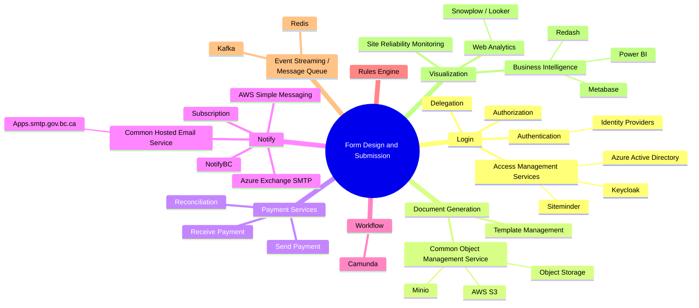

```mermaid
mindmap
  root((Form Design and Submission))
    Login
    ::icon(fas fa-book)
        Access Management Services
            Keycloak
            Siteminder
            Azure Active Directory
        Authentication
            Identity Providers
        Authorization
        Delegation
    Document Generation
    ::icon(fas fa-book)
      Template Management
      Common Object Management Service
        Object Storage
        Minio
        AWS S3
    Payment Services
    ::icon(fas fa-book)
        Send Payment
        Receive Payment
        Reconciliation
    Notify
    ::icon(fas fa-book)    
      Azure Exchange SMTP
      NotifyBC
      Common Hosted Email Service
        Apps.smtp.gov.bc.ca
      AWS Simple Messaging
      Subscription
    Workflow
    ::icon(fas fa-book)     
        Camunda
    Rules Engine
    Event Streaming /</br> Message Queue
        Kafka
        Redis
    Visualization
    ::icon(fas fa-book) 
        Business Intelligence
            Metabase
            Redash
            Power BI
        Site Reliability Monitoring
        Web Analytics
            Snowplow / Looker
```        

***
[Terms of Use](Terms-of-Use) | [Privacy](Privacy) | [Security](Security) | [Service Agreement](Service-Agreement) | [Accessibility](Accessibility)