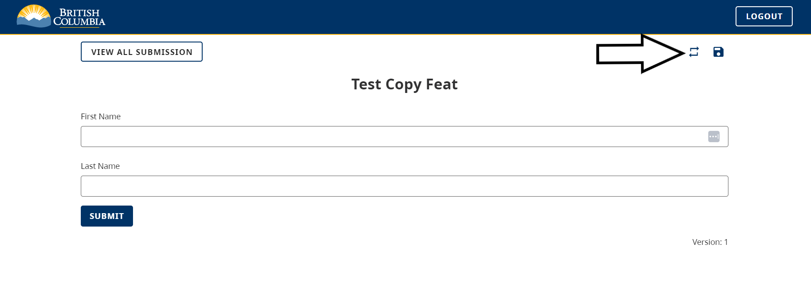

[Home](.) > [CHEFS Capabilities](CHEFS-Capabilities) > [CHEFS functionalities](CHEFS-functionalities) > **Allow multiple draft upload**
***

This new feature allows you to upload your draft submissions using the User Interface by simply providing a JSON file. Each object in this JSON file serves as a separate draft submission. You can download a Form-specific JSON file, also known as a Template file, and modify it to add multiple submissions as objects. So, you can easily submit multiple drafts with just one file upload!

**Things to remember:**

* Each submission created via this feature will be saved as a draft.
* Template files may vary for particular form versions.
* To enable this feature form designer/owner should enable the Save and Edit option under Form Functionality.
* In order to use Number fields as a bulk upload component, Number field must be enabled as required field or supply any value.
* In order to add a number component into sample/template for bulk upload, number component must be supplied with a default value like 0.

**How it works:**

Step 1: By default, Allow multiple draft upload option is disabled under form functionality. One can enable it by checking the checkbox. Remember that Enabling this “Allow multiple draft upload” feature will automatically enable the “Save and Edit Drafts” option.

When Submitters access the form, they can see an option in the Top-Right corner to switch to Multiple draft uploads. The position of this icon may look like this.

When the Submitter clicks on that icon, Submitter can see a changing view on the page. This view has a drag-and-drop area to upload a Template file with all the draft submissions.

As you can see, there are two comments on the last screenshot. One is to download the template for the form. Remember that templates may vary for a specific version of the form. The other area is to upload a JSON file containing draft submissions. Submitter can use the same template file and modify it as per requirement. Remember that JSON has multiple objects, and each object is a draft submission.

When you modify the JSON template file for a basic form that has only two text fields i.e. First name and Last Name, then the Jason file may look like this.

In this JSON template, there are three Draft submissions. See the video below to know how to upload a JSON template. Once you upload JSON it will process the file and submit all the draft submissions collected from the JSON template file.

<video width="320" height="240" controls>
  <source src="videos/multi-draft-upload.mp4" type="video/mp4">
  Your browser does not support the video tag.
</video>

**[Back to top](#top)**
