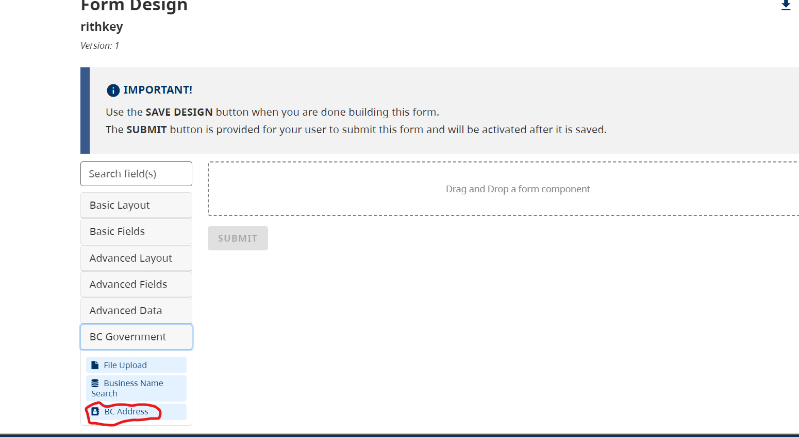
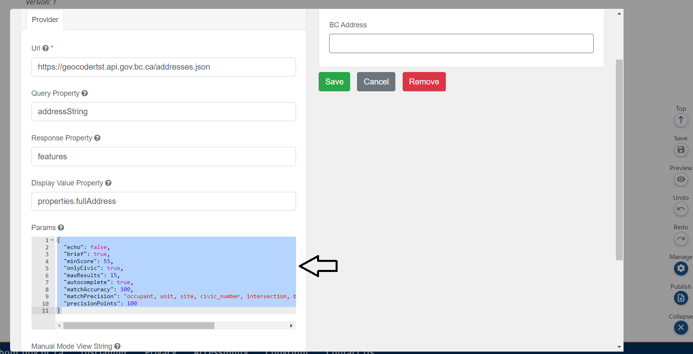

The BC Address component is a form.io custom component that autocompletes and suggests a list of BC addresses as users type into the field. 

## How it works

Drag and drop the 'BC Address' component into the form builder

This is a preconfigured component. Please note that users can only change the 'Params' details as indicated in the following image. Please visit this link for more information: [Geocoder Developer Toolkit](https://bcgov.github.io/ols-devkit/examples/address_autocomplete.html)

## What it looks like

BC Address component in preview mode: 

