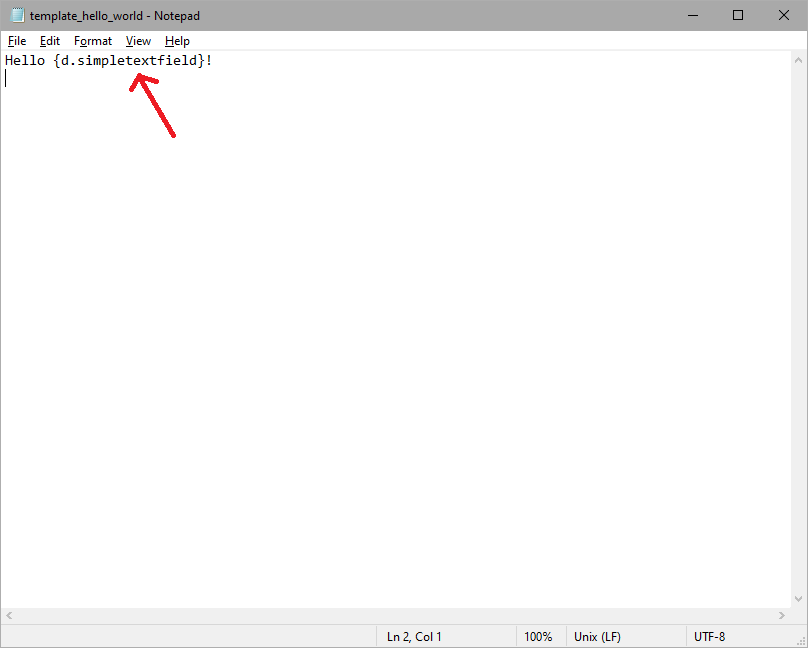
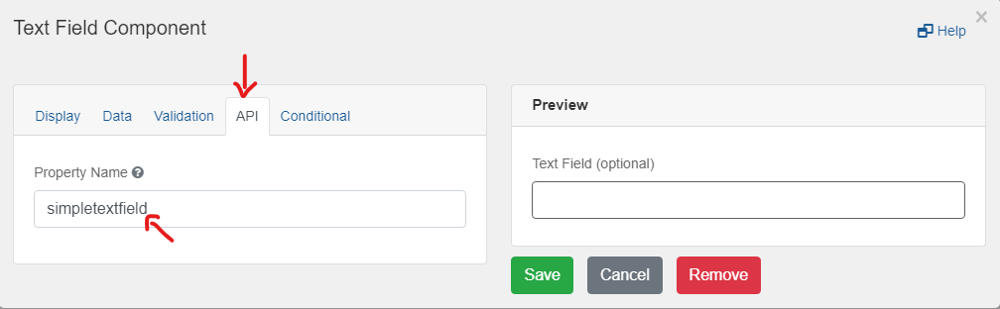

Provide your own CDOGS template so you can download a submission with custom formatting, and in a file type of your choice. 

On this page:
* [Formatting a submission](#Formatting-a-submission)
* [Creating a CDOGS template](#Creating-a-CDOGS-template)

## Formatting a submission

Having your own personalized template allows you to organize all your user's submission data and arrange it in a way that suits your needs.

Printing from the browser option only allows you to capture whatever is on the screen, using a template gives you more customization options. A typical example would be creating a layout that shows everything a user has submitted in a different format. This new format can be helpful when moving the data to another application.

## Creating a CDOGS Template

You can provide CHEFS a template file that holds variables that let you plug in your user's submission data.

You can use any of the following file types:

* .txt
* .docx
* .html
* .odt
* .pptx
* .xlsx

**Sample: write submissions to a .txt file**
Create a simple template upload that shows how to replace a variable in a .txt template file with data submitted by a user.  

1. First, create a simple .txt file that contains your variable name with the format {d.[variableName]}

2. You can find out the variable names by going to your Form Component's configuration and finding the variable name under the "API" tab for the component you are trying to target

3. Once you have your template file set up, you can now upload it to the CDOGS API through the “Print” icon when viewing submissions

Learn more about creating complex templates to fit your form's requirements, by [visiting the CDOGS Templating Wiki](https://github.com/bcgov/common-document-generation-service/blob/master/app/USAGE.md#templating).
