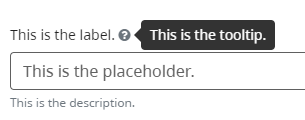

[Home](index) > [Capabilities](Capabilities) > **Accessibility** 
***  
## Our Approach 
Accessibility is important because it empowers everyone to use the forms you'll build with CHEFS. It ensures equal access and inclusion, enabling individuals to use forms on an equal footing. By making forms accessible, such as providing clear instructions and appropriate labels, we empower people to fully engage and participate. Accessibility not only benefits all users but also improves their experience and ensures compliance with accessibility standards. It fosters an inclusive environment where everyone can confidently and independently interact with CHEFS forms.  

Our goal is to go above the minimum compliance requirement level AA of the Web Content Accessibility Guidelines 2.1 ([WCAG 2.1](https://www.w3.org/TR/WCAG21/)).

## Our commitment  

We are committed to meeting your needs no matter how you use the service. We understand that people may have different needs for accommodation. To make sure we can be inclusive of everyone, we want to learn from you.

### Tell us how we’re doing
To tell us about accessibility issues on Submit, you can:

* Reach out to us through our [CHEFS Exchange Lab - Teams Channel](https://teams.microsoft.com/l/channel/19%3a34b9d4b4deb54eebaa9be8bc1ccf02f7%40thread.tacv2/CHEFS%2520(Exchange%2520Lab%2520Team)?groupId=bef8086f-20c7-43a4-bd07-29ce764e818c&tenantId=6fdb5200-3d0d-4a8a-b036-d3685e359adc)
* Create an issue on our [public GitHub repository](https://github.com/bcgov/common-hosted-form-service/issues/new?assignees=&labels=&projects=&template=bug_report.md&title=)  

We will work with you to:

* Understand issues you’ve encountered and how they impact you
* Log all bugs in our product backlog and address them with high priority.
* Resolve issues as soon as we can 

> We are grateful for your feedback and insights.

## Accessibility Topics  

- [Form Multilanguage Support](Form-Multilanguage) 
- [Screen Reader Support](Accessibility#screen-reader-support)

### Screen Reader Support  
  
The form components used in CHEFS already include accessibility features. [ARIA](https://en.wikipedia.org/wiki/WAI-ARIA) attributes make labels, tooltips, and descriptions accessible to screen readers and other tools. However, form developers still need to be mindful of accessibility principles to create truly inclusive experiences. The built-in accessibility features of CHEFS form components allow form developers to focus on other accessibility considerations.

As an example, the Vox screen reader for the Chrome browser will read this component:

as _"This is the label. This is the tooltip. This is the description. Within: This is the placeholder. Edit text"_. Note that the user does not need to hover, etc, to “pop up” the tooltip to have it read out.

***
[Terms of Use](Terms-of-Use) | [Privacy](Privacy) | [Security](Security) | [Service Agreement](Service-Agreement) | [Accessibility](Accessibility)