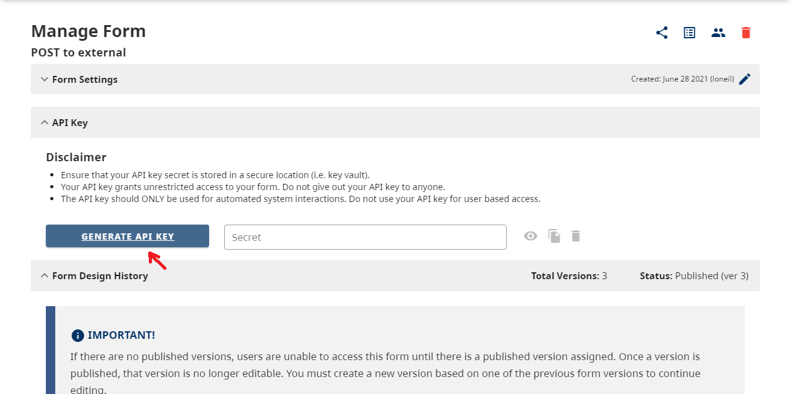
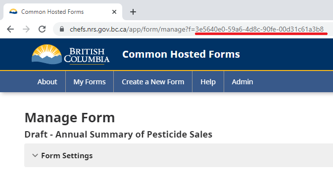
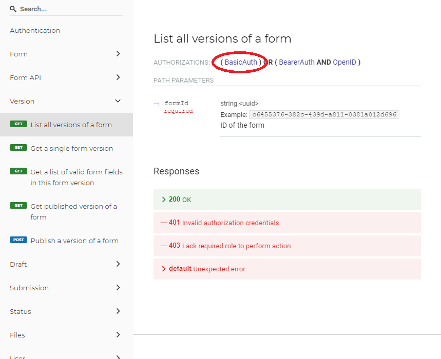

[Home](index) > [CHEFS Capabilities](Capabilities) > [Data Management](Data-Management) > **Generating API keys**
***


Connect your 3rd party applications with CHEFS to give it access to any of your form's data through our [documented CHEFS API specifications](https://submit.digital.gov.bc.ca/app/api/v1/docs).

<!-- **On this page:**
* [How to generate and regenerate an API key](Generating-API-Keys#how-to-generate-and-regenerate-an-api-key)
* [How to make a call to the CHEFS API](Generating-API-Keys#how-to-make-a-call-to-the-chefs-api)
* [Which API endpoints can be called?](Generating-API-Keys#which-api-endpoints-can-be-called)
* [How to handle API Rate Limiting](Generating-API-Keys#how-to-handle-api-rate-limiting) -->

## How to generate and regenerate an API key

You can generate an API key by going to your "Form Settings" and opening the `API Key` Panel. If you want to generate a new API key, click the `Generate API Key` button below and confirm your selection.



Once you have generated your key, you can click on the `Show Secret` icon to view and use this key in your applications to make calls to our [endpoints](https://chefs.nrs.gov.bc.ca/app/api/v1/docs).

Please note to never keep your API keys in an unsecure area.

Once you have an API Key, the `Regenerate API Key` button will invalidate the old key and create a new key. The old key will no longer work to access the API, and you will have to update your applications to use the new key.

## How to make a call to the CHEFS API
<!-- **[Back to top](#top)** -->

You can make calls to our [endpoints](https://submit.digital.gov.bc.ca/app/api/v1/docs) by using [Basic Authorization](https://datatracker.ietf.org/doc/html/rfc7617#section-2).

>If you require more information about how to use Basic Authorization, follow this link: https://datatracker.ietf.org/doc/html/rfc7617#section-2

1. Your Username corresponds to your `Form's ID`

You can find your Form's ID by going to your Form Settings page, and copying it from the URL



2. Your Password corresponds to your `Generated API Key`

## Which API endpoints can be called?
<!-- **[Back to top](#top)** -->

You can only make requests to the endpoints that have a BasicAuth Authorization type from our [API Specifications](https://submit.digital.gov.bc.ca/app/api/v1/docs).



## How to handle API Rate Limiting
<!-- **[Back to top](#top)** -->

The CHEFS API uses "Rate Limiting" to, as the name suggests, limit the rate at which the API will accept calls. This is to prevent malfunctioning code from accidentally overloading the API and affecting other users.

Below is a simplified example:

**Request #1**: when the API is called it returns two rate limiting HTTP headers:
```
HTTP/1.1 200 OK
RateLimit-Policy: 20;w=60
RateLimit: limit=20, remaining=19, reset=60
```
These correspond to:
- `RateLimit-Policy`: the maximum number of allowed requests is `20` in a `60` second window.
- `RateLimit`: the `limit` is `20`, same as above. This is the first request, so there are `19` remaining in the window. The window resets in `60` seconds.

**Request #2**: If you wait 15 seconds and make another API call, the headers will be:
```
HTTP/1.1 200 OK
RateLimit-Policy: 20;w=60
RateLimit: limit=20, remaining=18, reset=45
```
These correspond to:
- `RateLimit-Policy`: unchanged from above - this will rarely change
- `RateLimit`: the `limit` is `20`, and again will rarely change. This is the second request within the window, so there are `18` remaining in the window. Since we waited 15 seconds after the first request, the window now resets in `45` seconds.

Rapidly sending in **Request #3** through **Request #19** will gradually diminish both the `remaining` and `reset` fields.

**Request #20**: Sending in the next request within the window will produce headers like:
```
HTTP/1.1 200 OK
RateLimit-Policy: 20;w=60
RateLimit: limit=20, remaining=0, reset=24
```
These correspond to:
- `RateLimit`: the `limit` is `20`, and again will rarely change. This is the 20th request within the window, so there are `0` remaining in the window. The window now only has `24` seconds left before it resets.

**Request #21**: Sending another request before the window resets will produce headers like:
```
HTTP/1.1 429 Too Many Requests
RateLimit-Policy: 20;w=60
RateLimit: limit=20, remaining=0, reset=13
Retry-After: 13
```
These correspond to:
- `RateLimit`: the `limit` is `20`, and again will rarely change. This is the 21st request within the window and fails with HTTP 429, and there are still  `0` remaining in the window. The window now only has `13` seconds left before it resets.
- `Retry-After`: this is the same as the `reset` value in the `RateLimit` header (13), but is easier to use in code if you want to wait (please wait) before making the next call

Once the remaining 13 seconds in the window elapse, the counter is reset to 20 and API calls will again succeed.

The example above is simplified, but in the real world there are always multiple containers that run the API. The count of requests is (currently) not shared between containers. In other words, if the limit is 60 requests and there are two containers running, then worst case is 60 requests per minute, best case is 120 per minute, and probably it will be close to - but under - 120. 

<!-- **[Back to top](#top)** -->

***
[Terms of Use](Terms-of-Use) | [Privacy](Privacy) | [Security](Security) | [Service Agreement](Service-Agreement) | [Accessibility](Accessibility)
