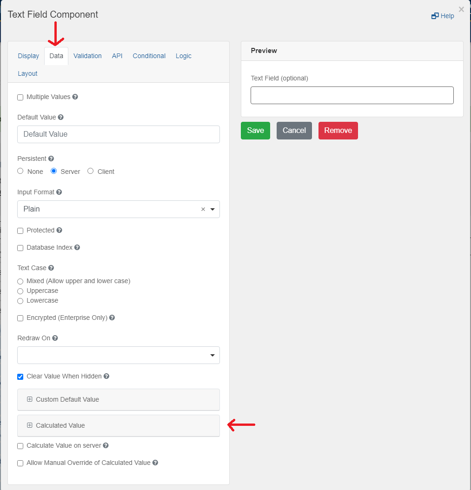

[Home](index) > [CHEFS Capabilities](Capabilities) > [Data Management](Data-Management) > **Populating a form design with External Data**
***


Connect an API that returns JSON to make requests and use that data inside of your CHEFS Form. This will require some knowledge in JavaScript.

## Components

When building your own form, you can make requests to your API with any "Advanced Fields Components."

- Simply drag your "Advanced Field Component" to your form


- Select the "Data" tab within the component's setup modal and open the "Calculated Value" panel



- Under the JavaScript panel, enter the following JavaScript template code to begin making a request to your API


```javascript
var makeRequest = (url, method) => {
    // Create the XHR request
    var request = new XMLHttpRequest();
    // Return it as a Promise
    return new Promise((resolve, reject) => {
        // Setup our listener to process completed requests
        request.onreadystatechange = () => {
            // Only run if the request is complete
            if (request.readyState !== 4) return;
            // Process the response
            if (request.status >= 200 && request.status < 300) {
                // If successful
                resolve(request);
            } else {
                // If failed
                reject({
                    status: request.status,
                    statusText: request.statusText
                });
            }
        };
        // Setup our HTTP request
        request.open(method || 'GET', url, true);
        // Send the request
        request.send();
    });
};

// Create the url variable to your API that returns JSON
const url = 'https://jsonplaceholder.typicode.com/todos/1';

makeRequest(url)
    .then((data) => {
        const response = JSON.parse(data.response);
        // instance.SetValue sets the value of your Component
        instance.setValue(response.title);
    })
    .catch(function (error) {
        console.log('Something went wrong', error);
    });
```

Add your own url for your API request and process the response within the .then() block.

<!-- **[Back to top](#top)** -->

***
[Terms of Use](Terms-of-Use) | [Privacy](Privacy) | [Security](Security) | [Service Agreement](Service-Agreement) | [Accessibility](Accessibility)
