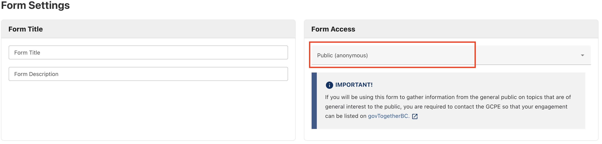

[Home](index) > [Capabilities](Capabilities) > [Data Management](Data-Management) > **Privacy and data collection**
***

<!-- * [Privacy](#Privacy)
* [Surveys and privacy](#Surveys-and-privacy)
* [Data storage](#Data-storage) -->

## Privacy
It's your responsibility to comply with privacy laws governing the collection, use and disclosure of personally identifiable information. 

Access to the CHEFS form designer tool does not grant you permission to collect, use or disclose any personal information. Before publishing or distributing your form, you must discuss the intention of the form with your [Ministry Privacy Officer](https://www2.gov.bc.ca/gov/content?id=A749F080FC794D82A2CBD96BABA2ABEC) and complete assessments as required.

We recommend that program areas that create forms complete a Privacy Impact Assessment (PIA). Since each survey and form are unique, it's challenging to capture all the individual components in one overarching PIA. 
To learn more about Privacy Impact Assessments, refer to the following resources:

* [Guide to Privacy Impact Assessments](https://www2.gov.bc.ca/gov/content?id=CFA561FF833D42B68FDD9A818ECAFFBE)

Since individual program areas are responsible for conducting their PIAs, we’ve provided the Privacy Impact Assessment (PIA) for CHEFS as a reference:

* [Link to CHEFS Privacy Impact Assessment](https://bcgov.sharepoint.com/:b:/r/teams/00003/Shared%20Documents/%F0%9F%92%BB%20General/Common%20Components/Form%20Design%20and%20Submission/PIA/Previous%20Versions/CITZ23007%20-%2022-027%20CHEFS%20-%20PCT%20signed.pdf?csf=1&web=1&e=MUEEea)

## Surveys and privacy
<!-- **[Back to top](#top)** -->

If you want to use CHEFS as a survey tool and anonymity is a requirement, you need to set your form to "Public." Requiring a user to log in will connect their answers to their username. 

To set your form responses to anonymous, open the "Manage Form" page and click "Public" under "Form Access."

## Data storage
<!-- **[Back to top](#top)** -->

The Office of the Chief Information Officer's (OCIO) [BCDevExchange](https://bcdevexchange.org/) hosts the data within Canada. The system admin team does not have any elevated permissions to view forms or form submissions through the frontend. Like other applications, a developer or database administrator will have access to the database passwords used to maintain the database. 

***
[Terms of Use](Terms-of-Use) | [Privacy](Privacy) | [Security](Security) | [Service Agreement](Service-Agreement) | [Accessibility](Accessibility)