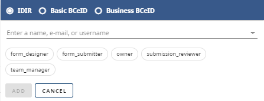

[Home](index) > [Capabilities](Capabilities) > [Form Management](Form-Management) > **Managing admin teams**
***

To manage your form and its submissions, you have the option to add team members with an IDIR account. Additionally, you can add Basic BCeID users with the role of form submitter, and BCeID Business users with roles including submitter, submission reviewer, and team manager.

## Adding new team member
1. Go to the Team Management page to configure role-based access for your team.
2. Click the `Add a team member` icon, then search for the user by their IDIR or name. Note that team members must have logged in to CHEFS at least once before they can be added to your team.

## Roles
There are 5 roles available. A form must have always at least 1 owner. A team manager (and owner) can edit team member roles.
        

| Role  | Permissions  | Identity provider |
| -------- | -------- | -------- |
| Owner    | Can do all of the below, adjust form settings, and delete the form   | IDIR    |
| Team Manager    | Can add and remove team members, and assign roles    | IDIR, Business BCeID    |
| Form Designer    | Can edit the form design and save new versions    | IDIR    |
| Reviewer    | Can review (and export), and edit form submissions   | IDIR, Business BCeID    |
| Submitter    | Can submit a team-protected form     | IDIR, Business BCeID , Basic BCeID    |
| Approver    | Can manage (status updates, and notes)   | IDIR, Business BCeID    |

***
[Terms of Use](Terms-of-Use) | [Privacy](Privacy) | [Security](Security) | [Service Agreement](Service-Agreement) | [Accessibility](Accessibility)
