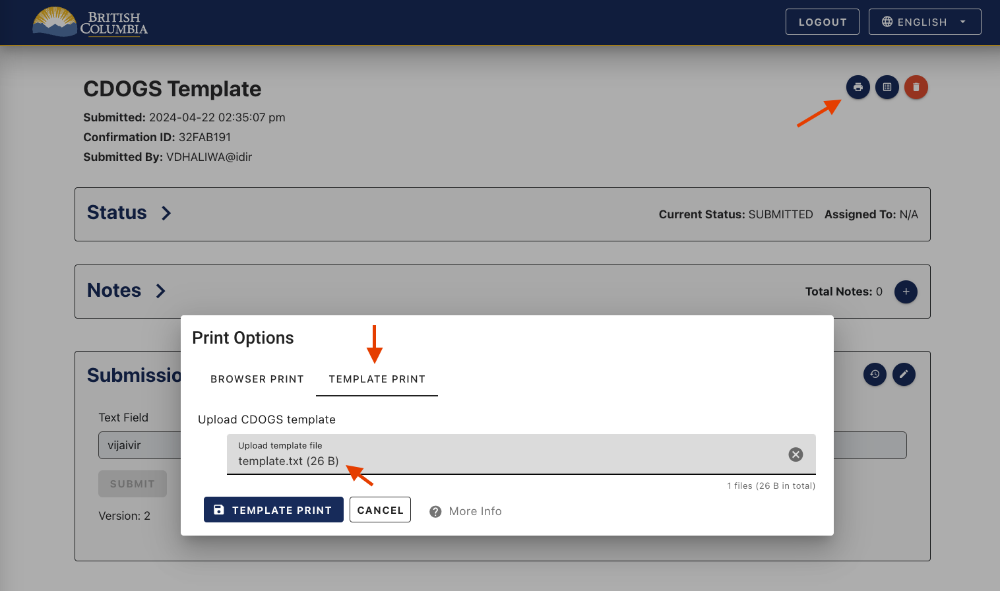
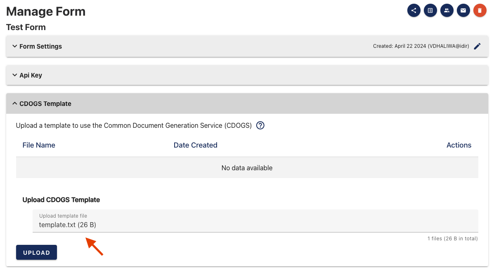
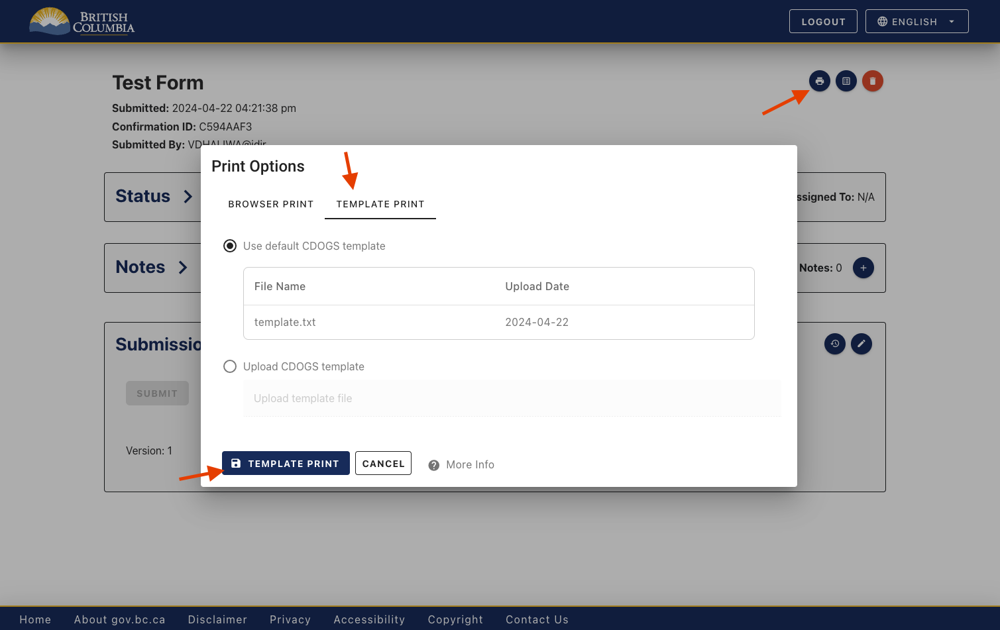

[Home](index) > [Capabilities](Capabilities) > [Functionalities](Functionalities) > **Download a submission with custom format (CDOGS)**
***
<!-- On this page:
* [Formatting a submission](#Formatting-a-submission)
* [Creating a CDOGS template](#Creating-a-CDOGS-template) -->
Provide your own CDOGS template so you can download a submission with custom formatting, and in a file type of your choice. 

## Formatting a submission

Having your own personalized template allows you to organize all your user's submission data and arrange it in a way that suits your needs.

Printing from the browser option only allows you to capture whatever is on the screen, using a template gives you more customization options. A typical example would be creating a layout that shows everything a user has submitted in a different format. This new format can be helpful when moving the data to another application.

## Creating a CDOGS Template

You can provide CHEFS a template file that holds variables that let you plug in your user's submission data.

You can use any of the following file types:

* .txt
* .docx
* .html
* .odt
* .pptx
* .xlsx

**Sample: write submissions to a .txt file**
Create a simple template upload that shows how to replace a variable in a .txt template file with data submitted by a user.  

1. First, create a simple .txt file that contains your variable name with the format {d.[variableName]}


2. You can find out the variable names by going to your Form Component's configuration and finding the variable name under the "API" tab for the component you are trying to target


3. Following submission metadata is available for use in the document templates.

    * {d.chefs.submissionId}: the unique identifier for the submission, such as 3cb9acc7-cfd8-4491-b091-1277bc0ec303
    * {d.chefs.confirmationId}: The uppercased first eight characters of the submissionId, such as 3CB9ACC7
    * {d.chefs.formVersion}: The numeric version of the form that was used to create the submission, such as 1

4. Once you have your template file set up, you can now upload it to the CDOGS API through the “Print” icon when viewing submissions



Learn more about creating complex templates to fit your form's requirements, by [visiting the CDOGS Templating Wiki](https://github.com/bcgov/common-document-generation-service/blob/master/app/USAGE.md#templating).

## Default CDOGS Template

You may also upload a default template for submitters and reviewers. Once you create a form, navigate to the 'Manage Form' screen and click on the CDOGS template dropdown.



 From here, you will be able to upload a CDOGS that will be available by default on the form viewer page. Note that we currently only allow one document template per form, so you will need to delete your current template before you can upload a new one. 
 
 To use the template, simply click on the 'Print' icon and choose the default template option from the form view or submission view pages. 

 


## Finding Field Names to Use in a CDOGS Template

### 🔍 Option 1: Check API Tab in Form Component Configuration
Go to your Form Component's configuration and find the variable name under the "API" tab for the component you are trying to target.  
(See Step 2 in the [Sample: write submissions to a .txt file](#sample-write-submissions-to-a-txt-file) section above for a quick example.)


### 📁 Option 2: Download Submission JSON
If the form already has submissions, go to the **Submissions Export** page and download a submission as JSON. The structure here mirrors your `{d...}` mappings very clearly.

> Example:  
> ```json
> {
>     "form": {
>       "submissionId": "a01d8482-e24b-4b63-9e95-034157c01ac5",
>       "confirmationId": "A01D8482",
>       "formName": "Example | Sample form",
>       "version": 15,
>       "createdAt": "2025-06-17T04:39:24.691Z",
>       "fullName": "John Doe",
>       "username": "JDOE",
>       "email": "john.doe@example.com",
>       "submittedAt": "2025-06-17T04:39:24.712Z",
>       "status": "SUBMITTED",
>       "assignee": null,
>       "assigneeEmail": null
>     },
>     "lateEntry": false,
>     "simplefile": [
>       {
>         "url": "/app/api/v1/files/sample-file-id",
>         "data": {
>           "id": "sample-file-id"
>         },
>         "size": 12728,
>         "storage": "chefs",
>         "originalName": "example-document.pdf"
>       }
>     ],
>     "simpletextfield": "sample",
>     "simpleemailadvanced": "test@example.com"
> }
> ```
Then you can use this in your template:
> ```
> {d.simplefile[i].originalName}
> {d.simplefile[i].url}
> {d.simpletextfield}
> {d.simpleemailadvanced}
> {d.form.submissionId}
> {d.form.confirmationId}
> {d.form.formName}
> {d.form.version}
> {d.form.createdAt}
> {d.form.fullName}
> {d.form.username}
> {d.form.email}
> {d.form.submittedAt}
> {d.form.status}
> ```

### Using Signature Component with CDOGS HTML Templates

**Signature Support:** If you're using the Signature component in your form and you're building an HTML-based CDOGS template, refer to the [Using Signature Component with CDOGS HTML Templates](https://github.com/bcgov/common-document-generation-service/blob/master/app/USAGE.md#signature-component-html-support) section in the CDOGS Templating Wiki for proper usage instructions and syntax.


***
[Terms of Use](Terms-of-Use) | [Privacy](Privacy) | [Security](Security) | [Service Agreement](Service-Agreement) | [Accessibility](Accessibility)