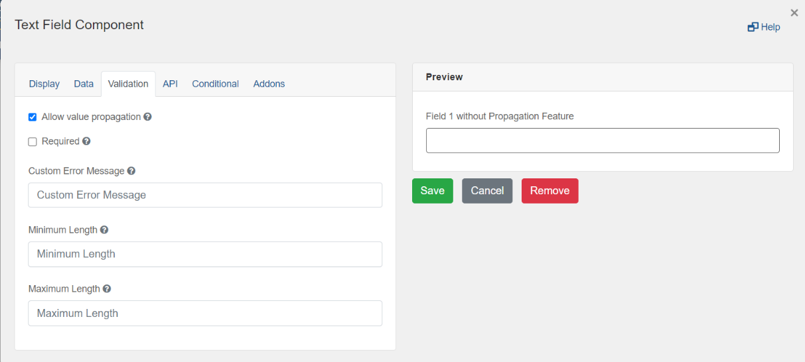

[Home](index) > [CHEFS Capabilities](Capabilities) > [CHEFS functionalities](CHEFS-functionalities) > **Copy an existing submission**
***

This feature allows submitters to create new submissions from previous ones. By creating new submissions from existing ones, the user can copy all the previous values for the fields enabled with “Allow value propagation”. All the form fields enabled with this option can be copied over to new submission.

This is how a Form designer can Enable this feature from Form Functionality.

Next, Enable the “Allow value propagation” checkbox for each field you want to copy while the submitter creates new submission from the old one. Designer can enable this option for fields under the validation tab of Field management while Designing a form. Remember that This option can only be available for Advanced components only. i.e.

Now Submitters can see a new action button under My Submissions table called “Copy this submission”. Like this:

By clicking on that Icon user will be redirected to the New page where all the existing values from the older submission are auto-populated to the form.

***
[Terms of Use](Terms-of-Use) | [Privacy](Privacy) | [Security](Security) | [Service Agreement](Service-Agreement) | [Accessibility](Accessibility)