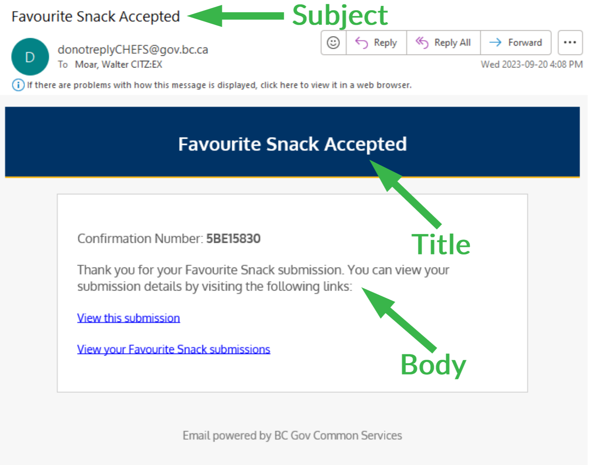
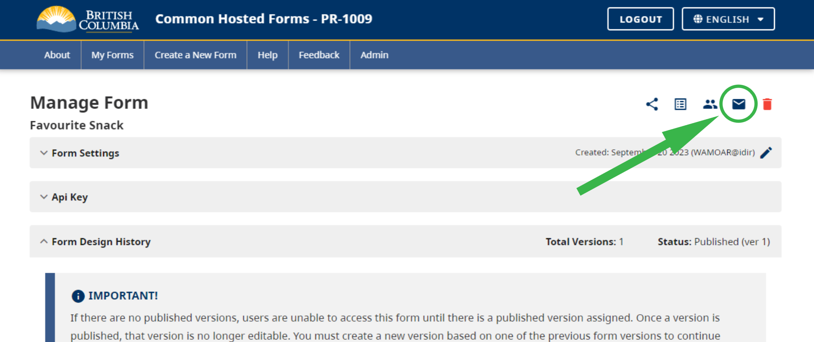
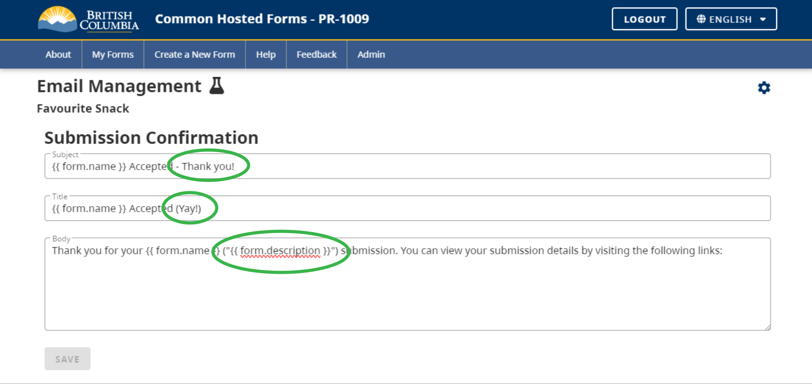
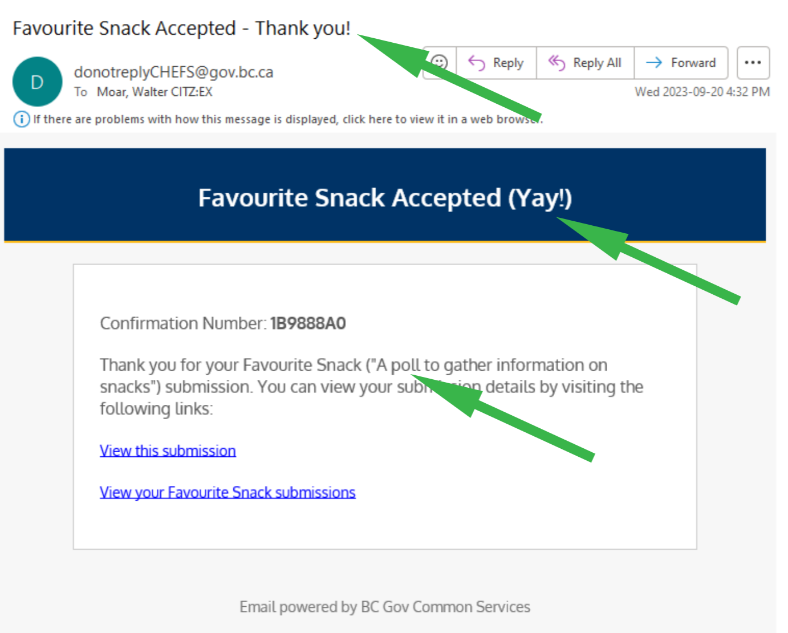

[Home](index) > [CHEFS Capabilities](CHEFS-Capabilities) > [CHEFS Functionalities](CHEFS-functionalities) > **Editing Email Templates**
***

> **EXPERIMENTAL**

CHEFS sends [Email Notifications and Reminders](CHEFS-Notifications-and-Reminders) at various points in the life of a submission. To give form owners some control over the content of these emails, the ability to edit the email templates is being added to CHEFS as an *experimental feature*. This feature is being released with minimal capabilities and will be expanded in the future when time allows.

## Limitations

- Currently only the Submission Confirmation email template is editable. Other email templates will be added in the future if there is demand for them.
- Only plain text can be used in the templates. HTML markup is not supported.
- Data from the submitted form cannot be included in the emails. This is due to potential privacy impacts, but the CHEFS team is looking into being able to offer this capability.

## Submission Confirmation for Submitters

This email can be requested by the form submitter after form submission.

After the user submits the form, the successful submission page has a link to "**EMAIL A RECEIPT OF THIS SUBMISSION**":

The email sent to the user contains a Subject, Title, and Body:

There is a button on the Form Management page to edit the email template:

The default templates for Subject, Title, and Body are displayed and can be edited:

Mustache syntax can be used to add the following fields to the templates:
- `form.name`: the "Name" of the form.
- `form.description`: the "Description" of the form.

All following emails for submission confirmation will use the new templates:

***
[Terms of Use](Terms-of-Use) | [Privacy](Privacy) | [Security](Security) | [Service Agreement](Service-Agreement) | [Accessibility](Accessibility)