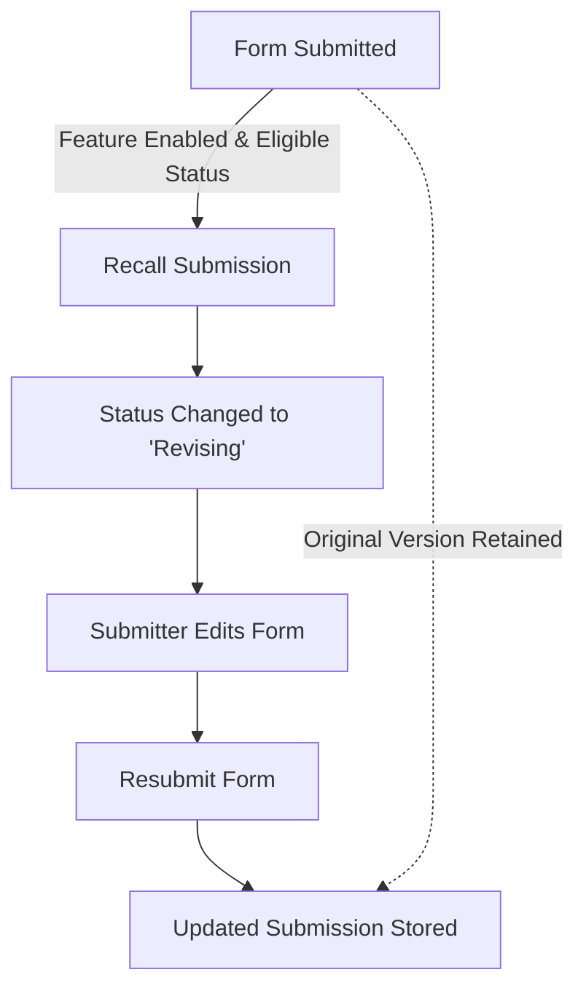

# Recall Submission Feature

## Overview
The *Recall Submission* feature allows a submitter to view their previously submitted form data and move a submission back into an editable state. This enables users to make corrections or updates without requiring intervention from the form owner—provided the feature is enabled for that form.

---

## Use Cases
This feature is ideal in scenarios where:
- A submitter realizes they made a mistake after submitting and needs to make corrections.
- Updates to submitted data are allowed without formal approval from the form’s business area.
- Quick revisions are needed to ensure data accuracy without administrative overhead.

---

## How It Works
1. **Viewing Submissions**  
   Submitters can access their previously submitted forms via the “View Submissions” page.
2. **Recalling a Submission**  
   If recall is enabled for the form, a *Recall* button will appear when viewing the details page of an eligible submissions.
   

4. **Revising the Submission**  
   Clicking *Recall* changes the submission status from **Submitted** to **Revising**.  
   - The submitter can then open and edit the form.  
   - Once changes are complete, they can resubmit.
5. **Version Retention**  
   The original version of the submission is retained in the database for audit and reference.

---

## Workflow Diagram

## Feature Availability
- **Form Owner Control** – The form owner can enable or disable recall in the form’s settings.

- **Submitter Role Requirement** – Only users with the *submitter* role for that form can recall their own submissions.

---

## Restrictions
A submission **cannot** be recalled if it is in any of the following statuses:
- **Assigned**
- **Completed**
- **Deleted**

---

## Enabling the Feature
**For Form Owners:**
1. Go to the form’s settings.
2. Locate the *Recall Submissions* setting.
3. Toggle **On** to allow submitters to recall eligible submissions.

---

## Submitter Instructions
1. Navigate to the form.
2. Click **View My Submissions**.
3. Locate the submission you want to revise.
4. If eligible, click **Recall**.
5. Make your changes and resubmit.

---

## Implementation Notes (for developers)
- Adds a new **Recall Submission** action for the `submitter` role.
- Includes a form-level feature flag controlled by the `formOwner` role.
- Maintains historical submission versions for data integrity.
