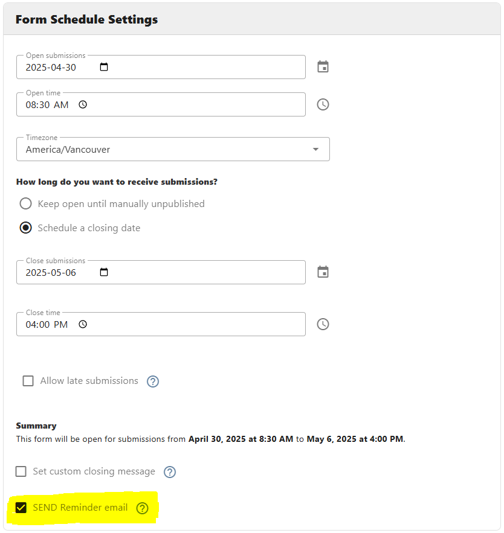

[Home](index) > [Capabilities](Capabilities) > [Functionalities](Functionalities) > **Schedule and Reminder notification**
***

<!-- 
- [Form schedule](#Form-schedule)
- [Reminder notifications](#Reminder-notifications) -->

## Form schedule 

This feature allows the form designer to schedule form submissions. By enabling this feature, form designers can limit the submissions to a form by selecting Open and Close submission dates or a specific period. The schedule feature can be enabled by clicking on the "Form Submission Schedule" checkbox under the Form schedule settings on form settings.

One thing to remember is that this feature can only be available to forms that have at least one version published. Forms can be scheduled using two scheduling options.

### Timezone Selection

Form designers can now select a specific timezone for their form schedule. The system defaults to the user's local timezone but allows explicit selection from available Canadian timezones. This ensures that all scheduling operations (open dates, close dates, and reminders) work consistently across different user locations.

### Schedule Options

By enabling the radio option **"Keep open until manually unpublished"**, the form submission will operate normally. The only limit a form designer can use is to select an "Open submissions date," so basically the form will be open on a specific date and time, and will remain available until the form gets unpublished manually.

**"Schedule a closing date"** is the other option where the form designer can select a specific closing date and time for form submissions. Selecting the Open and Close date/time makes the form available for submissions only during that specific selected period. Additionally, the form designer can allow end users to submit the form with a Grace period. To do so, the Form designer can use the "Allow late submissions" option and choose a specific interval.

Upon closing a form, the Form designer can set a custom message for the end user as well. This message will be displayed on the frontend once the form gets closed for the specific period. This feature can be used by clicking on the "Set custom closing message" checkbox.

### Form Schedule Time Settings

Each schedule option now includes precise time selection in addition to date selection:
- Open submissions time: Sets the exact time when the form will become available on the open date
- Close submissions time: Sets the exact time when the form will close on the close date (defaults to 23:59 if not specified)

The system displays a helpful summary of the scheduled dates and times, formatted according to the selected timezone, to help form designers confirm their settings.

### Late Submissions

For forms with a closing date, form designers can enable a grace period for late submissions:
- Enable "Allow late submissions" 
- Specify the length of the grace period (number + interval type: days, weeks, months, quarters, or years)
- During this grace period, submitters will still be able to access and submit the form, but it will be marked as a late submission

## Reminder Notifications
<!-- **[Back to top](#top)** -->

Reminder notifications is a service of CHEFS that allows the system to send reminder emails to the submitter of a specific form during the open submission period. The reminder system is designed to increase form completion rates by notifying users at strategic times.

### Reminder Eligibility

Reminder emails are only available for:
- Forms created by teams (not individual forms)
- Forms with a future opening date (reminders cannot be enabled for forms that have already opened)
- Forms with a schedule enabled

### Reminder Email Schedule

The system automatically determines when to send reminder emails based on the form's schedule:

1. **Forms without an End Date (Keep open until manually unpublished)**:
   - Only one reminder email is sent on the first day the form opens
   - The form must have a future opening date for this reminder to be sent

2. **Forms with a Start and End Date (Schedule a closing date)**:
   - The number of reminders sent depends on the length of the submission period:
     - Less than 3 days: One reminder on the opening day only
     - 4-6 days: Two reminders (opening day and one day before closing)
     - More than 6 days: Three reminders (opening day, middle of the period, and one day before closing)

### How Reminders Work

- **Opening day reminder**: Sent to all form submitters when the form opens
- **Middle of period reminder**: Only sent to users who haven't submitted the form yet
- **Day before closing reminder**: Only sent to users who haven't submitted the form yet

All reminders include a link to the form and information about the submission deadline.

### What is a Period?

A period is a timeframe when a form is open for submission, containing a start date/time and an end date/time. All dates and times in periods are timezone-aware based on the timezone selected in the form schedule settings.

<!-- **[Back to top](#top)** -->

***
[Terms of Use](Terms-of-Use) | [Privacy](Privacy) | [Security](Security) | [Service Agreement](Service-Agreement) | [Accessibility](Accessibility)