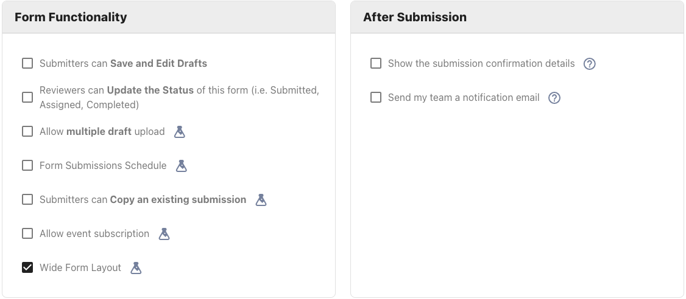
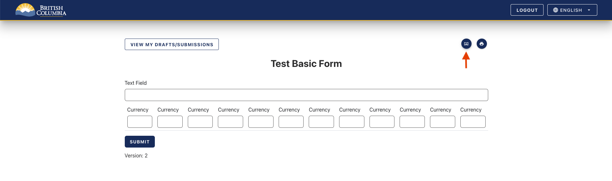
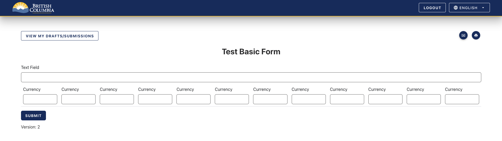

[Home](index) > [Capabilities](Capabilities) > [Functionalities](Functionalities) > **Wide form layout**
***
This feature adds the ability to toggle a wider layout, enhancing readability in larger forms. Select 'Wide Form Layout' from the 'Form Functionality' settings to enable this feature when creating a new form. When this is enabled for a form, the submitter, and reviewer views of the form will default to Wide Layout mode. 

This option will add a 'Wide Form Layout' button on the form viewer and submission pages, displaying the form in a wider layout. 

## Default Layout

## Wide Form Layout

This feature works by utilizing whitespace beside the page and dynamically adjusts based on responsive design breakpoints, which are influenced by the screen size of the device. Note that this feature is particularly noticeable for widths similar to 1023px, 1279px, and 1919px compared to 1024px, 1280px, and 1920px, where the layout transitions affect the spacing around the page.

***
[Terms of Use](Terms-of-Use) | [Privacy](Privacy) | [Security](Security) | [Service Agreement](Service-Agreement) | [Accessibility](Accessibility)