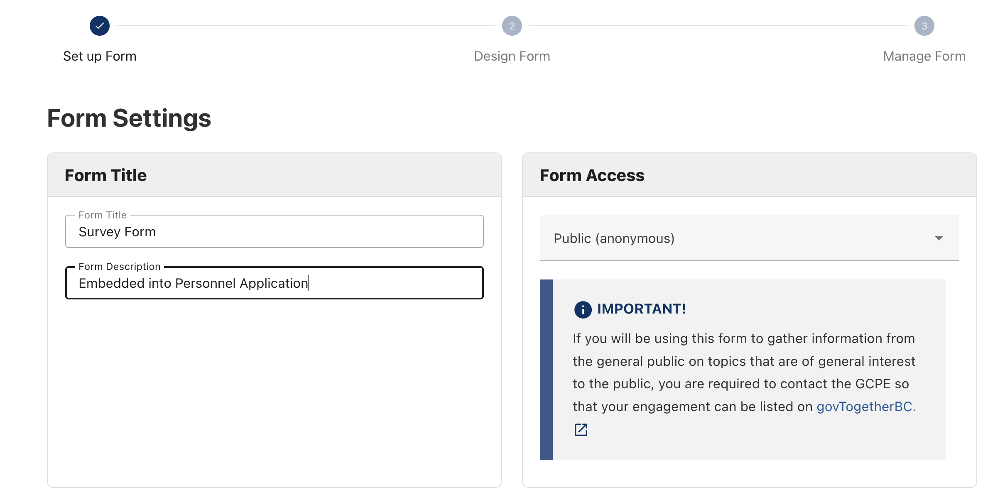
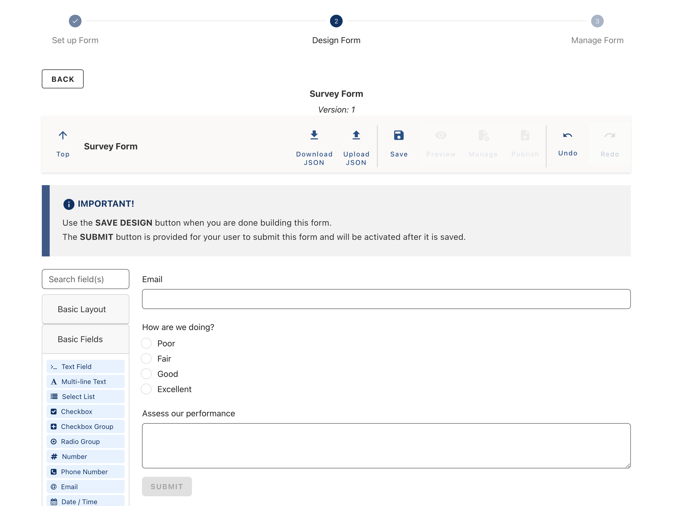
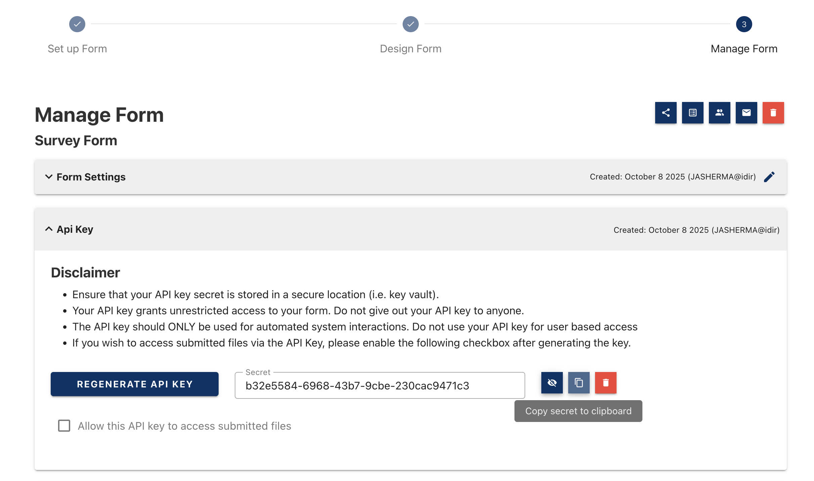
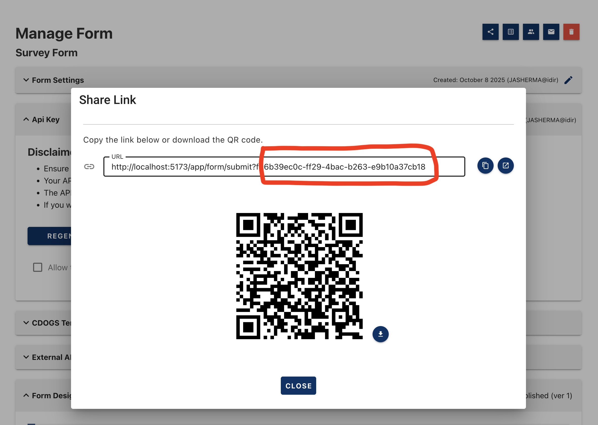

[Home](index) > [Capabilities](Capabilities) > [Integrations](Integrations) > **Embed your Form in another Application**

---

# CHEFS Form Viewer Web Component

## Table of Contents

### Part 1: Business Overview

1. [The Problem: Forms That Don't Fit Your Workflow](#the-problem-forms-that-dont-fit-your-workflow)
2. [The Solution: Embed CHEFS Forms Seamlessly](#the-solution-embed-chefs-forms-seamlessly)
3. [How It Works](#how-it-works)
4. [Understanding the Basics](#understanding-the-basics)
5. [Ready to Get Started?](#ready-to-get-started)

### Part 2: Technical Implementation

6. [Prerequisites](#prerequisites)
7. [Quick Start Guides](#quick-start-guides)
8. [API Reference](#api-reference)
9. [Authentication](#authentication)
10. [Basic Integration](#basic-integration)
11. [Advanced Integration](#advanced-integration)
12. [Troubleshooting](#troubleshooting)

---

## The Problem: Forms That Don't Fit Your Workflow

Do you currently struggle with:

- **Workflow disruption**: Users have to leave your application to fill out forms, then return?
- **Authentication complexity**: Your users are already logged into your system, but CHEFS requires separate login?
- **Integration challenges**: You have existing mobile apps, WordPress sites, or custom applications that need forms?
- **Inconsistent user experience**: Forms look and behave differently from your main application?
- **Technical barriers**: Your development team doesn't want to learn CHEFS-specific technologies?
- **Security concerns**: Worried about managing multiple authentication systems?

## The Solution: Embed CHEFS Forms Seamlessly

The CHEFS Form Viewer web component lets you integrate CHEFS forms directly into your existing applications with minimal effort:

- **No workflow disruption**: Forms appear within your application, not as separate pages
- **Respects your authentication**: Works with your existing user sessions and security model
- **Universal compatibility**: Works in most proven web-based applications - mobile apps, WordPress, custom sites, or enterprise systems
- **Consistent experience**: Forms match your application's look and feel
- **Developer-friendly**: Simple integration that any web developer can implement
- **Secure by design**: Handles authentication and data protection automatically between your application and CHEFS

## How It Works

Instead of redirecting users to CHEFS, you embed forms designed in CHEFS directly in your application using a simple web component. Your users never leave your site, and the form data flows seamlessly back to CHEFS for processing.

**For Business Stakeholders**: This means happier users, higher completion rates, and no need to rebuild your entire application.

**For Developers**: This means a single line of code to add powerful form capabilities to any web application.

---

## Understanding the Basics

### What is a Web Component?

Imagine a web component as a "plug-and-play" form that you can drop into any website or application. Just like you might embed a YouTube video or Google Map on your website, you can embed a CHEFS form using a simple piece of code.

### The Three Key Players

**1. CHEFS (Form Designer)**

- Where your forms are created, designed, and published
- Handles form logic, validation, and data collection
- Manages form submissions and stores the data securely

**2. Your Application (The Host)**

- Your existing website, mobile app, or system
- Where your users work and where the form will appear
- Maintains your existing user experience and branding

**3. The Web Component (The Bridge)**

- A small piece of code that connects CHEFS and your application
- Makes the form appear seamlessly within your application
- Handles all the technical details behind the scenes

### How Data Flows

1. **User fills out the form** in your application (they never leave your site)
2. **Form data is securely sent** to CHEFS for processing
3. **CHEFS validates and stores** the submission data
4. **Your application receives confirmation** that the form was submitted successfully

### What You Need to Get Started

**From CHEFS:**

- A published form (created by your form designer)
- An API Key (generated by CHEFS for your form)

**From Your Development Team:**

- Access to add code to your website/application
- Basic understanding of how to embed content (similar to adding videos or maps)

### Common Use Cases

- **Customer feedback forms** on your main website
- **Service request forms** within your customer portal
- **Application forms** in your mobile app
- **Survey forms** on your WordPress site
- **Registration forms** in your enterprise system

### Benefits at a Glance

- **No user disruption**: Forms appear where users expect them
- **Consistent branding**: Forms match your application's look and feel
- **Secure data handling**: All form data is processed through CHEFS's secure infrastructure
- **Easy maintenance**: Form updates in CHEFS automatically appear in your application
- **Mobile-friendly**: Forms work seamlessly on all devices

### Integration Capabilities

The web component provides powerful integration features that let your application stay in control:

**Real-time Notifications**

- Your application gets notified the moment forms are submitted
- You can trigger custom actions based on form responses
- No need to constantly check CHEFS for new submissions

**Data Access**

- Your application can access form submission data for its own storage
- Perfect for syncing data between CHEFS and your existing systems
- Enables automated workflows and business process integration

**Custom Workflows**

- Forms can trigger specific actions in your application
- Send confirmation emails, update user profiles, or create follow-up tasks
- Seamlessly integrate form submissions into your existing business processes

**User Experience Control**

- Your application can customize form behavior based on user context
- Pre-fill forms with known user information
- Show different forms to different users based on their permissions

**User Access & Authorization**

- Your application controls who can access which forms
- Leverage your existing user authentication system (no separate CHEFS login required)
- Implement role-based access - different user types see different forms or form sections
- Secure form access using your current security model (Active Directory, OAuth, etc.)
- Your application decides what user information to share with CHEFS for form personalization

---

## Ready to Get Started?

Now that you understand the business value and capabilities of the CHEFS Form Viewer web component, it's time to dive into the technical implementation details. The following sections provide everything your development team needs to successfully integrate CHEFS forms into your application.

**What You'll Find Below:**

- **Quick Start Guides** - Multiple integration approaches from simple one-line embeds to advanced programmatic setups
- **Complete API Reference** - All available attributes, methods, and events with detailed examples
- **Authentication Options** - Secure token-based authentication with automatic refresh capabilities
- **Integration Patterns** - Real-world examples for common use cases and scenarios
- **Troubleshooting** - Common issues and solutions to help your team succeed

**For Your Development Team:**
The technical documentation assumes familiarity with web development concepts like HTML, JavaScript, and web components, as well as basic knowledge of CHEFS form creation and administration. If your team needs additional support, the CHEFS development team is available to assist with implementation questions and best practices.

**Next Steps:**

1. Complete the [Prerequisites](#prerequisites) - Create your form and generate an API key
2. Review the [Quick Start Guides](#quick-start-guides) section to choose your integration approach
3. Set up authentication using the [Authentication](#authentication) section
4. Customize the component using the [API Reference](#api-reference) reference
5. Implement basic features using the [Basic Integration](#basic-integration) section
6. Add advanced features using the [Advanced Integration](#advanced-integration) section

---

## Prerequisites

Before you can embed a CHEFS form, you need to complete these essential setup steps:

#### 1. Create and Publish a Form in CHEFS

1. **Log into CHEFS** and navigate to the form designer
2. **Create a new form** or open an existing form
3. **Design your form** with the fields and logic you need
4. **Publish the form** to make it available for embedding

<details>
<summary>📷 View screenshot: Create new form</summary>



</details>

<details>
<summary>📷 View screenshot: Design form</summary>



</details>

> **Important**: When a form is embedded (whether it requires a login when accessed through CHEFS directly or whether it is `Public`), the host application is 100% responsible for user authentication and authorization, regardless of the form's access setting in CHEFS.

#### 2. Generate an API Key

1. **Navigate to the form settings** in CHEFS
2. **Go to the API Keys section**
3. **Generate a new API key** for your form
4. **Copy and securely store** the API key (you'll need this for authentication)

<details>
<summary>📷 View screenshot: Generate an API Key</summary>



</details>

> **Important**: Keep your API key secure and never expose it in client-side code. The recommended approach is to store the `formId` and `apiKey` securely on your backend server, then have your backend fetch auth tokens server-to-server and provide the `auth-token` and `form-id` to your frontend.

> **Important**: If you are adding file upload support, you must select "Allow this API key to access submitted files" for your API Key. This does not have to be done when you create the key, only when you add file upload. See [SimpleFile Integration](#simplefile-integration).

#### 3. Get Your Form ID

1. **Copy the Form ID** from the form settings or URL
2. **Note the Form ID format** - it should be a UUID like `11111111-1111-1111-1111-111111111111`

<details>
<summary>📷 View screenshot: Get Your Form ID</summary>



</details>

## Quick Start Guides

Once you have your form published and API key generated, the CHEFS Form Viewer web component offers multiple integration approaches to fit different development needs and complexity levels.

#### Simplified One-Line Embedding

The easiest way to embed a CHEFS form, inspired by Form.io's approach:

```html
<script src="/app/embed/chefs-form-viewer-embed.min.js?form-id=11111111-1111-1111-1111-111111111111&auth-token=YOUR_JWT_TOKEN"></script>
```

That's it! The embed script automatically loads the component, creates the element, applies your parameters, and calls `.load()`.

For a complete interactive demo with all available parameters, see: [`/app/embed/chefs-form-viewer-embed-demo.html`](./chefs-form-viewer-embed-demo.html)

#### Traditional Component Approach

1. Include the component script (minified) on your page:

```html
<script src="/app/embed/chefs-form-viewer.min.js"></script>
```

2. Add the element and call `load()`:

```html
<chefs-form-viewer
  form-id="11111111-1111-1111-1111-111111111111"
  auth-token="YOUR_JWT_TOKEN"
  language="en"
  token='{"sub":"user123","roles":["admin"],"email":"user@example.com"}'
  user='{"name":"John Doe","department":"IT"}'
  isolate-styles
></chefs-form-viewer>

<script>
  const el = document.querySelector('chefs-form-viewer');
  el.load();
  // Optional: listen to lifecycle
  el.addEventListener('formio:ready', (e) => console.log('ready', e.detail));
</script>
```

#### Programmatic Approach

```html
<chefs-form-viewer id="my-form"></chefs-form-viewer>

<script>
  const el = document.getElementById('my-form');
  el.formId = '11111111-1111-1111-1111-111111111111';
  el.authToken = 'YOUR_JWT_TOKEN';
  el.token = {
    sub: '123456789',
    roles: [],
    email: 'nicholas.cognito@gov.bc.ca',
  };
  el.user = {
    idpUserId: '123456789',
    username: 'NCOGNITO',
    firstName: 'Nicholas',
    lastName: 'Cognito',
    fullName: 'Nicholas Cognito',
    email: 'nicholas.cognito@gov.bc.ca',
    idp: {
      code: 'idir',
      display: 'IDIR',
      hint: 'idir',
    },
    public: false,
  };
  el.load();
</script>
```

## API Reference

### Required Parameters

- `form-id`: CHEFS form UUID (required)
- `auth-token`: JWT authentication token (preferred; see [Authentication](#authentication))
- `api-key`: API access key (fallback, only if `auth-token` is not available)

### Optional Parameters

- `submission-id`: Load specific submission (for editing/viewing)
- `read-only`: Render form as read-only (true/false)
- `language`: Form language (en, fr, etc.)
- `base-url`: Override API base URL
- `debug`: Enable debug logging (true/false)
- `isolate-styles`: Use Shadow DOM isolation (true/false)
- `no-icons`: Disable Font Awesome icons (true/false)
- `theme-css`: Custom theme CSS URL
- `token`: URL-encoded JSON JWT token object
- `user`: URL-encoded JSON user object
- `auto-reload-on-submit`: Automatically reload form as read-only after successful submission (true/false, default: true)

### Attributes (Configuration)

- `form-id` (string, required): CHEFS/Form.io form identifier.
- `auth-token` (string, preferred): JWT authentication token from CHEFS backend. Automatically refreshes before expiry. See [Getting an Auth Token](#getting-an-auth-token) for details.
- `api-key` (string, fallback): API access key for Basic authentication. Only required if `auth-token` is not provided.
- `submission-id` (string): prefill the form using an existing submission.
- `read-only` (boolean): render as read-only.
- `language` (string): i18n code (default `en`).
- `base-url` (string): override the autodetected base. This should be where your CHEFS form is hosted: ex. [`https://submit.digital.gov.bc.ca/app/`](https://submit.digital.gov.bc.ca/app)
- `debug` (boolean): enable verbose console logging; can also set `window.CHEFS_VIEWER_DEBUG = true`.
- `no-shadow` (boolean): render in light DOM (global page CSS may apply). In this mode styles are injected into `document.head`.
- `submit-button-key` (string): data key used to distinguish submit vs draft (default `submit`).
- `theme-css` (string): absolute URL to a theme stylesheet loaded after base styles.
- `isolate-styles` (boolean): when in Shadow DOM, adds minimal isolation (`:host { all: initial }`) and a normalized container baseline.
- `no-icons` (boolean): do not load Font Awesome (Form.io icon classes won't render).
- `token` (string): JSON string containing a **parsed token object** for Form.io evalContext (custom JavaScript access). **Warning**: Use parsed token payload only, never raw JWT strings.
- `user` (string): JSON string containing a user object for Form.io evalContext (custom JavaScript access).
- `auto-reload-on-submit` (boolean): When `true` (default), automatically reloads the form as read-only after successful submission, displaying the submitted data. This provides a CHEFS-like confirmation experience. Only applies to final submissions, not draft saves. Set to `false` to disable and handle post-submission behavior manually.

Boolean attribute semantics: presence, `"true"`, empty string, or `"1"` are treated as true.

#### Programmatic API

- `load()` → Fetch schema and initialize Form.io instance.
- `reload()` → Destroy current instance then load again.
- `submit()` → Programmatic submit (sets submit key true, posts to backend).
- `draft()` → Programmatic draft (sets submit key false, posts to backend).
- `setSubmission(data)` → Apply data to Form.io instance.
- `getSubmission()` → Read current submission from the Form.io instance.
- `refreshAuthToken()` → Manually refresh the authentication token.
- `destroy()` → Destroy the Form.io instance and clean up resources.

## Authentication

The component supports two authentication methods with automatic token refresh capabilities. However, for production applications, we strongly recommend a secure server-to-server approach.

#### Recommended Architecture (Production)

**Best Practice: Server-to-Server Authentication**

For production applications, follow this secure pattern:

1. **Store credentials securely** on your backend server:

   - `formId` and `apiKey` should never be exposed to the frontend
   - Store them in environment variables or secure configuration

2. **Backend token generation**:

   - Your backend server uses the `formId` and `apiKey` to generate auth tokens
   - Tokens are short-lived (typically 15 minutes)
   - Your backend handles token refresh and management
   - New token should be generated whenever loading a screen with the web component.

3. **Frontend receives tokens**:
   - Your frontend receives only the `auth-token` and `form-id` from your backend
   - No sensitive credentials are exposed to the client
   - Tokens can be refreshed by your backend as needed
   - Tokens are automatically refreshed within the web component for the lifetime of the component instance
   - The refresh cycle continues as long as the backend refresh endpoint successfully returns new tokens

**Example Backend Implementation:**

```javascript
// Backend endpoint to get auth token for frontend
app.get('/api/chefs-token/:formId', async (req, res) => {
  try {
    const { formId } = req.params;
    const apiKey = process.env.CHEFS_API_KEY; // Stored securely

    const response = await fetch(`${CHEFS_SERVER_URL}/gateway/v1/auth/token/forms/${formId}`, {
      method: 'POST',
      headers: {
        'Content-Type': 'application/json',
        Authorization: 'Basic ' + btoa(`${formId}:${apiKey}`),
      },
      body: JSON.stringify({ formId }),
    });

    const data = await response.json();
    res.json({
      authToken: data.token,
      formId: formId,
    });
  } catch (error) {
    res.status(500).json({ error: 'Failed to get auth token' });
  }
});
```

**Frontend Implementation:**

```javascript
// Frontend fetches token from your backend
async function loadChefsForm() {
  const response = await fetch('/api/chefs-token/your-form-id');
  const { authToken, formId } = await response.json();

  // Use the token with the web component
  const viewer = document.querySelector('chefs-form-viewer');
  viewer.formId = formId;
  viewer.authToken = authToken;
  viewer.load();
}
```

#### Authentication Methods

The component supports these authentication approaches:

#### Bearer Token (Preferred)

- Set via `auth-token` attribute or `authToken` property
- Short-lived JWT token obtained from CHEFS backend (see [Getting an Auth Token](#getting-an-auth-token) below)
- Automatically refreshes 60 seconds before expiry
- More secure as tokens expire and are refreshed

**Getting an Auth Token:**

```javascript
// POST to the token endpoint with Basic auth
const response = await fetch('CHEFS_SERVER_URL/gateway/v1/auth/token/forms/YOUR_FORM_ID', {
  method: 'POST',
  headers: {
    'Content-Type': 'application/json',
    Authorization: 'Basic ' + btoa('YOUR_FORM_ID:YOUR_API_KEY'),
  },
  body: JSON.stringify({ formId: 'YOUR_FORM_ID' }),
});

const data = await response.json();
const authToken = data.token; // Use this as the auth-token attribute
```

#### Basic Authentication (Fallback)

- Set via `api-key` attribute or `apiKey` property
- Uses `form-id:api-key` for Basic auth header
- Static credentials that don't expire
- Less secure as credentials are long-lived

#### Authentication Priority

The component automatically chooses the best available method:

1. **Bearer Token** - If `auth-token` is provided, uses `Authorization: Bearer <token>`
2. **Basic Auth** - If only `api-key` is provided, uses `Authorization: Basic <base64(formId:apiKey)>`
3. **Custom Hook** - If `onBuildAuthHeader` is set, uses custom header function
4. **No Auth** - If neither is provided, requests are sent without authentication

#### Automatic Token Refresh

When using Bearer tokens, the component automatically manages token refresh to maintain authentication throughout the form session.

**Initialization:**

- Automatic refresh is initialized when `load()` is called and an `auth-token` is present
- The refresh cycle begins immediately after the component loads the form

**Refresh Process:**

- **Parses JWT expiry** from the token payload to determine when the token will expire
- **Schedules refresh** 60 seconds before expiry (minimum 10 seconds from now)
- **Refreshes token** by calling the refresh endpoint (see [Token Refresh Mechanics](#token-refresh-mechanics) for details)
- **Updates all requests** with the new token automatically without re-registering plugins
- **Emits events** when tokens are refreshed (`formio:authTokenRefreshed`)
- **Continues the cycle** by scheduling the next refresh based on the new token's expiry time

The refresh cycle continues automatically until the component is destroyed or the token can no longer be refreshed.

#### Token Refresh Mechanics

**Refresh Endpoint:**

The component calls the refresh endpoint at: `${baseUrl}/gateway/v1/auth/refresh`

Where `baseUrl` is the component's base URL (auto-detected from `window.location` or set via `base-url` attribute).

**Request Format:**

```javascript
POST /gateway/v1/auth/refresh
Content-Type: application/json
Authorization: Bearer <current-token>

{
  "refreshToken": "<current-token>"
}
```

**Response Format:**

```javascript
{
  "token": "<new-jwt-token>"
}
```

**Refresh Cycle Lifecycle:**

1. **Initial Setup**: When `load()` is called with an `auth-token`, the component:

   - Extracts the JWT expiry time from the token payload
   - Calculates time until refresh (60 seconds before expiry, minimum 10 seconds)
   - Schedules the first refresh timer

2. **Automatic Refresh**: When the timer triggers:

   - Calls `refreshAuthToken()` which POSTs to the refresh endpoint
   - On success: Updates `authToken` property, emits `formio:authTokenRefreshed` event
   - Schedules the next refresh based on the new token's expiry time
   - The cycle repeats indefinitely

3. **Cleanup**: When the component is destroyed:
   - All refresh timers are cleared
   - No further refresh attempts are made

**Manual Refresh:**

You can manually trigger a token refresh using the `refreshAuthToken()` method:

```javascript
const viewer = document.querySelector('chefs-form-viewer');
await viewer.refreshAuthToken();
```

Manual refresh follows the same process as automatic refresh:

- Calls the refresh endpoint
- Updates the token on success
- Automatically schedules the next refresh based on the new token's expiry
- Emits events for success or failure

**Failure Handling:**

When token refresh fails (network error, server error, invalid response):

- **No automatic retry**: The component does not automatically retry failed refresh attempts
- **Error event**: `formio:error` event is emitted with error details
- **Token remains unchanged**: The current token is kept (may be expired or invalid)
- **Refresh cycle stops**: No further automatic refreshes are scheduled
- **Manual recovery**: You must handle the error and either:
  - Obtain a new token from your backend and update `authToken` property
  - Manually call `refreshAuthToken()` to retry
  - Reload the component with a fresh token

**Edge Cases:**

**Token Expiring Soon (< 10 seconds):**

- If a token expires in less than 10 seconds, the refresh is scheduled for 10 seconds from now
- This ensures there's always a minimum window for the refresh request

**Already Expired Token:**

- If a token is already expired when the component loads, refresh is scheduled for 10 seconds
- The component will attempt to refresh immediately when the timer fires
- If refresh fails, see Failure Handling above

**Missing Expiry Claim:**

- If the JWT doesn't contain an `exp` (expiry) claim, automatic refresh is not scheduled
- You'll need to manually refresh tokens or provide tokens with expiry claims

**Token Refresh During Active Use:**

- Refresh happens transparently in the background
- Form operations continue normally during refresh
- New token is immediately available for all subsequent requests via dynamic header resolution

#### Custom Authentication

For advanced scenarios, you can provide a custom authentication function:

```javascript
const viewer = document.querySelector('chefs-form-viewer');
viewer.onBuildAuthHeader = (url) => {
  // Custom logic to determine auth headers
  if (url.includes('/api/')) {
    return { Authorization: 'Bearer custom-token' };
  }
  return {};
};
```

#### Authentication Events

- `formio:authTokenRefreshed` - Fired when token is successfully refreshed

  - Detail: `{ authToken: 'new-token', oldToken: 'previous-token' }`
  - Fired after: Token is updated and next refresh is scheduled
  - Use case: Update your application's token storage, log refresh events, or trigger UI updates

- `formio:error` - Fired when token refresh fails
  - Detail: `{ error: 'error message' }`
  - Fired when: Network errors, server errors (non-200 responses), invalid response format, or missing token in response
  - Important: After this event, automatic refresh stops. You must handle the error and recover manually (see [Failure Handling](#token-refresh-mechanics) above)
  - Use case: Show error messages to users, attempt manual recovery, or redirect to re-authentication

#### Security Notes

- **Token Storage**: Tokens are stored in memory only, not persisted
- **Automatic Cleanup**: Refresh timers are cleared when component is destroyed
- **Same-Origin Only**: Authentication only applies to requests to the component's base URL
- **Dynamic Headers**: Auth headers are resolved fresh for each request, ensuring current tokens are used

### Security Best Practices

- **Never expose your `api-key`** in client-side code or public repositories
- **Always use your backend** to fetch a short-lived `auth-token` and pass it to the frontend for embedding
- **Use HTTPS** for all requests and embedding
- **Store credentials securely** on your backend server in environment variables or secure configuration
- **Implement proper token refresh** on your backend to maintain security
- **Validate user permissions** before allowing form access
- **Use the recommended server-to-server architecture** for production applications

## Basic Integration

### Event Handling

The component provides a comprehensive event system for integration with support for cancelable events and async operations.

**Event Types and Capabilities:**

- **Cancelable Events**: Can be prevented using `event.preventDefault()`
- **Async Events**: Support `waitUntil(promise)` for asynchronous operations
- **Event Details**: Most events include relevant data in `event.detail`
- **Event Bubbling**: All events bubble and are composed for cross-boundary communication

**Core Lifecycle Events:**

- `formio:beforeLoad` (cancelable) - Before loading begins
- `formio:beforeLoadSchema` (cancelable) - Before schema fetch
- `formio:loadSchema` (detail: `{ form, schema }`) - After schema is loaded
- `formio:beforeInit` (cancelable, supports `waitUntil(promise)`) - Before Form.io initialization
- `formio:ready` (detail: `{ form }`) - When form is ready for interaction
- `formio:render` (detail: `{ form }`) - When form renders
- `formio:change` (detail: `{ changed, submission }`) - When form data changes

**Submission Events:**

- `formio:beforeSubmit` (cancelable, supports `waitUntil(promise)`, detail: `{ submission }`) - Before submission begins
- `formio:submit` (detail: `{ submission }`) - When submission starts
- `formio:submitDone` (detail: `{ submission }`) - When submission succeeds
- `formio:error` (detail: `{ error }`) - When any error occurs

**Auto-Reload Events** (only for final submissions, not drafts):

- `formio:beforeAutoReload` (cancelable, supports `waitUntil(promise)`, detail: `{ submission, submissionId }`) - Before auto-reload starts (after successful submission)
- `formio:autoReload` (detail: `{ submission, submissionId }`) - When auto-reload begins
- `formio:autoReloadComplete` (detail: `{ submission, submissionId }`) - When auto-reload completes successfully

**Navigation Events:**

- `formio:beforeNext` (cancelable, supports `waitUntil(promise)`, detail: `{ currentPage, submission }`) - Before moving to next page
- `formio:beforePrev` (cancelable, supports `waitUntil(promise)`, detail: `{ currentPage, submission }`) - Before moving to previous page

**Authentication Events:**

- `formio:authTokenRefreshed` (detail: `{ authToken, oldToken }`) - When auth token is refreshed

**Asset Loading Events:**

- `formio:assetStateChange` (detail: `{ from, to, assets, errors }`) - When asset loading state changes

**SimpleFile Events:**

- `formio:beforeFileUpload` (cancelable, supports `waitUntil(promise)`, detail: `{ formData, config, action }`) - Before file upload
- `formio:beforeFileDownload` (cancelable, supports `waitUntil(promise)`, detail: `{ fileId, config, action }`) - Before file download
- `formio:beforeFileDelete` (cancelable, supports `waitUntil(promise)`, detail: `{ fileInfo, fileId, action }`) - Before file deletion

**Event Control Methods:**

**`event.preventDefault()`**
Prevents the default action from occurring. Use with cancelable events:

```javascript
viewer.addEventListener('formio:beforeSubmit', (e) => {
  if (!validateSubmission(e.detail.submission)) {
    e.preventDefault(); // Cancel the submission
    showError('Please fix the errors before submitting');
  }
});
```

**`event.detail.waitUntil(promise)`**
Allows async operations to complete before the event proceeds. If any promise resolves to `false` or rejects, the action is blocked:

```javascript
viewer.addEventListener('formio:beforeSubmit', (e) => {
  // Async validation
  e.detail.waitUntil(
    validateWithServer(e.detail.submission)
      .then((isValid) => {
        if (!isValid) {
          showError('Server validation failed');
          return false; // Block submission
        }
        return true; // Allow submission
      })
      .catch(() => false) // Block on error
  );
});
```

**Example Event Usage:**

```javascript
const viewer = document.querySelector('chefs-form-viewer');

// Listen for form ready
viewer.addEventListener('formio:ready', (e) => {
  console.log('Form is ready for interaction');
});

// Handle form submission with validation
viewer.addEventListener('formio:beforeSubmit', (e) => {
  const submission = e.detail.submission;

  // Client-side validation
  if (!validateSubmission(submission)) {
    e.preventDefault();
    showError('Please fix the errors before submitting');
    return;
  }

  // Async server validation
  e.detail.waitUntil(
    validateWithServer(submission)
      .then((isValid) => isValid)
      .catch(() => false)
  );
});

// Handle successful submission
viewer.addEventListener('formio:submitDone', (e) => {
  console.log('Form submitted successfully:', e.detail.submission);
  // Redirect or show success message
  window.location = '/thank-you';
});

// Handle errors
viewer.addEventListener('formio:error', (e) => {
  console.error('Form error:', e.detail.error);
  showError('An error occurred. Please try again.');
});

// Handle file upload with security checks
viewer.addEventListener('formio:beforeFileUpload', (e) => {
  const { formData, config } = e.detail;
  const file = formData.get('files');

  // File size check
  if (file.size > 10 * 1024 * 1024) {
    // 10MB limit
    e.preventDefault();
    showError('File too large');
    return;
  }

  // Async security check
  e.detail.waitUntil(
    checkFileSecurity(file)
      .then((isSecure) => isSecure)
      .catch(() => false)
  );
});

// Handle token refresh
viewer.addEventListener('formio:authTokenRefreshed', (e) => {
  console.log('Auth token refreshed:', e.detail.authToken);
  console.log('Previous token:', e.detail.oldToken);
  // Update your application's token storage if needed
  // Example: Update your backend's token cache
  updateTokenInBackend(e.detail.authToken);
});

// Handle token refresh failures with recovery
viewer.addEventListener('formio:error', (e) => {
  // Check if this is a token refresh error
  if (e.detail.error && e.detail.error.includes('refresh')) {
    console.error('Token refresh failed:', e.detail.error);

    // Option 1: Attempt manual refresh retry
    setTimeout(async () => {
      try {
        await viewer.refreshAuthToken();
      } catch (err) {
        // If retry fails, get a new token from backend
        await recoverTokenFromBackend();
      }
    }, 2000);

    // Option 2: Get a fresh token from your backend
    // recoverTokenFromBackend();

    // Option 3: Show error to user and allow manual re-authentication
    // showTokenErrorToUser();
  }
});

// Manual token refresh example
async function refreshTokenManually() {
  const viewer = document.querySelector('chefs-form-viewer');
  try {
    await viewer.refreshAuthToken();
    console.log('Manual refresh successful');
  } catch (error) {
    console.error('Manual refresh failed:', error);
    // Handle error - get new token from backend, show error, etc.
  }
}

// Recovery function: Get new token from backend and update component
async function recoverTokenFromBackend() {
  try {
    const response = await fetch('/api/chefs-token/your-form-id');
    const { authToken, formId } = await response.json();

    const viewer = document.querySelector('chefs-form-viewer');
    viewer.authToken = authToken;
    // Component will automatically resume refresh cycle
    console.log('Token recovered from backend');
  } catch (error) {
    console.error('Failed to recover token:', error);
    // Show error to user, redirect to login, etc.
  }
}

// Handle auto-reload after submission (only for final submissions, not drafts)
viewer.addEventListener('formio:beforeAutoReload', (e) => {
  console.log('About to auto-reload form as read-only:', e.detail.submissionId);
  // You can cancel auto-reload if needed
  // e.preventDefault();
});

viewer.addEventListener('formio:autoReload', (e) => {
  console.log('Auto-reloading form as read-only...');
});

viewer.addEventListener('formio:autoReloadComplete', (e) => {
  console.log('Form reloaded as read-only:', e.detail.submissionId);
  // Form is now read-only with submitted data
});

// Disable auto-reload and handle post-submission manually
viewer.setAttribute('auto-reload-on-submit', 'false');
viewer.addEventListener('formio:submitDone', (e) => {
  // Handle submission yourself (redirect, show message, etc.)
  window.location = `/thank-you?submission=${e.detail.submission.id}`;
});
```

#### Advanced Configuration

When using the simplified embed script, you can provide advanced configuration via the global `ChefsViewerConfig` object:

```html
<script>
  window.ChefsViewerConfig = {
    // Set token and user objects
    token: { sub: 'user123', roles: ['admin'], email: 'user@example.com' },
    user: { name: 'John Doe', department: 'IT' },

    // Before hook - modify configuration before loading
    before: function (element, params) {
      console.log('About to load form:', params);
      element.isolateStyles = true;
    },

    // After hook - add event listeners after form loads
    after: function (element, formioInstance) {
      element.addEventListener('formio:submitDone', function (e) {
        alert('Form submitted successfully!');
        window.location = '/thank-you';
      });
    },
  };
</script>
<script src="/app/embed/chefs-form-viewer-embed.min.js?form-id=YOUR_FORM_ID&api-key=YOUR_API_KEY"></script>
```

#### Using Token and User in Form.io JavaScript

The `token` and `user` objects you provide are made available in Form.io's evalContext, allowing you to use them in:

- **Conditional Logic**: Show/hide components based on user roles or properties
- **Calculated Values**: Pre-fill fields with user information
- **Custom Validation**: Validate based on user context
- **Advanced Logic**: Any custom JavaScript in Form.io components

> **IMPORTANT SECURITY NOTE**: The `token` parameter is intended for **parsed token data only** (like Keycloak's `tokenParsed` object), not raw authorization tokens. In CHEFS, we pass the parsed JWT payload containing user metadata, roles, and claims - never the base64-encoded JWT string that could be used for API authorization. Follow this same approach: provide only the decoded token payload for Form.io logic, never actual authorization credentials.

> **ANOTHER IMPORTANT SECURITY NOTE**: The `token` parameter is **NOT** the `auth-token`. The `auth-token` is not a user-based token, it is to verify the web component can load this form.

**Examples:**

```javascript
// Conditional display based on user role
show = token.roles && token.roles.includes('my-important-role');

// Pre-fill a field with user email
value = token.email || '';

// Show component only for specific department
show = user.department === 'IT';

// Complex logic combining token and user data
if (token.roles.includes('manager') && user.department === 'HR') {
  value = 'Manager Access Granted';
} else {
  value = 'Standard Access';
}

// INCORRECT: Never pass raw JWT strings
// token: "eyJhbGciOiJSUzI1NiIsInR5cCI6IkpXVCJ9..."  // DON'T DO THIS

// CORRECT: Pass parsed token payload only
// token: { sub: "user123", roles: ["admin"], email: "user@gov.bc.ca", ... }
```

**Implementation Example:**

```html
<chefs-form-viewer
  form-id="your-form-id"
  auth-token="your-auth-token"
  token='{"sub":"user123","roles":["admin"],"email":"user@example.com"}'
  user='{"name":"John Doe","department":"IT","idpUserId":"123456"}'
></chefs-form-viewer>
```

## Advanced Integration

### SimpleFile Integration

The SimpleFile component provides secure file upload, download, and delete operations with event-based security controls.

> **Important**: Your API Key must have enabled File Access by selecting the "Allow this API key to access submitted files" when you generate your API Key. This can be selected at any point, it does not require a new key. The allows the webcomponent to call the file APIs, but the host application is 100% responsible for enforcing any user permissions by leveraging the events.

**Available Events:**

- `formio:beforeFileUpload` - Fired before file upload with `{ formData, config, action }`
- `formio:beforeFileDownload` - Fired before file download with `{ fileId, config, action }`
- `formio:beforeFileDelete` - Fired before file deletion with `{ fileInfo, fileId, action }`

**Authentication:**
The SimpleFile component automatically uses the component's authentication via the `chefsToken()` function, which returns the current auth header.

**Security Example:**

```javascript
const viewer = document.querySelector('chefs-form-viewer');

// Example 1: Security check before upload
viewer.addEventListener('formio:beforeFileUpload', (event) => {
  const { formData, config } = event.detail;

  // Security check: file size limit
  const file = formData.get('files');
  if (file.size > 10 * 1024 * 1024) {
    // 10MB limit
    event.preventDefault(); // Cancel the upload
    alert('File too large');
    return;
  }

  // Async security check
  event.detail.waitUntil(
    fetch('/api/security/check-upload-permission')
      .then((res) => res.ok)
      .catch(() => false)
  );
});

// Example 2: Authorization check before download
viewer.addEventListener('formio:beforeFileDownload', (event) => {
  const { fileId } = event.detail;

  // Check user permissions
  if (!currentUser.canDownloadFiles) {
    event.preventDefault();
    return;
  }

  // Async permission check
  event.detail.waitUntil(checkFilePermissions(fileId));
});

// Example 3: Confirmation before delete
viewer.addEventListener('formio:beforeFileDelete', (event) => {
  const { fileId } = event.detail;

  // Show confirmation dialog
  const confirmed = confirm('Are you sure you want to delete this file?');
  if (!confirmed) {
    event.preventDefault();
  }
});
```

### Asset Loading and Self-Hosting

By default, the component loads these assets in this order:

1. Complete CHEFS CSS bundle (chefs-index.css - includes Bootstrap, Vuetify, Form.io, custom styles)
2. Font Awesome CSS (for Form.io icon classes) unless `no-icons`
3. Form.io JS (if not already present)
4. CHEFS theme CSS (chefs-theme.css - CSS variables and theming)
5. Custom components bundle (chefs-form-viewer-components)

We serve Form.io CSS/JS and Font Awesome from same-origin Express routes to:

- Avoid CORS/CSP blocking in embedded contexts.
- Ensure fonts work in Shadow DOM: the component registers a document-level `@font-face` (`id="cfv-fa-face"`) for `FontAwesome` when the default icons CSS is used. This stabilizes glyph rendering (e.g., button spinners) across browsers.

If `no-icons` is set, the icons CSS/fonts are not loaded and a tiny neutralizing rule ensures glyphs don't appear in Shadow DOM.

### Backend Endpoints

The component uses a comprehensive set of backend endpoints that are automatically configured based on the `base-url` (or auto-detected from the current location). All endpoints can be overridden via the `endpoints` property.

**Default Endpoint Configuration:**

The component automatically generates endpoint URLs using this pattern:

- **Base URL**: Auto-detected from `window.location` (e.g., `/app` or `/pr-1234`) or set via `base-url` attribute
- **Form ID**: From `form-id` attribute (replaces `:formId` in URLs)
- **Submission ID**: From `submission-id` attribute (replaces `:submissionId` in URLs)

**Overrideable Endpoints:**

You can override any endpoint by setting the `endpoints` property:

```javascript
const viewer = document.querySelector('chefs-form-viewer');
viewer.endpoints = {
  // Asset endpoints
  mainCss: 'https://mycdn.com/custom-chefs-styles.css',
  formioJs: 'https://mycdn.com/formio.js',
  componentsJs: 'https://mycdn.com/components.js',
  themeCss: 'https://mycdn.com/theme.css',
  iconsCss: 'https://mycdn.com/font-awesome.css',

  // API endpoints
  schema: 'https://api.example.com/forms/:formId/schema',
  submit: 'https://api.example.com/forms/:formId/submit',
  readSubmission: 'https://api.example.com/forms/:formId/submissions/:submissionId',

  // File operation endpoints
  files: 'https://api.example.com/files',
  uploadFile: 'https://api.example.com/files/upload',
  getFile: 'https://api.example.com/files/:fileId',
  deleteFile: 'https://api.example.com/files/:fileId',

  // Component-specific endpoints
  bcgeoaddress: 'https://api.example.com/geocoder/address',
};
```

Although this allows complete customization, the most likely overrides will be for `themeCss` and `iconsCss` allowing overrides to the look and feel to better match your hosting application.

**Endpoint Categories:**

**Asset Endpoints** (for loading CSS/JS resources):

- `mainCss` - Complete CHEFS CSS bundle (Bootstrap, Vuetify, Form.io, custom styles)
- `formioJs` - Form.io JavaScript library
- `componentsJs` - CHEFS custom components bundle
- `themeCss` - CHEFS theme CSS with CSS variables
- `iconsCss` - Font Awesome CSS for Form.io icons
- `formioJsFallback` - CDN fallback for Form.io JS
- `iconsCssFallback` - CDN fallback for Font Awesome CSS

**API Endpoints** (for form operations):

- `schema` - Fetch form schema and metadata
- `submit` - Submit form data
- `readSubmission` - Load existing submission data

**File Operation Endpoints** (for SimpleFile component):

- `files` - Base URL for file operations
- `uploadFile` - Upload new files
- `getFile` - Download files by ID
- `deleteFile` - Delete files by ID

**Component-Specific Endpoints**:

- `bcgeoaddress` - BC Geocoder address search API

### Theming and Styles

- Base viewer styles are scoped to the component. Use `theme-css` or the default theme endpoint to change look/feel.
- For Shadow DOM, use `:host` and selectors like `:host .formio-form ...` to avoid leaking/breaking global styles.
- The component injects a small rule so FA icons inherit the button text color (`currentColor`) in Shadow DOM, ensuring spinners are visible.

### Prefill and Read-Only

- Set `submission-id` to prefill. The component prefetches the submission and applies data immediately, on the next tick, and once after first render to reduce races with Form.io internals.
- Set `read-only` to render without allowing edits.

### Auto-Reload After Submission

By default, the component automatically reloads the form as read-only after successful submission, displaying the submitted data. This provides a CHEFS-like confirmation experience.

**Behavior:**

- Only occurs for final submissions (not draft saves)
- Automatically sets `read-only="true"` and `submission-id` to the submitted ID
- Waits 1 second after submission before reloading
- Can be cancelled via the `formio:beforeAutoReload` event

**Disable Auto-Reload:**

```html
<chefs-form-viewer form-id="your-form-id" auth-token="your-token" auto-reload-on-submit="false"></chefs-form-viewer>
```

**Customize Auto-Reload:**

```javascript
viewer.addEventListener('formio:beforeAutoReload', (e) => {
  // Cancel auto-reload and handle manually
  e.preventDefault();

  // Redirect to custom success page
  window.location = `/success?submission=${e.detail.submissionId}`;
});
```

### Code Generator and Demos

**Embed Code Generator**

Use the interactive code generator at [`/app/embed/chefs-form-viewer-generator.html`](https://submit.digital.gov.bc.ca/app/embed/chefs-form-viewer-generator.html) to:

- Configure all available parameters via a visual form
- Generate embed code for all three methods (embed script, component HTML, programmatic)
- Copy-paste ready code snippets
- Launch live demos with your configuration
- Allows client-side fetching of `auth-token` to launch the embedded demo

**Demo Pages**

- **Interactive Embed Demo**: [`/app/embed/chefs-form-viewer-embed-demo.html`](https://submit.digital.gov.bc.ca/app/embed/chefs-form-viewer-embed-demo.html) - One-line embedding with URL parameters

### Form Metadata Access

The component provides three ways to access form metadata:

**Method 1: Element Properties**

```javascript
const element = document.querySelector('chefs-form-viewer');
console.log(element.formName); // "Contact Form"
console.log(element.formDescription); // "Submit your inquiry"
console.log(element.formMetadata); // { name: "Contact Form", ... }
```

**Method 2: Global Event**

```javascript
globalThis.addEventListener('chefs-form-viewer:metadata-loaded', function (e) {
  console.log(e.detail.formName); // "Contact Form"
  console.log(e.detail.formDescription); // "Submit your inquiry"
  console.log(e.detail.form); // Full form object
});
```

**Method 3: Global Callback**

```javascript
globalThis.ChefsViewerConfig = {
  onMetadataLoaded: function (metadata) {
    console.log(metadata.formName); // "Contact Form"
    console.log(metadata.formDescription); // "Submit your inquiry"
  },
};
```

## Troubleshooting

### Common Issues and Solutions

**Form Not Loading**

- Verify `form-id` is correct and the form is published in CHEFS
- Check authentication credentials (`auth-token` or `api-key`)
- Ensure the form is accessible from your domain (check CORS settings)

**Authentication Errors**

- Verify your `api-key` has the correct permissions
- Check that the `auth-token` is valid and not expired (see [Getting an Auth Token](#getting-an-auth-token) for token generation)
- Ensure the form ID matches the one used to generate the token

**Styling Issues**

- Use `isolate-styles` attribute for better CSS isolation
- Check if `theme-css` attribute is pointing to a valid stylesheet
- Verify that Font Awesome is loading correctly (check `no-icons` attribute)

**Event Handling Problems**

- Ensure event listeners are attached after the component is loaded
- Check that event names are correct (case-sensitive)
- Verify that event handlers are not being overridden

### Debug Mode

Enable debug logging to troubleshoot issues:

```html
<chefs-form-viewer debug="true" ...></chefs-form-viewer>
```

Or set globally:

```javascript
window.CHEFS_VIEWER_DEBUG = true;
```

### Backend Route Details

**Form Operations:**

- `GET /webcomponents/v1/form-viewer/:formId/schema` → Returns `{ form, schema }` for published forms
- `POST /webcomponents/v1/form-viewer/:formId/submit` → Creates new submission
- `GET /webcomponents/v1/form-viewer/:formId/submission/:submissionId` → Loads existing submission

**Asset Serving:**

- `GET /webcomponents/v1/assets/chefs-index.css` → Complete CHEFS CSS bundle
- `GET /webcomponents/v1/assets/chefs-theme.css` → CHEFS theme CSS
- `GET /webcomponents/v1/assets/formio.js` → Form.io JavaScript
- `GET /webcomponents/v1/assets/font-awesome/css/font-awesome.min.css` → Font Awesome CSS
- `GET /webcomponents/v1/assets/font-awesome/fonts/:file` → Font Awesome font files

**File Operations:**

- `POST /webcomponents/v1/files?formId=:formId` → Upload files (with virus scanning)
- `GET /webcomponents/v1/files/:fileId` → Download files
- `DELETE /webcomponents/v1/files/:fileId` → Delete files

**Component APIs:**

- `GET /webcomponents/v1/bcgeoaddress/advance/address` → BC Geocoder address search

### Security & Authentication

All endpoints require proper authentication:

- **Bearer Token**: Preferred method using `auth-token` attribute
- **Basic Auth**: Fallback using `form-id:api-key` combination
- **CORS**: All routes support cross-origin requests with proper headers
- **File Security**: Upload endpoints include virus scanning and validation
- **Permissions**: File operations validate against form submission permissions

**Error Handling:**

Standard HTTP status codes:

- `401` - Authentication required or invalid
- `403` - Insufficient permissions
- `404` - Resource not found
- `409` - File failed virus scan
- `413` - File too large
- `415` - Unsupported file type

> **IMPORTANT**: Currently, embedded forms require an API Key. API Keys have a setting to determine if File Access is allowed. When adding a File Upload component to your form, you must select "Allow this API key to access submitted files". It is up to your developers to enforce user level permissions. See [SimpleFile Integration](#simplefile-integration) for an example leveraging events to secure file interactions.

**Security Notes:**

- `originAccess` middleware is currently permissive, but placed for future per-form origin allowlists (coming soon).
- All static asset routes set long-lived caching headers where appropriate.

### Getting Help

- **Code Generator**: Use the interactive tool at [`/app/embed/chefs-form-viewer-generator.html`](https://submit.digital.gov.bc.ca/app/embed/chefs-form-viewer-generator.html)
- **Demo Pages**: Test your configuration with [`/app/embed/chefs-form-viewer-embed-demo.html`](https://submit.digital.gov.bc.ca/app/embed/chefs-form-viewer-embed-demo.html)
- **CHEFS Support**: Contact the CHEFS development team for implementation assistance
