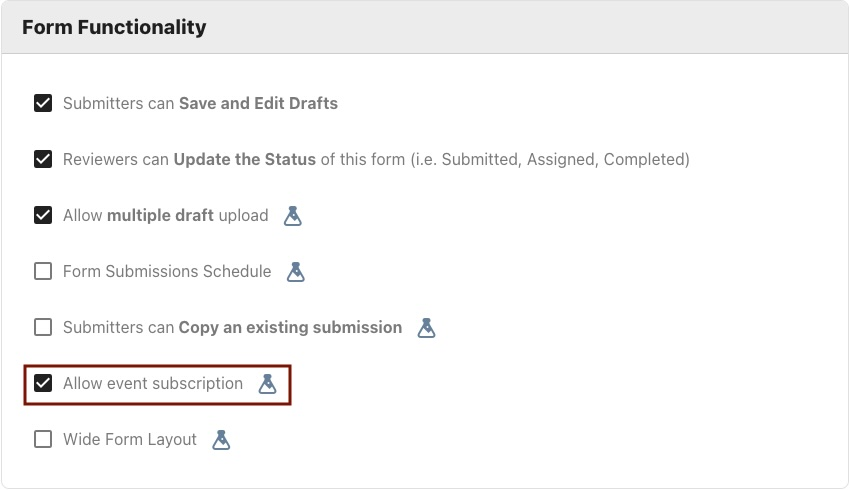
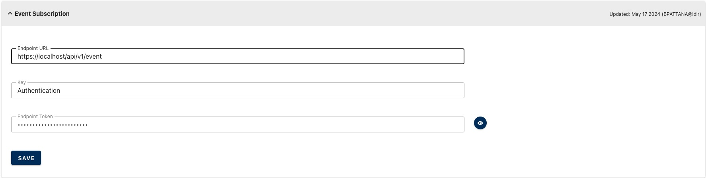

[Home](index) > [Capabilities](Capabilities) > [Integrations](Integrations) > **Event Subscription** 
***  

CHEFS includes the Event Subscription feature, which can call an external endpoint and send submission metadata whenever a form is submitted. This page provides details on Event Subscription, including how to configure it and the different events that trigger calls to the external endpoint.

Event Subscription is available for configuration to all IDIR users. To configure Event Subscription, the form must be in a published state. After publishing, navigate to the manage form page. In the edit mode of form settings, click on Allow event subscription.



This should add another expandable panel section where Event Subscription parameters can be configured.



* Endpoint URL - This can be any HTTPS endpoint with a POST method that can accept submission data in the format defined below. This endpoint will be called upon the following events with the respective payload.

    * submission of a form, including drafts
   
   ```
    {
        "formId": "ed5f9b10-xxxx-xxxx-xxxx-a6133236564a",
        "formVersion": "1a62dec9-xxxx-xxxx-xxxx-342a1cc138cd",
        "subscriptionEvent": "eventSubmission",
        "submissionId": "974900b1-xxxx-xxxx-xxxx-bcbb02b8b9bd"
    }
    ```

    * unpublish a form

    ```
    {
        "formId": "ed3f9b10-xxxx-xxxx-xxxx-a6133845564a",
        "formVersion": "1a62dec9-xxxx-xxxx-xxxx-362a1cc148cd",
        "subscriptionEvent": "eventFormUnPublished"
    }
    ```
    * publish of a form
    ```
    {
        "formId": "ed3f9b10-xxxx-xxxx-xxxx-a6133846464a",
        "formVersion": "28b7d8e5-xxxx-xxxx-xxxx-1bb46520dd51",
        "subscriptionEvent": "eventFormPublished"
    }
    ```
* Key - Authentication key passed as part of HTTP header while calling the external end point
* Endpoint Token - Authentication token passed as part of HTTP header while calling the external end point

External application behind that above configured API could then retrieve and process the submission or form events like publish and unpublish of form using the [CHEFS APIs](https://submit.digital.gov.bc.ca/app/api/v1/docs). External application can get access to any of their form's data by [generating API Keys.](https://developer.gov.bc.ca/docs/default/component/chefs-techdocs/Capabilities/Data-Management/Generating-API-keys/)


***
[Terms of Use](Terms-of-Use) | [Privacy](Privacy) | [Security](Security) | [Service Agreement](Service-Agreement) | [Accessibility](Accessibility)
