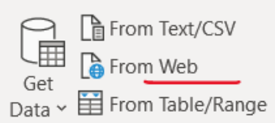
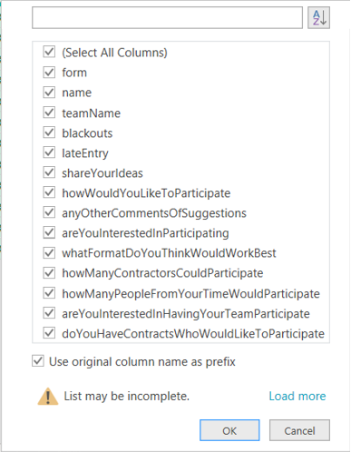
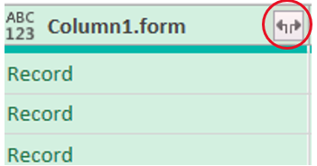
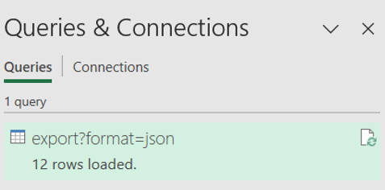
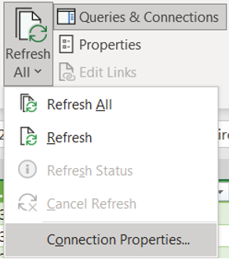

[Home](index) > [Capabilities](Capabilities) > [Integrations](Integrations) > **Excel Power Query Integration**
***

## Excel Integration 

Microsoft Excel is one of many ways to work with form submission data. 

### Excel Power Query 

By getting data from the Web and creating a new Power Query you can work with the submission data. 

### CHEFS Form Information 
You will need this information about your form:   
* The formId. One way to retrieve this is to navigate to your form The URL in the browser window will contain ```.../form?f={formId}```   
* Your form's [API Key](../Data-Management/Generating-API-keys) 

### Query Configuration: Submissions 

* In the ribbon at the top of Excel in the Data menu, select: 
```Get Data > From Other Sources > From Web ```

   

* Enter the following URL replacing the {formId}:  
```https://submit.digital.gov.bc.ca/app/api/v1/forms/{formId}/export?format=json ```
  * Choose ```Basic``` for the authorization type, 
  * For "User name" use your formId and "Password" set to your API Key 
  * In “Select which level to apply these settings to”, choose a URL with the formId included in it so that the password only applies to this form. 

* Double-click the file to open it   
   
* Edit Settings   
   
* Choose Json and OK   
   
* You should now see submission Records   
  
* Convert to a Table   
  


* Now we need to Expand the submission Records. Click the Column Select button:   
   
* Select the columns you’d like to keep and OK   
  
* Scan the columns. Some nested data may need to be expanded further. Follow the same process to expand the data   
   
  
* Expanded data will be listed   
  
* [Transform and/or Combine data](https://support.microsoft.com/en-us/office/about-power-query-in-excel-7104fbee-9e62-4cb9-a02e-5bfb1a6c536a) (optional, e.g. parse dates, format text, filter form version, etc)   
* Close and Load the data 
  
* Edit the query if needed   
  
* Refresh data on demand, or review Connection Properties to set a refresh schedule   
  

***
[Terms of Use](Terms-of-Use) | [Privacy](Privacy) | [Security](Security) | [Service Agreement](Service-Agreement) | [Accessibility](Accessibility)