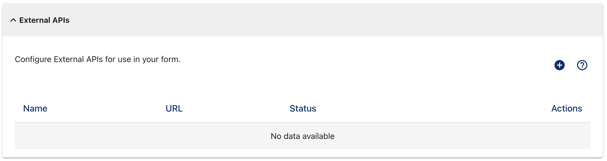
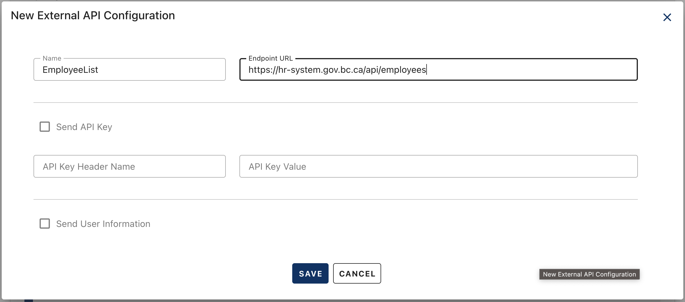
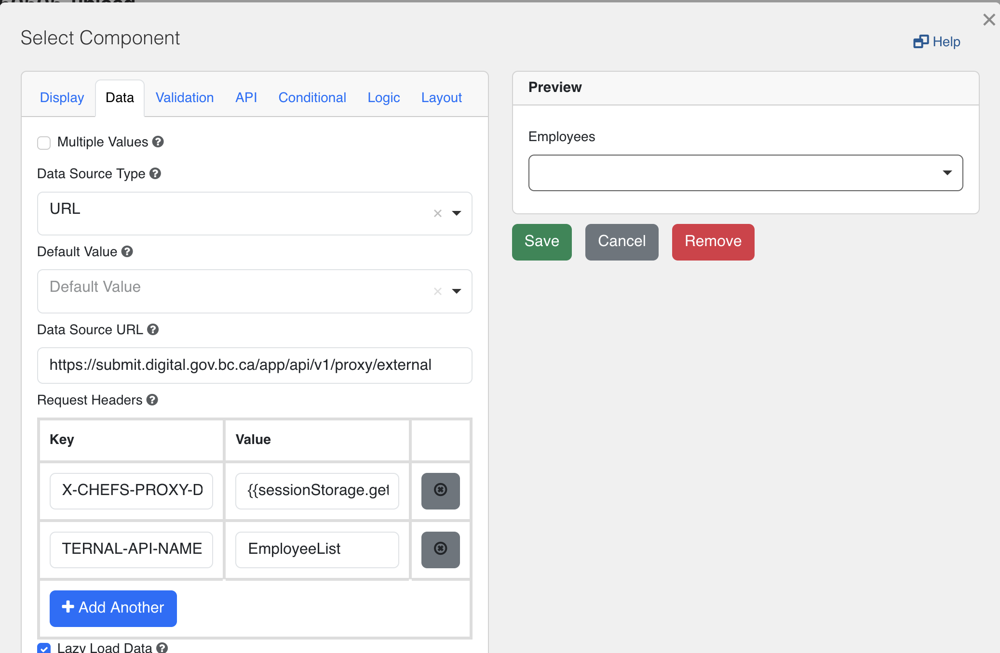
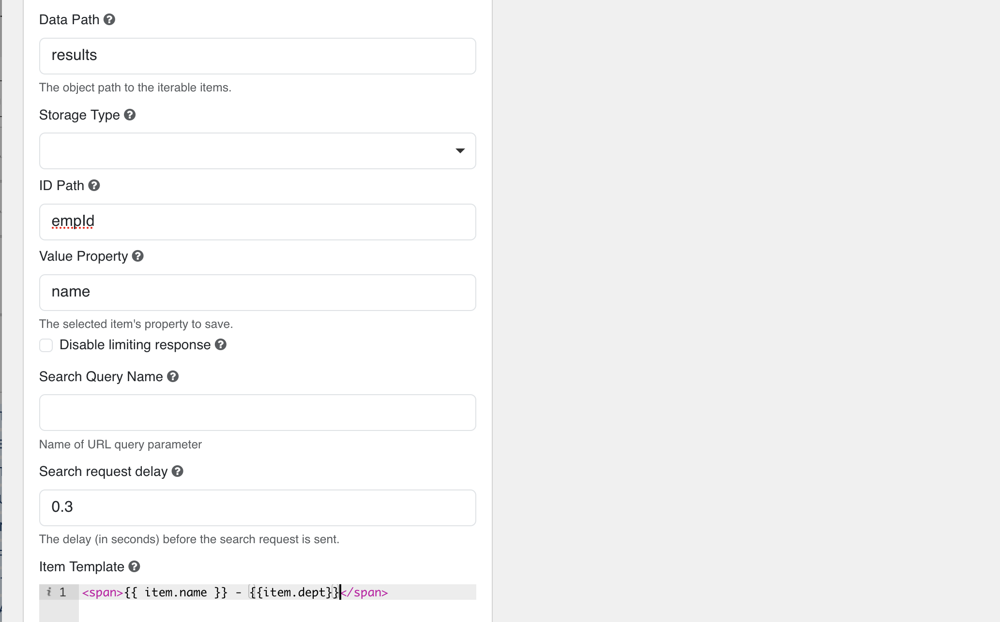
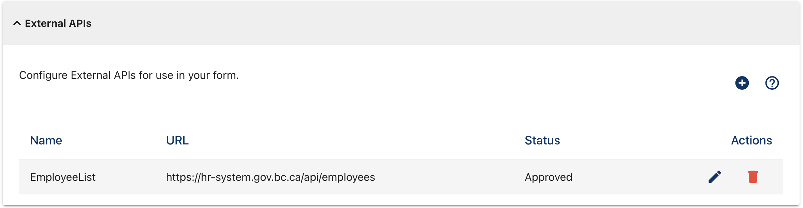
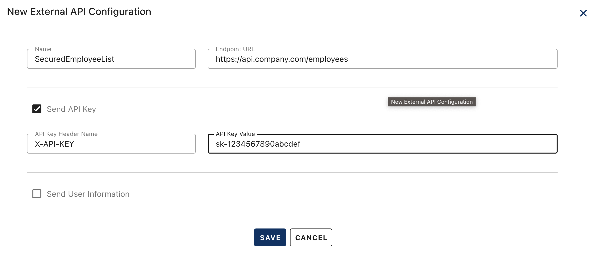
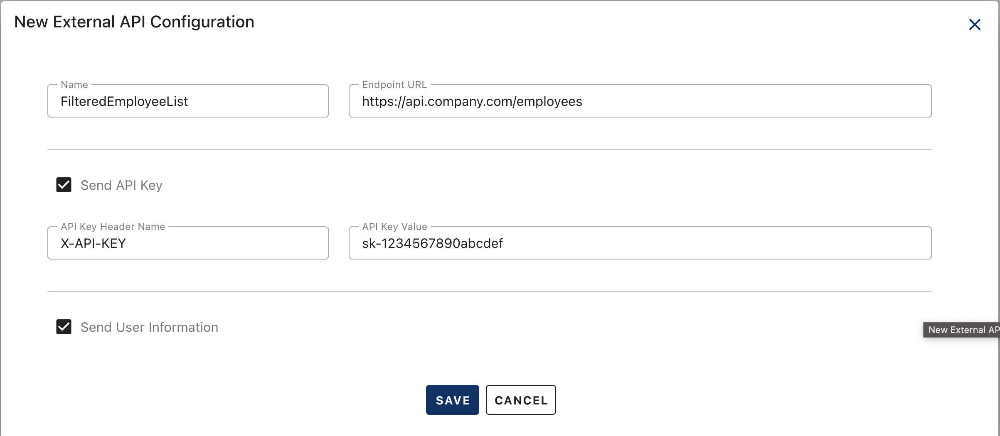

[Home](index) > [Capabilities](Capabilities) > [Integrations](Integrations) > **Getting Live Data in Your Forms**
***  

# Getting Live Data in Your Forms

## The Problem
Do you currently:
- Manually type lists into your forms?
- Copy and paste data from other systems?
- Worry about your form data being outdated?
- Struggle to show different information to different users?
- Have security concerns about sharing sensitive data?

## The Solution
Your form can automatically get live information from other systems - securely and intelligently. This means:
- Your forms always show current data
- Different users see different information based on their access
- Sensitive data stays protected
- No more manual copying and pasting
- No more outdated information

**Important**: This feature can only read information from other systems. It cannot send form data to external systems.

---

## Understanding the Basics

### What is an External API? (The Technical Term)
An "External API" is just the technical name for how your form connects to other systems. Think of it as a secure way for your form to ask another system "What data do you have?" and get the answer back automatically.

**Real-world example**: Instead of updating your form every time a new department is added to your organization, the form automatically shows the current list from your HR system.

**Even better**: You can show different information to different people. For example, a manager might see all departments, while a regular employee only sees departments they have access to.

---

## Understanding Your Options: Two Ways to Connect to Other Systems

Now that you understand the basics, it's important to know that CHEFS offers two ways to connect to external systems:

### Form.io Built-in Connection

- **What it is**: Direct connection to external systems
- **Security concern**: Passwords and access keys are visible to anyone who can see your form
- **When to use**: Only for public information that doesn't require any login or password

### CHEFS Secure Connection (What we're covering here)

- **What it is**: Secure connection that keeps your passwords and access keys private
- **Security benefit**: Your credentials are encrypted and never visible to users
- **Identity verification**: The external system knows exactly who is requesting information
- **When to use**: For any system that requires a password, access key, or needs to know who is making the request

**Recommendation**: Use the secure connection feature (described in this guide) for most situations, as it's more secure and flexible.

---

## Phase 1: Simple Data Reading

The simplest way to use an External API is to read public data from another system.

**Note**: Phase 1 scenarios can also be achieved using Form.io's built-in connection feature. However, using the secure connection feature provides consistency across your forms and makes it easier to add authentication later if needed. For advanced usage patterns, see [Using External API Paths (Gateway Pattern)](#advanced-usage-using-external-api-paths-gateway-pattern).

### When to Use Phase 1

- The external system doesn't require authentication
- You want to display the same data to all users
- You're connecting to public APIs or open data sources

### Examples

- List of provinces and territories
- Public department directories
- Open government datasets
- Weather information
- Public reference data

### Setup Process

Don't worry if this seems complex at first - we'll walk through each step, and you can always ask for help if you get stuck.

#### Step 1: Tell CHEFS Where to Find Your Data

This step is like giving CHEFS the address of the system that has your information. You're telling CHEFS "go to this system and get the data from there."

1. Go to your form's **Manage Form** screen
2. Find and open the **External APIs** section
3. Click the **+** button (hover text: "Create new External API")

<details>
<summary>📷 View screenshot: Manage Form screen</summary>



</details>

4. In the popup, fill in the basic information:
   - **Name**: Give your connection a descriptive name (e.g., "EmployeeList") - this helps you remember what it's for
   - **Endpoint URL**: The web address where the data is located (you'll get this from the system administrator or service provider)

<details>
<summary>📷 View screenshot: Add External API popup</summary>



</details>

5. Click **Save** to submit for approval

#### Step 2: Tell Your Form Component How to Get the Data

This step tells your form component (like a dropdown) how to ask CHEFS for the data you want to display.

1. In the Form Designer, add a **Select** component from the Advanced Fields section
2. In the component settings, go to the **Data** tab
3. Set **Data Source Type** to "URL" (this tells the component to get data from a web address)
4. Set **Data Source URL** to: `{chefs host}/app/api/v1/proxy/external` (this is CHEFS's special address for getting external data)
   - **Production**: `https://submit.digital.gov.bc.ca/app/api/v1/proxy/external`
   - **Test**: `https://chefs-test.apps.silver.devops.gov.bc.ca/app/api/v1/proxy/external`
5. Add these **Request Headers** (this information tells CHEFS which system to use):

| Key | Value |
|-----|-------|
| X-CHEFS-PROXY-DATA | {{sessionStorage.getItem('X-CHEFS-PROXY-DATA')}} |
| X-CHEFS-EXTERNAL-API-NAME | [Your API Name from Step 1] |

<details>
<summary>📷 View screenshot: Select component Data tab</summary>



</details>

6. Configure the display fields (these tell the component how to show the data):
   - **Data Path**: Where in the response the data array is located (where to find the list of items)
   - **ID Path**: Which field contains the unique identifier (the unique code for each item)
   - **Value Property**: Which field contains the display text (what users will see in the dropdown)
   - **Item Template**: How each option should be displayed (the format for showing each item)

<details>
<summary>📷 View screenshot: Select component display fields</summary>



</details>

#### Step 3: Wait for Approval

Your connection will start with a status of **Submitted**. This is normal - the CHEFS team reviews all new external connections to ensure they're secure and appropriate. Once approved, the status will change to **Approved** and your form will be able to use the external data.

**Note**: Requests are actioned ASAP. You can request approval via our [Teams channel](https://teams.microsoft.com/l/channel/19%3A34b9d4b4deb54eebaa9be8bc1ccf02f7%40thread.tacv2/CHEFS%20(Exchange%20Lab%20Team)?groupId=bef8086f-20c7-43a4-bd07-29ce764e818c&tenantId=6fdb5200-3d0d-4a8a-b036-d3685e359adc). You can continue building your form while waiting for approval.

<details>
<summary>📷 View screenshots: External API status changes</summary>




</details>

---

## Phase 2: Connecting to Protected Systems

Many external systems require a password or access key to access their data. This phase shows how to connect to systems that need authentication.

### When to Use Phase 2

- The external system requires an API key for access
- You need to connect to internal or private systems
- The data source has security requirements

### Examples

- Internal HR systems
- Government databases with restricted access
- Third-party services that require authentication
- Business systems with API key protection

### Setup Process

#### Step 1: Get Your Access Information

Contact the system administrator or service provider to obtain:

- The access key or password value
- The header name the system expects (often "X-API-KEY" or "Authorization")
- Whether to use the "Bearer" prefix (for Authorization headers)

**Common Access Key Patterns:**
- **X-API-KEY**: `your-access-key-here`
- **Authorization Bearer**: `Bearer your-long-lived-token-here`

**Note**: Use long-lived tokens for external connections, as they provide stable access to your external systems. These are system-level tokens, not user authentication tokens.


#### Step 2: Set Up the Secure Connection

1. Follow the same steps as Phase 1, but also configure the access key settings:
   - Check the **Send API Key** checkbox
   - Enter the **API Key Header Name** (e.g., "X-API-KEY" or "Authorization")
   - Enter the **API Key Value** (your actual access key or "Bearer your-token" for Authorization headers)

<details>
<summary>📷 View screenshot: API Key configuration</summary>



</details>

#### Step 3: Set Up Your Form Component

The form component configuration is identical to Phase 1. The access key is automatically included in requests to the external system.

---

## Phase 3: User-Specific Data

The most advanced use of secure connections allows you to show different data to different users based on their identity and permissions.

### When to Use Phase 3

- Different users should see different data from the same endpoint
- You need to filter data based on user roles or permissions
- The external system supports user-based filtering

### Examples

- Show only departments the user has access to
- Display user-specific project lists
- Filter data based on user's organization or role
- Personal dashboards with user-specific information

### Setup Process

#### Step 1: Configure the External API

1. Follow the steps from Phase 1 or 2
2. Check the **Send User Information** checkbox

<details>
<summary>📷 View screenshot: User Information configuration</summary>



</details>

#### Step 2: Configure Your Form Component

The form component configuration remains the same. CHEFS will automatically include user information in the request headers.

#### Step 3: Configure Your External System

Your external system needs to be configured to:

- Read the user information from the request headers
- Filter or return data based on the user's identity
- Handle the user context appropriately

### User Information Provided

When **Send User Information** is enabled, CHEFS provides the following information to your external system:

**Note**: Not all headers may be present in every request, as the available information varies depending on the user's authentication method and system configuration. CHEFS provides the limited information available from the user's token to help external systems identify and authorize the user appropriately.

| Information | Header Name | Example |
|-------------|-------------|---------|
| Form ID | X-CHEFS-FORM-FORMID | The current form identifier |
| Form Version ID | X-CHEFS-FORM-VERSIONID | The current form version identifier |
| Submission ID | X-CHEFS-FORM-SUBMISSIONID | The current submission identifier (only on submissions) |
| User ID | X-CHEFS-USER-USERID | User ID from the identity provider |
| Username | X-CHEFS-USER-USERNAME | Login name (e.g., ASMITTY) |
| Full Name | X-CHEFS-USER-FULLNAME | User's full name |
| Email | X-CHEFS-USER-EMAIL | User's email address |
| Organization | X-CHEFS-USER-IDP | Identity provider (e.g., 'idir') |
| Token Subject | X-CHEFS-TOKEN-SUB | Current User Subject (id) |
| Token Issued At | X-CHEFS-TOKEN-IAT | When token issued |
| Token Expiry | X-CHEFS-TOKEN-EXP | When token expires |

---

## Advanced Usage: Using External API Paths (Gateway Pattern)

The `X-CHEFS-EXTERNAL-API-PATH` header allows you to use one secure connection configuration to access multiple endpoints from the same system. This is especially useful when you have many APIs that share the same base URL and authentication.

### What is the Gateway Pattern?

Instead of creating a separate secure connection for each endpoint, you create one secure connection with a base URL (like `https://api.yourcompany.com/`), then use the `X-CHEFS-EXTERNAL-API-PATH` header to specify which specific endpoint to call.

**Example**: If your secure connection is configured with base URL `https://api.yourcompany.com/`, you can call:
- `https://api.yourcompany.com/departments` by setting `X-CHEFS-EXTERNAL-API-PATH` to `/departments`
- `https://api.yourcompany.com/users` by setting `X-CHEFS-EXTERNAL-API-PATH` to `/users`
- `https://api.yourcompany.com/projects/123` by setting `X-CHEFS-EXTERNAL-API-PATH` to `/projects/123`

### When to Use the Gateway Pattern
- You have multiple APIs from the same system
- All APIs share the same base URL and authentication
- You want to minimize the number of secure connection configurations
- You need to call different endpoints dynamically

### Benefits
- **One approval process**: Only need to get one secure connection approved
- **Consistent authentication**: Same API key or credentials for all endpoints
- **Easier management**: One configuration to maintain instead of many
- **Flexibility**: Can call any endpoint without creating new secure connections

### How to Use

#### Step 1: Configure the Gateway Secure Connection
Create a secure connection with the base URL of your API system (e.g., `https://api.yourcompany.com/`).

#### Step 2: Add the Path Header
In your form component or JavaScript, add the `X-CHEFS-EXTERNAL-API-PATH` header with the specific endpoint path:

**For Select components:**
| Key | Value |
|-----|-------|
| X-CHEFS-PROXY-DATA | {{sessionStorage.getItem('X-CHEFS-PROXY-DATA')}} |
| X-CHEFS-EXTERNAL-API-NAME | [Your Gateway API Name] |
| X-CHEFS-EXTERNAL-API-PATH | `/departments` |

**For JavaScript:**
```javascript
headers: {
  "X-CHEFS-PROXY-DATA": sessionStorage.getItem('X-CHEFS-PROXY-DATA'),
  "X-CHEFS-EXTERNAL-API-NAME": "CompanyAPI",
  "X-CHEFS-EXTERNAL-API-PATH": `/users/${userId}`
}
```

### Real-World Example
A government department might have one secure connection configured for their internal systems (`https://internal.gov.bc.ca/api/`), then use different paths to access:
- `/departments` - List of departments
- `/employees/{id}` - Employee information
- `/projects/{id}/members` - Project team members
- `/locations` - Office locations

All using the same secure connection configuration and authentication!

---

## Advanced Usage: Using Secure Connections with Other Components

The secure connection feature can be used with any Form.io component that supports JavaScript, not just Select components. This allows you to create custom logic and use external data in more sophisticated ways.

### When to Use Advanced Usage

- You need to flexibility on how and when to call for external data
- You want to perform calculations with external data
- You need custom logic based on external information
- You're using components that don't have built-in data source options

### Examples

- Hidden components that fetch and store external data
- Custom calculations using external data
- Conditional logic based on external system responses
- Pre-populating fields with external data

### Setup Process

#### Step 1: Configure the Secure Connection

Follow the same steps as in the phases above to configure your secure connection.

#### Step 2: Add JavaScript to Your Component

Add JavaScript code to your component that calls the CHEFS proxy endpoint and handles the response.

This example shows how to use a secure connection in a Hidden component to look up party information:

```
let partyId = utils.getValue(instance.root.submission, 's2_PartyID');
const formId = "bd436b77-cf3f-455f-b0f2-48238381e5f8";
const url = "https://submit.digital.gov.bc.ca/app/api/v1/proxy/external";
const envId = "2b157a04-6d13-f9d6-3c39-cad3bb584b8b"; // Match Env

Formio.fetch(url, { 
    headers: {
      "Content-Type": "application/json",
      "X-CHEFS-PROXY-DATA": sessionStorage.getItem('X-CHEFS-PROXY-DATA'),
      "X-CHEFS-EXTERNAL-API-NAME": "EnvPartyLookup",
      "X-CHEFS-EXTERNAL-API-PATH":  `/api/v1/chefs/${envId}?partyId=${partyId}&formId=${formId}`
    }
  })
.then(response => response.json())
  .then(result => {
      const errorCounter = instance.root.getComponent(['partyDetails', 's2_HiddenErrorCounter']);
      const initializedState = instance.root.getComponent(['partyDetails', 's2_HiddenInitializationState']);

      initializedState.setValue(1);

      // Check for a valid response
      if (result && result.PartyName) {
          // Successful lookup
          instance.data._partyLookupData = result; // Assign the valid result
          instance.root.checkData(); // Revalidate the form
          errorCounter.setValue(-1); // Set error counter to -1 for success
      } else {
          // Invalid response (doesn't contain PartyName)
          instance.root.setValue(['partyDetails', 's2_PartyID'], ''); // Clear invalid input
          instance.data._partyLookupData = {}; // Clear _partyLookupData
          const currentCounter = parseInt(errorCounter.getValue()) || 0; // Get current counter value
          errorCounter.setValue(currentCounter + 1); // Increment error counter
      }
  })
  .catch(error => {
      // Handle network or fetch errors
      console.error('Error fetching data:', error);

      const errorCounter = instance.root.getComponent(['partyDetails', 's2_HiddenErrorCounter']);
      const initializedState = instance.root.getComponent(['partyDetails', 's2_HiddenInitializationState']);

      initializedState.setValue(1); // Mark as initialized for any interaction
      instance.data._partyLookupData = {}; // Clear _partyLookupData
      const currentCounter = parseInt(errorCounter.getValue()) || 0; // Get current counter value
      errorCounter.setValue(currentCounter + 1); // Increment error counter
  });
```

This code:

- Reads a value (`partyId`) from another form component
- Calls the secure connection with the required headers
- Leverages `X-CHEFS-EXTERNAL-API-PATH` header to call a specific endpoint
- Handles successful responses by storing the data and updating form state
- Manages errors by clearing invalid data and tracking error counts
- Updates form validation and initialization states

---

## Troubleshooting

### Common Issues and Solutions

#### "400 Bad Request" Error

- **Cause**: Missing or incorrect request headers
- **Solution**: Verify all required headers are configured in your Select component

#### "407 Proxy Authentication Required" Error

- **Cause**: Secure connection is not yet approved
- **Solution**: Wait for approval or contact the CHEFS team

#### "502 Bad Gateway" Error

- **Cause**: The external system is not responding
- **Solution**: Check that your endpoint URL is correct and the external system is available

#### "500 Internal Server Error" Error

- **Cause**: Unexpected CHEFS server error
- **Solution**: Contact the CHEFS team for assistance

### Testing Your Configuration

1. **Check Connection Status**: Ensure your secure connection shows "Approved" status
2. **Verify Headers**: Confirm all required headers are configured in your Select component
3. **Test Endpoint**: Verify your endpoint URL works independently
4. **Check Response Format**: Ensure your external system returns data in the expected format

### Getting Help

If you encounter issues:

1. Check the error messages in your browser's developer tools
2. Verify your configuration matches the examples above
3. Contact the CHEFS team with specific error details

---

## Best Practices

### Security

- Use API keys for sensitive data
- Keep API keys secure and don't share them
- Regularly rotate API keys when possible

### Performance

- Keep response times reasonable (under 5 seconds)
- Use appropriate data formats (JSON recommended)
- Consider caching for frequently accessed data

### Data Format

- Return data in JSON format
- Use consistent field names
- Include both ID and display value fields
- Handle empty or error responses gracefully

### Naming Conventions

- Use descriptive names for your secure connections
- Follow consistent naming patterns
- Document your connection configurations for team members
