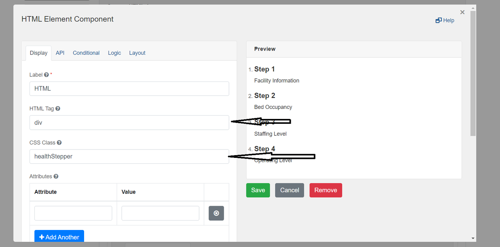
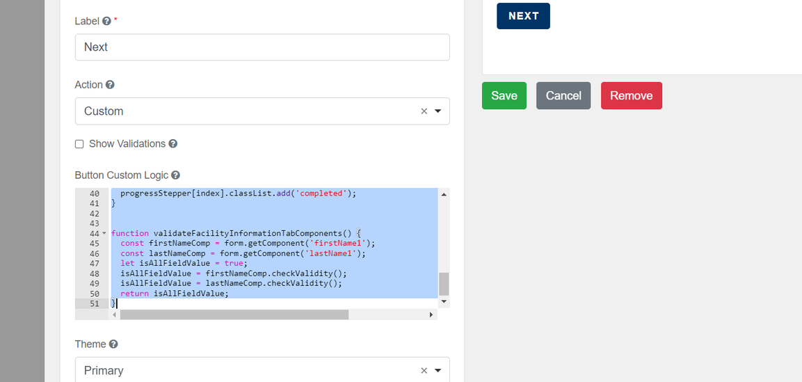
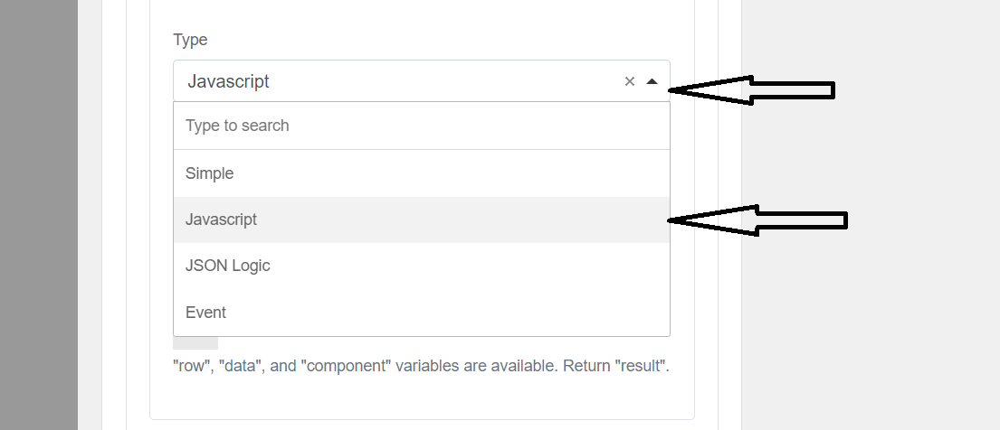
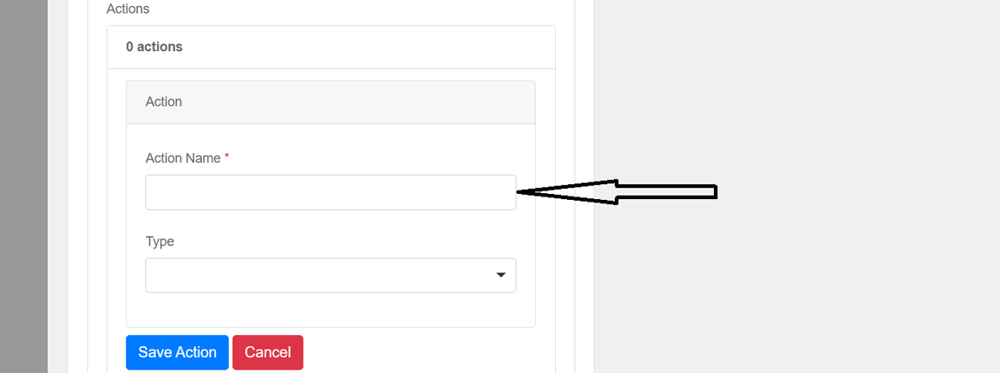
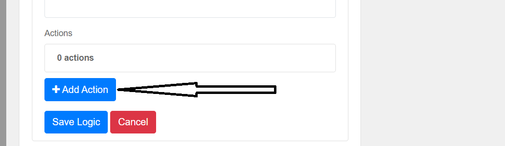
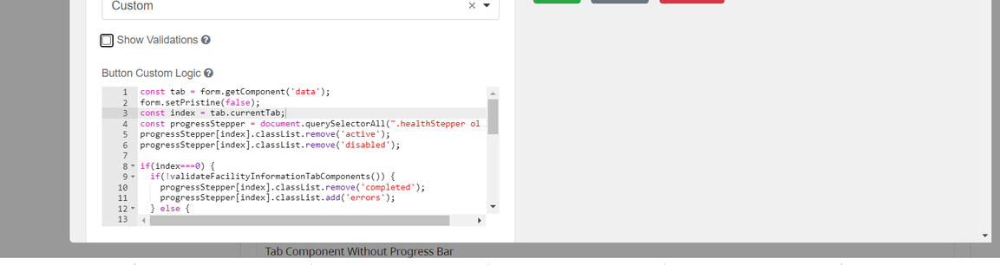
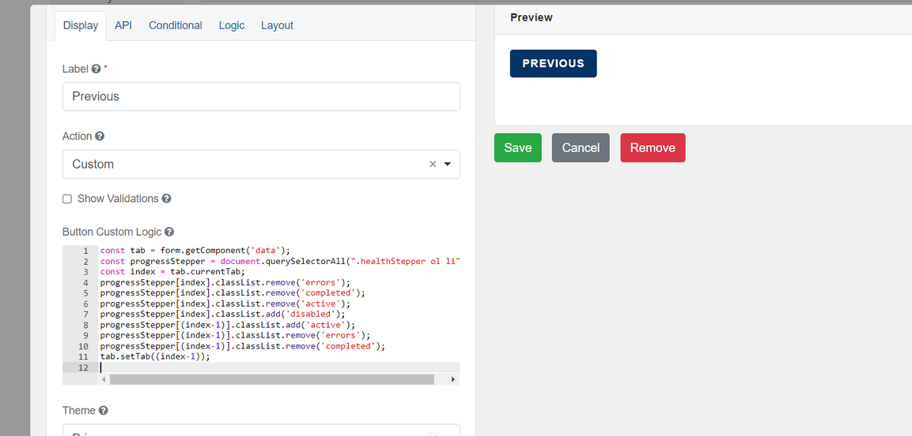
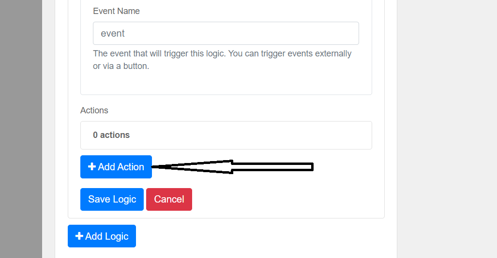
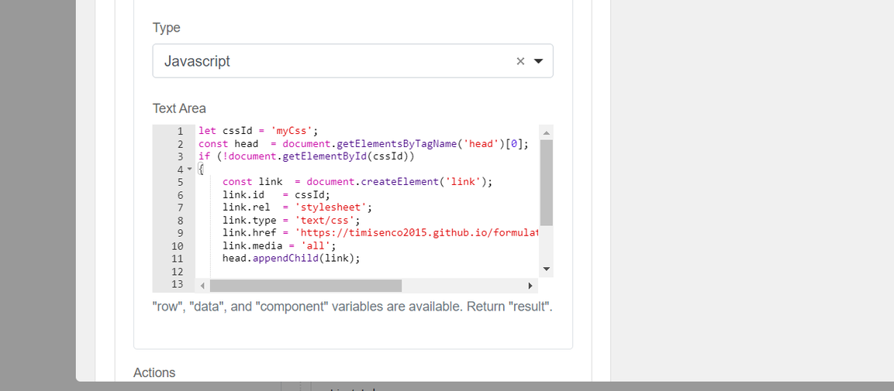
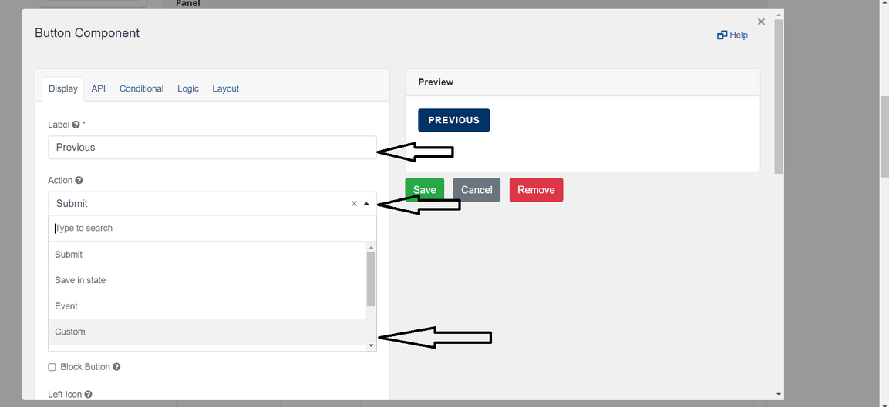

[Home](index) > [Components](Components) > [Custom](Custom) > **Advanced Progress Bar**
***

## Examples
> Try a working example<br>
> [View Example: Progress Bar with Validation](https://submit.digital.gov.bc.ca/app/form/submit?f=e7cb5ddd-1c24-4437-a7fd-85326713013f)
> [View Example: Progress Bar Using Layout](https://submit.digital.gov.bc.ca/app/form/submit?f=cd5eb16b-1565-419c-bed6-387281c066fc)
> [View Example: Progress Bar Using Layout with Validation](https://submit.digital.gov.bc.ca/app/form/submit?f=655438f6-40d9-475a-bc4f-bfe76d9a04b3)


> Download this example file and [import](Importing-and-exporting-form-designs) it into your design<br>
>  [example_progress_bar_with_validation_schema.json](../examples/example_progress_bar_with_validation_schema.json){:download="example_progress_bar_with_validation_schema.json"}<br>
>  [example_progress_bar_using_layout_schema.json](../examples/example_progress_bar_using_layout_schema.json){:download="example_progress_bar_using_layout_schema.json"}<br>
>  [example_progress_bar_using_layout_with_validation_schema.json](../examples/example_progress_bar_using_layout_with_validation_schema.json){:download="example_progress_bar_using_layout_with_validation_schema.json"}

---
## Advanced Progress Bar (Tutorial)

A custom progress bar can be added to the form to enhance the user experience and indicate the remaining steps within the form. More features have been added to advance the functionalities of the progress bar.

**Features added**

- ability to perform validity checks on all the components ( e.g. input component) in each tab component
- ability to indicate error colour in case the validity checks fail
- each progress bar step has a title that corresponds with the title of each tab of the tab component

### Type A: Progress Bar with Tab Component

This Progress Bar is designed to work with Tab Component, and with the Next and Previous Buttons


**Step 1**: Start by dragging an ‘HTML Component’ into the form builder.

**Step 2**: change the ‘HTML tag’ field from `p` to `div`, and in the ‘Display’ tag enter a unique and custom class name in the ‘CSS Class'. In this screenshot, we used `healthStepper`



**Step 3**: Copy the following code into the ‘Content’ section

```
<ol class="c-stepper">
    <li class="c-stepper__item active">
        <h3 class="c-stepper__title">Step 1</h3>
        <p class="c-stepper__desc">Facility Information</p>
    </li>
    <li class="c-stepper__item disabled">
        <h3 class="c-stepper__title">Step 2</h3>
        <p class="c-stepper__desc">Bed Occupancy</p>
    </li>
     <li class="c-stepper__item disabled">
        <h3 class="c-stepper__title">Step 3</h3>
        <p class="c-stepper__desc">Staffing Level</p>
    </li>
     <li class="c-stepper__item disabled">
        <h3 class="c-stepper__title">Step 4</h3>
        <p class="c-stepper__desc">Operating Level</p>
    </li>
    <!-- Other steps -->
</ol>
```


**Step 4**: Click on the ‘Logic’ tab and click on the ‘Add Logic’ button



**Step 5**: Enter any name as the 'Logic Name'


**Step 6**: In ‘Trigger' section, click on ‘Type’ dropdown menu, and select 'Javascript’



**Step 7**: Click “Add Action“ button


**Step 8**: Enter any name in “Action Name“



**Step 9**: In ‘Trigger' section, click on ‘Type’ dropdown menu, and select 'Javascript’


**Step 10**: Copy the following code into the ‘Text Area’ section

```
let cssId = 'myCss'; 
const head  = document.getElementsByTagName('head')[0];
if (!document.getElementById(cssId))
{
    const link  = document.createElement('link');
    link.id   = cssId;
    link.rel  = 'stylesheet';
    link.type = 'text/css';
    link.href = 'https://bcgov-citz-ccft.github.io/forminators/customprogresssteppercss/chefsCustomCss.css';
    link.media = 'all';
    head.appendChild(link);
}
```


**Step 11**: Click on ‘Save Logic’ and then ‘Save’ the component.

**Step 12**: Next, add a ‘Tabs’ component from the ‘Advanced Fields’ into the builder

**Step 13**: Enter a unique name in the label field. 


**Step 14**: Add as many tabs as you want and details for each tab added


**Step 15**: Under the ‘Logic’ tab, click on the ‘Add Logic’ button and add any ‘Logic Name’


**Step 16**: Under 'Logic Name', enter any name. Under ‘Trigger', select ‘Type’ dropdown menu, and select 'Event’


**Step 17**: enter “change“ in the “Event Name“ field and click on “Add Action“ button


**Step 18**: Click on the “Add Action“ Button



**Step 19**: enter any name in the “Action Name“ field, select the “Type“ dropdown menu, and select the “Custom Action“


**Step 20**: paste the following code into the “Custom Action (Javascript)“ field

```
const { root} = instance;
root.setPristine(false);

const comp = root ? root.getComponent('data') : null;
const index = comp.currentTab;

const progressStepper = document.querySelectorAll(".healthStepper ol li");
leftOfIndex(index);

rightOfIndex(index, progressStepper.length)
progressStepper[index].classList.remove('errors');
progressStepper[index].classList.remove('disabled');
progressStepper[index].classList.add('active');
progressStepper[index].classList.remove('completed');


function leftOfIndex(index){
  for(let i=0; i<index; i++) {
    if(i===0) {
      if(!validateFacilityInformationTabComponents()) {
        progressStepper[i].classList.remove('completed');
        progressStepper[i].classList.remove('disabled');
        progressStepper[i].classList.remove('active');
        progressStepper[i].classList.add('errors');
      } else {
        progressStepper[i].classList.remove('errors');
        progressStepper[i].classList.remove('disabled');
        progressStepper[i].classList.remove('active');
        progressStepper[i].classList.add('completed');
      } 
    } else {
      progressStepper[i].classList.remove('errors');
      progressStepper[i].classList.remove('disabled');
      progressStepper[i].classList.remove('active');
      progressStepper[i].classList.add('completed');
    }
  }
}
function rightOfIndex(index, endIndex){
  for (let i=(endIndex-1); i>index; i--){
    progressStepper[i].classList.remove('completed');
    progressStepper[i].classList.remove('errors');
    progressStepper[i].classList.remove('active');
    progressStepper[i].classList.add('disabled');
  }
}

function validateFacilityInformationTabComponents() {
  const firstNameComp = root.getComponent('firstName');
  const lastNameComp = root.getComponent('lastName');
  let isAllFieldValue = true;
  isAllFieldValue = firstNameComp.checkValidity();
  isAllFieldValue = lastNameComp.checkValidity();
  return isAllFieldValue;
}
```


> **Note**

> Change the ‘data' in the `root.getComponent('data')` to the name you entered in the “label” field of the Tab Component in Step 13

> ```
> const comp = root ? root.getComponent('data') : null;
> ```

> Change the 'healthStepper' in the `document.querySelectorAll(".healthStepper ol li")` to the name you enter in the “CSS Class“ field in Step 2

> ```
> const progressStepper = document.querySelectorAll(".healthStepper ol li");
> ```

> In this demo, we are only validating two input components in the first tab of the TabComponent which is why the line of code if the index is equal to zero `if(i===0){`

> The lines of codes below read the two input components in the first tab of the TabComponent and execute a validity check on them. See Step 2 for reference.

> ```
> function validateFacilityInformationTabComponents() {
>   const firstNameComp = root.getComponent('firstName');
>   const lastNameComp = root.getComponent('lastName');
>   let isAllFieldValue = true;
>   isAllFieldValue = firstNameComp.checkValidity();
>   isAllFieldValue = lastNameComp.checkValidity();
>   return isAllFieldValue;
> }
> ```

**Step 21**: Drag the button component to the builder, and change the label to “Next“. Under “Action“, click the dropdown and change select “Custom“


**Step 22**: Copy the following code into “Button Custom Logic“ field

```
const tab = form.getComponent('data');
form.setPristine(false);
const index = tab.currentTab;
const progressStepper = document.querySelectorAll(".healthStepper ol li");
progressStepper[index].classList.remove('active');
progressStepper[index].classList.remove('disabled');

if(index===0) {
  if(!validateFacilityInformationTabComponents()) {
    progressStepper[index].classList.remove('completed');
    progressStepper[index].classList.add('errors');
  } else {
    progressStepper[index].classList.remove('errors');
    progressStepper[index].classList.add('completed');
  }
}

progressStepper[(index+1)].classList.add('active');
progressStepper[(index+1)].classList.remove('disabled');
progressStepper[(index+1)].classList.remove('errors');
progressStepper[(index+1)].classList.remove('completed');
tab.setTab((index+1)); 


function validateFacilityInformationTabComponents() {
  const firstNameComp = form.getComponent('firstName');
  const lastNameComp = form.getComponent('lastName');
  let isAllFieldValue = true;
  isAllFieldValue = firstNameComp.checkValidity();
  isAllFieldValue = lastNameComp.checkValidity();
  return isAllFieldValue;
}
```




> **Note**

> Change the ‘data' in the `form.getComponent('data')` to the name you entered in the “label” field of the TabComponent in Step 13

> ```
> const tab = form.getComponent('data');
> ``` 

> Change the 'healthStepper' in the `document.querySelectorAll(".healthStepper ol li")` to the name you entered in the “CSS Class“ field in Step 2

> ```
> const progressStepper = document.querySelectorAll(".healthStepper ol li");
> ```

**Step 23**: Drag a button component to the builder, and change the label to “Previous“. Under “Action“, click the dropdown and change select “Custom“


**Step 24**: Copy the following code into “Button Custom Logic“ field

```
const tab = form.getComponent('data');
const progressStepper = document.querySelectorAll(".healthStepper ol li");
const index = tab.currentTab;
progressStepper[index].classList.remove('errors');
progressStepper[index].classList.remove('completed');
progressStepper[index].classList.remove('active');
progressStepper[index].classList.add('disabled');
progressStepper[(index-1)].classList.add('active');
progressStepper[(index-1)].classList.remove('errors');
progressStepper[(index-1)].classList.remove('completed');
tab.setTab((index-1));
```



> **Note**

> Change the ‘data' in the `form.getComponent('data')` to the name you entered in the “label” field of the TabComponent in Step 13

> ```
> const tab = form.getComponent('data');
> ``` 

> Change the 'healthStepper' in the `document.querySelectorAll(".healthStepper ol li")` to the name you entered in the “CSS Class“ field in Step 2

> ```
> const progressStepper = document.querySelectorAll(".healthStepper ol li");
> ```

---

### Type B: Progress Bar with any Layout Component

This Progress Bar is designed to work with any layout component and with the Next and Previous Buttons. Its functionality has been developed almost similarly to Formio Wizard.  You switch between each layout using the Previous and Next buttons. It uses the `hide` attribute of each layout by setting it to true or false and using the triggerRedraw function to redraw the component to the screen.


**Step 1**: Start by dragging an ‘HTML Component’ into the form builder.

**Step 2**: change the ‘HTML tag’ field from `p` to `div`, and in the ‘Display’ tag enter a unique and custom class name in the ‘CSS Class. In this screenshot, we used `healthStepper`


**Step 3**: Copy the following code into the ‘Content’ section

```
<ol class="c-stepper">
    <li class="c-stepper__item active">
        <h3 class="c-stepper__title">Step 1</h3>
        <p class="c-stepper__desc">Facility Information</p>
    </li>
    <li class="c-stepper__item disabled">
        <h3 class="c-stepper__title">Step 2</h3>
        <p class="c-stepper__desc">Bed Occupancy</p>
    </li>
     <li class="c-stepper__item disabled">
        <h3 class="c-stepper__title">Step 3</h3>
        <p class="c-stepper__desc">Staffing Level</p>
    </li>
     <li class="c-stepper__item disabled">
        <h3 class="c-stepper__title">Step 4</h3>
        <p class="c-stepper__desc">Operating Level</p>
    </li>
    <!-- Other steps -->
</ol>
```


**Step 4**: Click on the ‘Logic’ tab and click on the ‘Add Logic’ button


**Step 5**: Enter any Logic Name


**Step 6**: In ‘Trigger' section, click on ‘Type’ dropdown menu, and select 'Javascript’


**Step 7**: Click “Add Action“ button



**Step 8**: Enter any name in “Action Name“


**Step 9**: In ‘Trigger' section, click on ‘Type’ dropdown menu, and select 'Javascript’


**Step 10**: Copy the following code into the ‘Text Area’ section

```
let cssId = 'myCss'; 
const head  = document.getElementsByTagName('head')[0];
if (!document.getElementById(cssId))
{
    const link  = document.createElement('link');
    link.id   = cssId;
    link.rel  = 'stylesheet';
    link.type = 'text/css';
    link.href = 'https://bcgov-citz-ccft.github.io/forminators/customprogresssteppercss/chefsCustomCss.css';
    link.media = 'all';
    head.appendChild(link);
}
```



**Step 11**: Click on ‘Save Logic’ and then ‘Save’ the component.

**Step 12**: Next, add a ‘Tabs’ component from the ‘Advanced Fields’ into the builder

**Step 13**: Drag a button component to the builder, and change the label to “Previous“. Under “Action“, click the dropdown and change select “Custom“



**Step 14**: Copy the following code into “Button Custom Logic“ field

```
const componentList = ["facilityInformationPanel", "bedOccupancyPanel","staffingLevelPanel",
"operatingLevelPanel"];

const stepperssHiddenValue = form.getComponent('stepperssHiddenValue');
const index = parseInt(stepperssHiddenValue.getValue());

const progressStepper = document.querySelectorAll(".multiComponentStepper ol li");

progressStepper[index].classList.remove('completed');
progressStepper[index].classList.remove('errors');
if(index===0){
  const currentComponent =form.getComponent(componentList[index]);
  currentComponent.hidden=false;
  currentComponent.component.hidden=false;
  currentComponent.triggerRedraw();
  progressClassName(index);
  
}else if (index>0){
  const currentComponent =form.getComponent(componentList[index]);
  currentComponent.hidden=true;
  currentComponent.component.hidden=true;
  currentComponent.triggerRedraw();
  
  const previousComponent =form.getComponent(componentList[(index-1)]);
  previousComponent.hidden=false;
  previousComponent.component.hidden=false;
  previousComponent.triggerRedraw();
  progressStepper[index].classList.add('disabled');
  progressStepper[index].classList.remove('active');
  progressStepper[index].classList.remove('completed');
  progressStepper[index].classList.remove('erros');
  if((index-1)===0){
    progressClassName((index-1));
  } else{
     progressClassName(index);
  }
  
  
  stepperssHiddenValue.setValue((index-1));
}

function progressClassName(index){
  if(index===0) {
    progressStepper[index].classList.add('active');
    progressStepper[index].classList.remove('disabled');
    progressStepper[index].classList.remove('errors');
    progressStepper[index].classList.remove('completed');
  } else {
    progressStepper[(index-1)].classList.add('active');
    progressStepper[(index-1)].classList.remove('disabled');
    progressStepper[(index-1)].classList.remove('completed');
    progressStepper[(index-1)].classList.remove('erros');
}
}
```


**Step 15**: Drag a button component to the builder, and change the label to “Next“. Under “Action“, click the dropdown and change select “Custom“


**Step 16**: Copy the following code into “Button Custom Logic“ field

```
const componentList = ["facilityInformationPanel", "bedOccupancyPanel","staffingLevelPanel",
"operatingLevelPanel"];
const stepperssHiddenValue = form.getComponent('stepperssHiddenValue');
const index = parseInt(stepperssHiddenValue.getValue());

const progressStepper = document.querySelectorAll(".multiComponentStepper ol li");


if(index<(parseInt(progressStepper.length)-1)){
  progressStepper[index].classList.remove('active');
  progressStepper[index].classList.remove('disabled');
  if(index===0) {
    if(!validateFacilityInformationTabComponents()) {
      progressStepper[index].classList.remove('completed');
      progressStepper[index].classList.add('errors');
    } else {
      progressStepper[index].classList.remove('errors');
      progressStepper[index].classList.add('completed');
    }
  } else {
    progressStepper[index].classList.remove('errors');
    progressStepper[index].classList.add('completed');
  }

  const currentComponent =form.getComponent(componentList[(index)]);
  currentComponent["hidden"] = true;
  currentComponent.component["hidden"]=true;
  
  const nextComponent =form.getComponent(componentList[(index+1)]);
  nextComponent.hidden=false;
  nextComponent.component.hidden=false;
  nextComponent.triggerRedraw();
  progressStepper[(index+1)].classList.add('active');
  progressStepper[(index+1)].classList.remove('disabled');
  stepperssHiddenValue.setValue((index+1))
} else if(index===(parseInt(progressStepper.length)-1)){
   progressStepper[index].classList.remove('active');
  progressStepper[index].classList.remove('errors');
  progressStepper[index].classList.remove('disabled');
  progressStepper[index].classList.add('completed');
}


function validateFacilityInformationTabComponents() {
  const firstNameComp = form.getComponent('firstName1');
  const lastNameComp = form.getComponent('lastName1');
  let isAllFieldValue = true;
  isAllFieldValue = firstNameComp.checkValidity();
  isAllFieldValue = lastNameComp.checkValidity();
  return isAllFieldValue;
}
```


> **Note**

> Replace this array with an array of layout components you want to hide and show using the “Previous“ and “Next“ button.

> ```
> const componentList = ["facilityInformationPanel", "bedOccupancyPanel","staffingLevelPanel",
> "operatingLevelPanel"];
> ```

<!-- **[Back to top](#top)** -->

***
[Terms of Use](Terms-of-Use) | [Privacy](Privacy) | [Security](Security) | [Service Agreement](Service-Agreement) | [Accessibility](Accessibility)