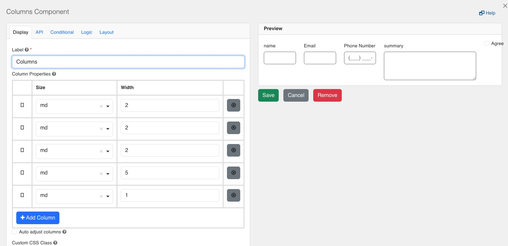
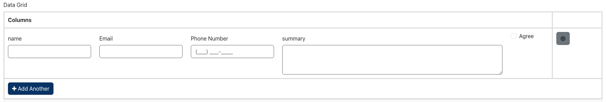

[Home](index) > [Components](Components) > [How-To Guides](how-to-guides) > **Best Practices for Data Grid Components**
***

## Best Practices for Data Grid Components  
Following are some good practices specifically for working with Data Grid components in CHEFS.

### Keep it simple
- Avoid adding too many fields in a single row.
- Ideally, limit it to 4–6 columns per row to maintain readability and even lesser if form is device friendly,

### Use Conditional Add Button Logic

To ensure that users fill all required fields in the current row before they can add another row. You can use the Conditional Add Button setting to write logic such as:

```
show = row.dataGrid.every(entry => entry.name && entry.email && entry.phone);
```

### Column Width and Layout

By default, Data Grid cells don’t have enforced width, which may clutter complex forms. You can fix this by:
- Using Columns layout inside each Data Grid cell to control how much space each field takes.
- Apply responsive Bootstrap grid classes like:

```
col-md-3  → 25% width  
col-md-6  → 50% width  
col-md-9  → 75% width  
col-md-12 → full width
```

This is useful when you want a text area to take up more space and shorter fields like checkboxes or numbers to take less. This keeps the grid organized, prevents UI overlap, and makes long-text inputs easier to read and interact with.

### Example Use Case

In the example below, a row inside a Data Grid includes the following fields:
- `name` (text field)
- `email` (text field)
- `phone number` (phone field)
- `summary` (textarea)
- `agree` (checkbox)

To create a clear and space-efficient layout, the Columns component is configured as follows:

| Field         | Width | Description                          |
|---------------|-------|--------------------------------------|
| Name          | 2     | Compact width for short names        |
| Email         | 2     | Moderate space for email input       |
| Phone Number  | 2     | Enough space to show formatted phone |
| Summary       | 5     | Larger area for textarea input       |
| Agree         | 1     | Small column for checkbox            |

> 💡 The total of all column widths should equal **12** (based on the 12-column grid system). Adjust proportions as needed for your form layout.

 
 

### Avoid Deep Nesting

Avoid nested components like Panels, Columns, and other Data Grids inside a Data Grid row 
- Deep nesting can cause confusion for form designers and users alike.
- It can make logic harder to manage (like conditional logic or validation rules).
- Increases render time and risks unexpected rendering issues.

### Performance Awareness

Performance issues may arise if the data grid contains many rows or complex components with too many components.

Examples of heavy components include:
- Rich text editors
- Embedded maps
- Fields loaded conditionally
- Form logic (JavaScript conditions, calculated values) triggers frequently across the grid.

Tips to improve performance:
- Limit rows, maximum rows can be set within datagid configuration.
- Disable unused features: e.g., uncheck Table View or clear unneeded logic triggers.
- Use hidden fields wisely: Avoid too many hidden fields running calculations on every change using logic tab.
***
[Terms of Use](Terms-of-Use) | [Privacy](Privacy) | [Security](Security) | [Service Agreement](Service-Agreement) | [Accessibility](Accessibility)