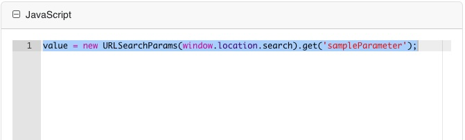

[Home](index) > [Components](Components) > [Custom](Custom) > **Calculated Values**
***

## Examples 
Calculated values allows you to create fields that get filled in for you based on what the user inputs elsewhere.
Use the advanced field of the control you wish to populate with a calculated value.

<!-- **[Back to top](#top)** -->

> Try a working example<br>
> [View example](https://submit.digital.gov.bc.ca/app/form/submit?f=081d9df3-b601-461b-99e7-a26a46331b0c&sampleParameter=1234567)

> Download this example file and [import](Importing-and-exporting-form-designs) it into your design<br>
> [example_calculated_values_schema.json](../examples/example_calculated_values_schema.json){:download="example_calculated_values_schema.json"}
***

## Calculated Values (Tutorial)

<!-- **On the page:**
* [Data](#data)
* [totalling values from a data grid example](#totals-datagrid)
* [Calculated Values](#calculated-values)  -->

## Data
<!-- **[Back to top](#top)** -->

To designate which data values for a selection should be used for calculated values in other fields, use the Data tab.

This option is available in both basic and advanced controls.

### Sum of values from a datagrid - Example
#### Steps to implement:
1. If you have a datagrid containing amounts that you want to sum. Create a field outside of the datagrid and put [the code below](https://github.com/bcgov/common-hosted-form-service-techdocs/edit/main/docs/Components/Custom/Calculated-Values.md#code-for-sum-of-value-from-a-datagrid) into the "Calculated Value" section on the Data tab of the settings for the number or currency component you want to show the grand total in.
2. You will need to make sure that your datagrid name on the API tab is the same as you see in [this code block](https://github.com/bcgov/common-hosted-form-service-techdocs/edit/main/docs/Components/Custom/Calculated-Values.md#code-for-sum-of-value-from-a-datagrid) `budgetDataGrid` which appears in two places.  You can change this to what you want it to be but it has to be the same in both places.
3. You also need to make sure that the name of the components you are want to add values for matches the `row.total` name.   Again you can change both this "total" value and your component's name, but they need to match.
4. The other setting you will need to make is to set the value for the "Redraw on" setting on the Data tab to the field that contains the subtotals in the datagrid.


#### Code for sum of value from a datagrid:
```javascript
let grandTotalVar = 0;
// budgetDataGrid is the name of your data grid
if (Array.isArray(data.budgetDataGrid)) {
  data.budgetDataGrid.forEach(row => {
    // total is the name of your component you want to add up values for
    const subtotal = Number(row.total) || 0;
    grandTotalVar += subtotal;
  });
}
value = grandTotalVar;
```

### Select list example
Drag and drop a `Select List` component into the designer and add some values on the `Data` tab. The label can be what you want the user to see, and the value can be what you would like to be accessible to calculate from in other fields.

 

## Calculated Values
<!-- **[Back to top](#top)** -->

### JavaScript
On the field you wish to display the calculated value, navigate to the `Data` tab.

 

On the Data tab, scroll down to `Calculated Value` and expand the field. There are some useful help references there.

In the `JavaScript` section enter your calculation for the field you wish to display.


With this example you could add up an assigned value for a set of radio buttons and assign each question a weighting:
`value = (data.questionAbc * 5) +  (data.questionDef * 5) +  (data.questionGhi * 5) +  (data.questionJkl * 5)`

You can use this section to create complex calculated values using JavaScript, by referencing one or more existing fields on your form with the data `data.*` variable. You can calculate numerical values, build String values, do conditional logic and much more.

If you need to know the field name for a field you wish to base a calculated value on, look at the API tab and the Property Name box for the name.


### Capture query parameter
To automatically populate a form field with query parameters attached to the URL, go to the Data tab, locate and expand the Custom Default Value section. Then, in the JavaScript segment, input the calculation corresponding to the field you intend to exhibit, in our case something similar. 



One factor to bear in mind is the potential for someone to modify the query parameter in the URL, potentially impersonating a similar value. If this poses a concern, it may be advisable to assign a unique and difficult-to-guess random identifier (such as a UUID) to each parameter. Subsequently, utilize this random identifier within the URL.

***
[Terms of Use](Terms-of-Use) | [Privacy](Privacy) | [Security](Security) | [Service Agreement](Service-Agreement) | [Accessibility](Accessibility)

