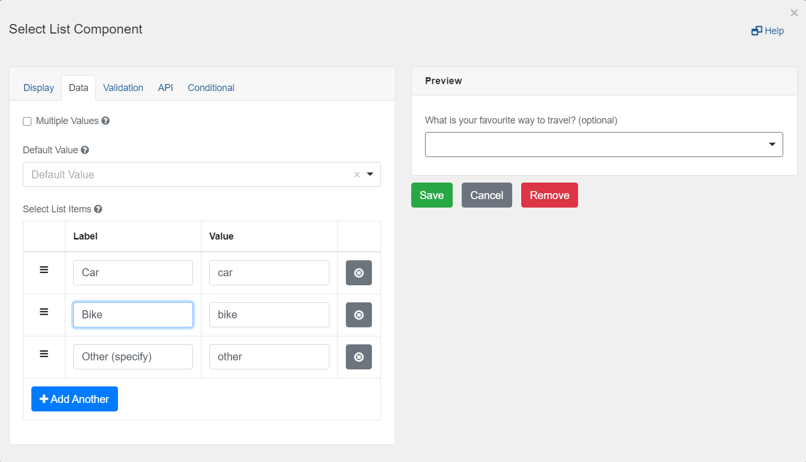
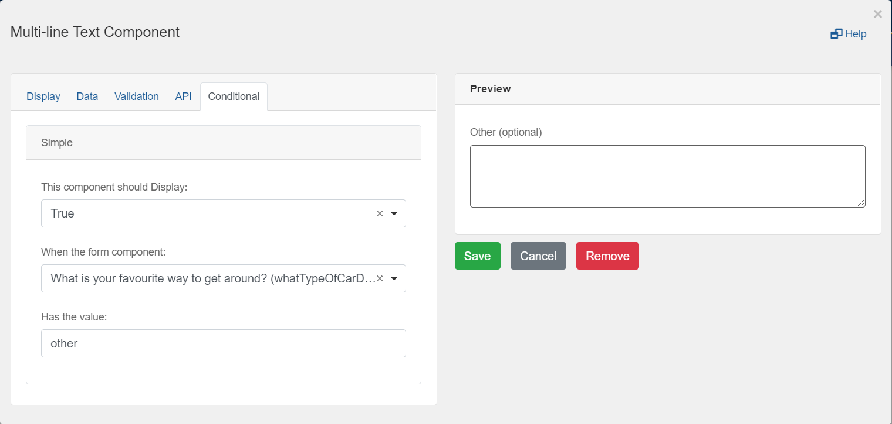
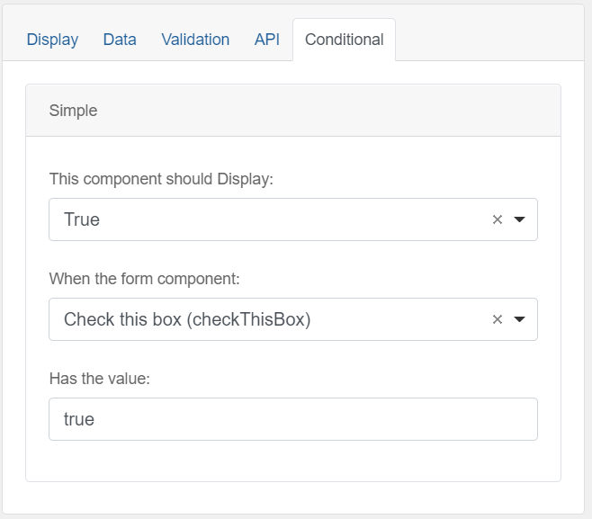
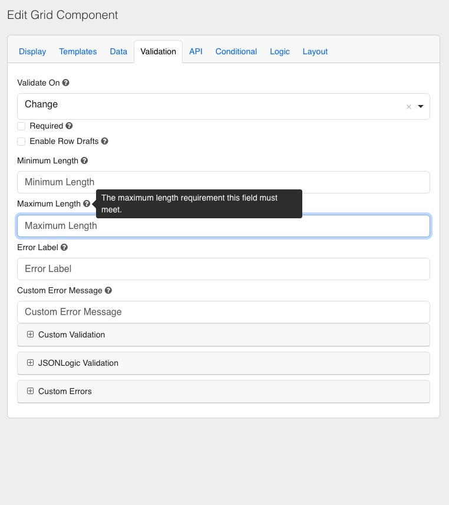
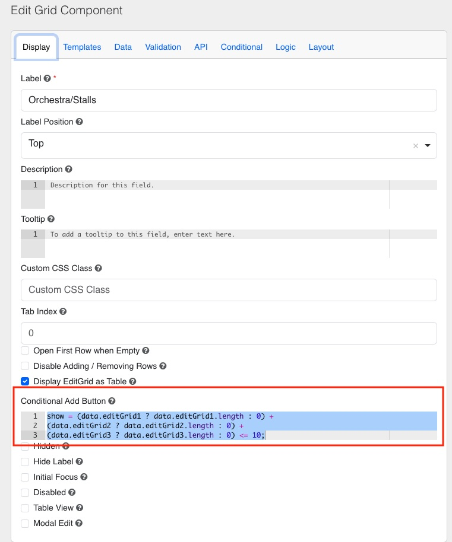

[Home](index) > [Components](Components) > [Custom](Custom) > **Conditional forms fields**
***

## Examples

> Try a working example<br>
> [View example](https://submit.digital.gov.bc.ca/app/form/submit?f=8aa2b9dc-9bc9-48bc-95d2-c3246a609b4b)

> Download this example file and [import](Importing-and-exporting-form-designs) it into your design<br>
> [example_conditional_logic_schema.json](../examples/example_conditional_logic_schema.json){:download="example_conditional_logic_schema.json"}

***

## Conditional forms fields (Tutorial)

You can show or hide components based on choices a user makes while filling out a form.
This can be done by using simple fields or advanced JavaScript logic.

<!-- On this page
* [Simple conditional logic](#Simple-conditional-logic)
* [Advanced conditional logic](#Advanced-conditional-logic) -->


## Simple Conditional Logic
<!-- **[Back to top](#top)** -->

### Select List
Drag and drop a `Select List` component into the designer and add some values on the `Data` tab. Ensure one has the value "other".

 

### Multi-line Text
Drag and drop a `Multi-line Text` component into the designer and go to the `Conditional` tab to select the following options:

 

### Checkbox
The checkbox component will return `true` or `false` as the value. 



### Save and view the form
When you choose "other" from the select list, the "Other" form field will appear.

Conditional logic **does not work** in the form designer view, you must save the form and view it.

## Advanced Conditional Logic
<!-- **[Back to top](#top)** -->

### JavaScript
You can place JavaScript on the Conditional tab in advanced form components to show or hide elements. Here is an example of logic to show or hide a component from choices made in 2 other form fields.

`show = data.doYouWantToSeeACar && data.areYouSure == "yes";`

The "data" variable is the form data object which includes all of the form fields in the design. Access form components by using the Property Name found on each component's API tab.


The checkbox component will return a `true` or `false`. There is no need to compare it to a value.

## Conditional Limiting Rows on Edit Grid
<!-- **[Back to top](#top)** -->

The **Validation** tab of this Edit Grid component allows you to define specific limits and constraints for user inputs. Here’s an explanation of each setting:

1. **Minimum Length**  
   - Defines the minimum number of characters required for an input field within each row of the Edit Grid.  
   - If the input is shorter than this value, the validation will fail, and an error message can be displayed.

2. **Maximum Length**  
   - Sets the upper limit for the number of characters allowed in an input field.  
   - This ensures that users cannot exceed a specified text length.



### Conditional Add Button with JavaScript

The **Conditional Add Button** setting allows you to control when the “Add Another” button in the Edit Grid component is displayed. It is typically used to impose limits or conditions on adding rows dynamically.

Here’s an example of the logic used to conditionally display the "Add Another" button:

```javascript
show = (data.editGrid1 ? data.editGrid1.length : 0) + 
       (data.editGrid2 ? data.editGrid2.length : 0) + 
       (data.editGrid3 ? data.editGrid3.length : 0) <= 10;
```




> Try this example<br>
> [View example](https://submit.digital.gov.bc.ca/app/form/submit?f=57330dc4-5b8f-40b0-976e-2c22e5452ffc)

> Download this example file and [import](Importing-and-exporting-form-designs) it into your design<br>
> [example_conditional_edit_grid_row_limits_schema.json](../examples/example_conditional_edit_grid_row_limits_schema.json){:download="example_conditional_edit_grid_row_limits_schema.json"}
<!-- **[Back to top](#top)** -->

***
[Terms of Use](Terms-of-Use) | [Privacy](Privacy) | [Security](Security) | [Service Agreement](Service-Agreement) | [Accessibility](Accessibility)