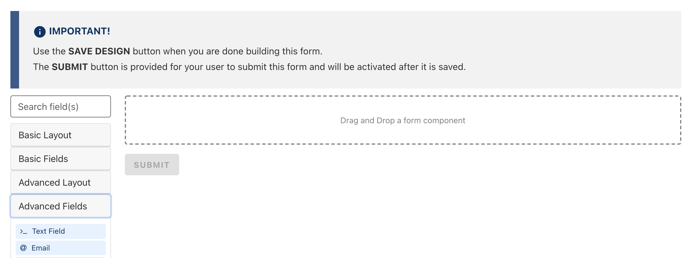
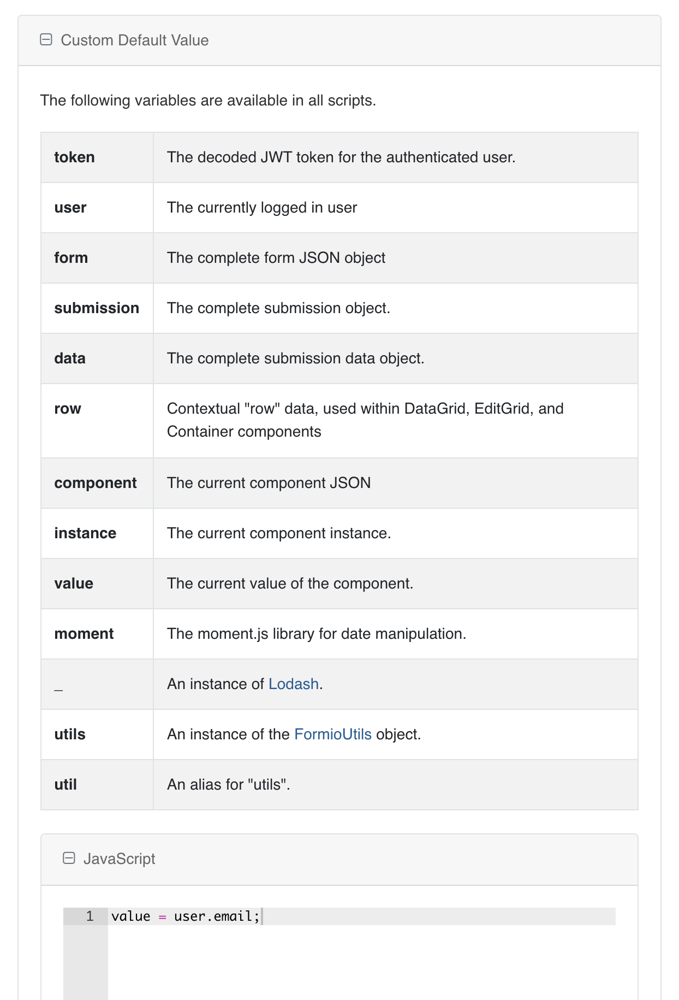
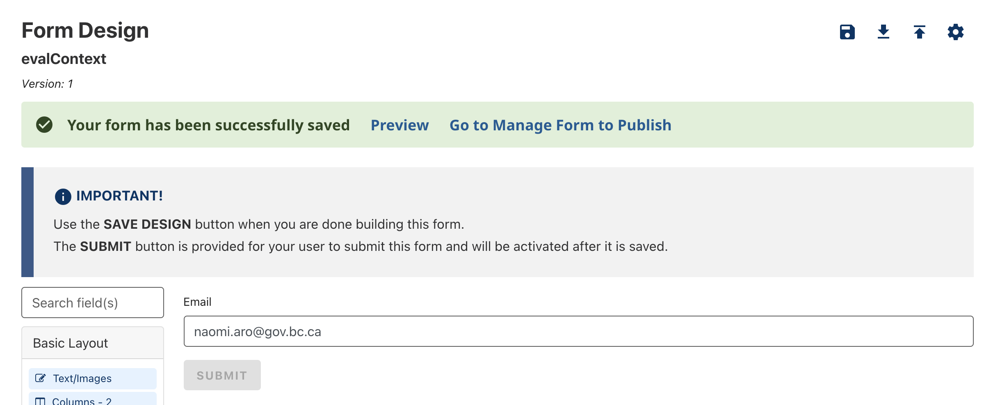

[Home](index) > [Components](Components) > [Custom](Custom) > **Custom Default Value**
***

## Examples

Example user field:
```json
{
  "username": "naomiaro",
  "firstName": "Naomi",
  "lastName": "Aro",
  "fullName": "Naomi Aro",
  "email": "naomi.aro@gov.bc.ca",
  "idp": "idir",
  "public": false
}
```

You can give your form fields a custom default value, including details about the currently logged in user. 

Custom Default Values are only available on Advanced Fields.
***

## Custom Default Value (Tutorial)
<!-- 
On this page:
* [Getting the Current User's Email](#Getting-the-Current-User's-Email)
* [Tips](#Tips) -->

## Getting the Current User's Email
<!-- **[Back to top](#top)** -->

To setup a form field which will default to the currently logged in user's email address, start by dragging over a new `Advanced Fields > @ Email` form field



When the editor opens, navigate to tab `Data` and scroll down to open the section named `Custom Default Value`. Inside the Javascript section you need to write
```javascript
value = user.email;
```
and then save your email component progress.



To make sure all custom defaults are loaded properly you can open your form preview or refresh your form designer page.

### Form Preview


### Form Designer


### User session variables
When a user successfully logs into the CHEFS, specific variables are assigned to the user, contributing to their logged-in session. This session concludes under the following circumstances: when the browser window is closed, when the user logs out, or when the user no longer meets the criteria associated with one or more of these session variables.

* Access Token Lifespan: The Access Token Lifespan is set to 5 minutes, representing the maximum duration before an access token expires. Upon each successful login, the user is assigned this access token. To maintain the session, this token is refreshed every 5 minutes by sending an HTTP request to the identity server with a refresh token. The server responds with a new access token for API calls. If, for any reason, the CHEFS frontend/browser fails to refresh this access token within the designated timeframe, the application continues attempting to obtain a new valid token until the SSO Max session duration is reached.

* SSO Session Max: The SSO Session Max is set to 10 hours, representing the maximum duration before a session expires. Tokens and browser sessions are invalidated upon session expiration.

## Tips
<!-- **[Back to top](#top)** -->

For further insight into what is available from the variables in the table - an easy way is by entering

```javascript
value = JSON.stringify(token);
```

***
[Terms of Use](Terms-of-Use) | [Privacy](Privacy) | [Security](Security) | [Service Agreement](Service-Agreement) | [Accessibility](Accessibility)
