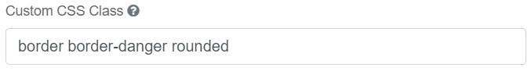
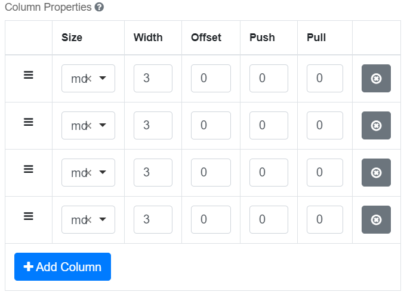
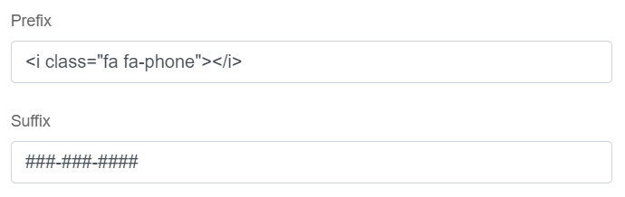
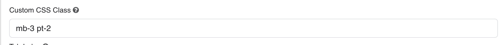

[Home](index) > [Components](Components) > [Custom](Custom) > **Styles**
***

## Working Examples

> Try a working example 
> [View example](https://submit.digital.gov.bc.ca/app/form/submit?f=1a795260-d9b5-44dd-89a8-52d769284df2)

> Download this example file and [import](Importing-and-exporting-form-designs) it into your design 
> [example_styles_schema.json](../examples/example_styles_schema.json){:download="example_styles_schema.json"}
***

## Styles (Tutorial)

Create visually pleasing designs with built-in formatting styles using our version of [Bootstrap](https://getbootstrap.com/docs/4.5/components/).

<!-- **On this page:**

* [Styles(Tutorial)](#Styles(Tutorial))
   * [Components](#Components)
   * [Utilities](#Utilities)
   * [Columns](#Columns)
   * [Icons](#Icons)
     * [Button icons](#Button-icons)
     * [Input icons or text](#Input-icons-or-text) -->

## Styles(Tutorial)

### Components
[Bootstrap Components](https://getbootstrap.com/docs/4.5/components/) can be added using the `Layout > HTML Element` in Advanced Fields. Copy and paste components from the examples on the Bootstrap site. There are also a few samples implemented here in the working example.

You can either paste examples directly into the `content` field or into the `HTML Tag` and `CSS Class` fields like this:

You'll find some components built into simple and advanced fields like Panel. Other options are also available in components like adding prefix and suffix to input groups.

### Utilities
<!-- **[Back to top](#top)** -->

Experiment with [Bootstrap Utilities](https://getbootstrap.com/docs/4.0/utilities/) to add custom styles to your form.

### Columns
<!-- **[Back to top](#top)** -->

Use [Bootstrap Grids](https://getbootstrap.com/docs/4.0/layout/grid/) to customize columns. A form is 12 columns wide, divide it up any way you like (6x2, 4x3, 10+2, etc). There are some pre-set column widths in Simple Fields. In Advanced Fields, here's an example of 4 columns of width 3 (4 X 3 = 12):

You can also nest columns, that is to say put columns inside of other components like a panel or even another parent column component.

### Icons
<!-- **[Back to top](#top)** -->

Add icons to buttons and input fields from [Font Awesome](https://fontawesome.com/v4.7.0/icons/).

#### Button Icons

Example, enter “fa fa-plus” in one of the button icon fields.

#### Input Icons or Text
You can add an input icon in front of a field by adding an HTML tag into the “Prefix” field. <I class=”fa fa-phone”></i>.

### Spacing

You can add spacing using spacing utility classes. These are highly customizable and help maintain a clean layout.

#### pattern:

`{property}{side}-{size}`

- **property**: `p` (padding) or `m` (margin)
- **side**:
  - `t` = top
  - `b` = bottom
  - `l` = left
  - `r` = right
  - `x` = left and right
  - `y` = top and bottom
  - (no letter) = all sides
- **size**: from `0` (no space) to `5` (max space)

#### Examples

| Class     | Description                        |
|-----------|------------------------------------|
| `pb-5`    | Max padding at the bottom          |
| `px-3`    | Medium padding on left and right   |
| `my-2`    | Small vertical margin              |
| `m-0`     | No margin                          |
| `p-4`     | Large padding on all sides         |

Combine classes to control spacing more precisely:

Example: `mb-3 pt-2`

#### Applying Classes in CHEFS

1. Select the component you'd like to style from Advanced Layout, fields or data components
2. Add your spacing classes in the Custom CSS Class field.

Explore all Bootstrap spacing classes in the [Bootstrap Spacing Docs](https://getbootstrap.com/docs/4.0/utilities/spacing/)

Let us know if you'd like help applying these styles to a specific use case!

***
[Terms of Use](Terms-of-Use) | [Privacy](Privacy) | [Security](Security) | [Service Agreement](Service-Agreement) | [Accessibility](Accessibility)