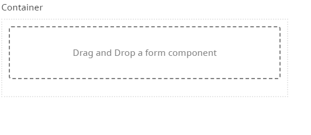
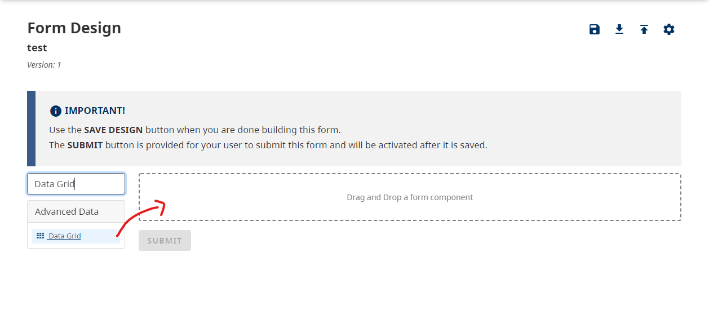
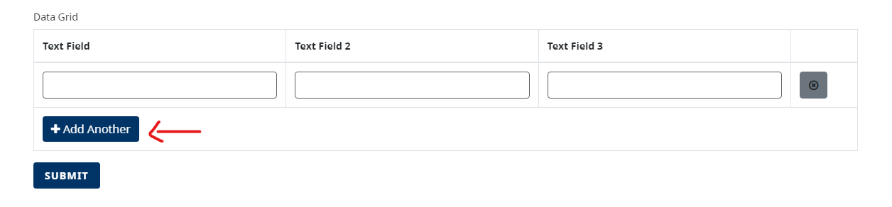
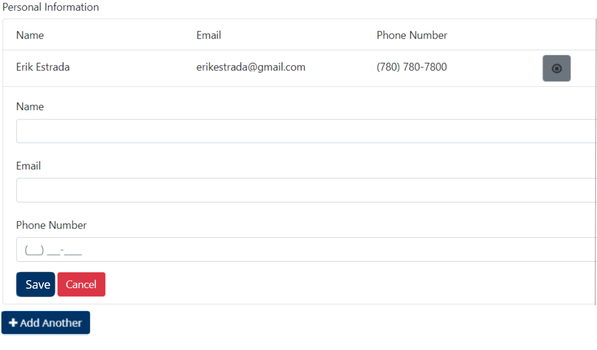

[Home](index) > [Components](Components) > [Form Builder](Form-Builder) > **Advanced Data**
***

|  | Advanced data components are fields that manipulate the way Data is presented, saved, and organized. |
|----------|----------|

<!-- * [Hidden](#hidden)    
* [Container](#container)
* [Data Map](#data-map)
* [Data Grid](#data-grid)
* [Edit Grid](#edit-grid)
* [Tree](#tree) -->

## Hidden
<!-- **[Back to top](#top)** -->

The Hidden component is more of an open-ended tool to be used within the form or application.  While there is no front-end widget or display for hidden components, the component will be visible within the form builder. The Hidden component can handle behind-the-scenes calculations or logic needed to facilitate more advanced workflows on your form or application.

## Container
<!-- **[Back to top](#top)** -->

A Container is a wrapper around a set of fields, similar to a Field Set. What makes the Container unique is the way the data is stored. The fields inside the Container are put into an object with the container key. This is useful for creating more complex objects and data sets within your form.

## Data Map
<!-- **[Back to top](#top)** -->

A Data Map component allows users to create key/value pairs. Both the key and the value fields can get the values while filling out the form. New pairs can be added to the form by the 'Add Another' button and removed by the 'X' (Remove Row) button.

## Data Grid
<!-- **[Back to top](#top)** -->

Data Grids allow users to add a grouping of components on a line item grid. Users can then add multiple rows of the component grouping inside the Data Grid. Additionally, any number of grids can be added within a form, which is especially useful when needing the ability to add or duplicate multiple fieldsets.

You can create multiple rows of data to create a set of Data points.
Use the Data Grid Component in the Form Builder to start creating new rows.

Drag and drop a `Data Grid` Component into the designer.

Add other components into the Data Grid's columns to populate the rows of the Data Grid.

Once you have populated all of the columns that you want for this Data Grid, you can save your form to test it out. You will simply be able to click the `+ Add Another` when filling out the form.

### Tips

If you require a high volume of columns in your Data Grid, we suggest that you organize your Components within your Data Grid by inserting additional Columns to organize all of the Data.

> You can also download an example file and [import](Importing-and-exporting-form-designs) it into your design to test out columns in the Data Grid 

### Examples
> Try a working example: 
> [View simple example](https://submit.digital.gov.bc.ca/app/form/submit?f=b4e1efc5-ee38-4f1e-8190-d4030b47baf0) 
> [View advanced example](https://submit.digital.gov.bc.ca/app/form/submit?f=285efa0d-e3d7-457c-9d34-67a9719cac1c)

> You can also download the example files and [import](Importing-and-exporting-form-designs) it into your design 
> Simple: [simple-data-grid.json](../examples/simple-data-grid.json){:download="simple-data-grid.json"} 
> Advanced: [advanced-data-grid.json](../examples/advanced-data-grid.json){:download="advanced-data-grid.json"}

## Edit Grid
<!-- **[Back to top](#top)** -->

The Edit Grid replicates a table-like structure when it comes to the capture and display of form data. Users can add multiple components inside the Edit Grid. Additionally, any number of grids can be added within a form, which is especially useful when needing the ability to add or duplicate multiple fieldsets. There is also flexibility in how the Edit Grid data rows are saved and displayed to the end user.

<!-- **[Back to top](#top)** -->

***
- [Basic Layout](Basic-Layout) 
- [Basic Fields](Basic-Fields) 
- [Advanced Layout](Advanced-Layout) 
- [Advanced Fields](Advanced-Fields) 
- **Advanced Data**
- [BC Government](BC-Government)

***
[Terms of Use](Terms-of-Use) | [Privacy](Privacy) | [Security](Security) | [Service Agreement](Service-Agreement) | [Accessibility](Accessibility)