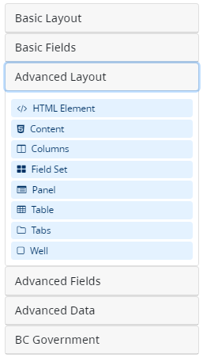
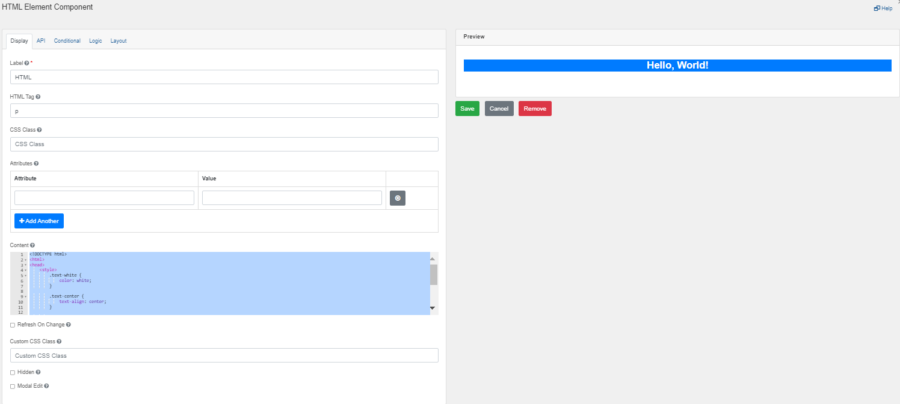
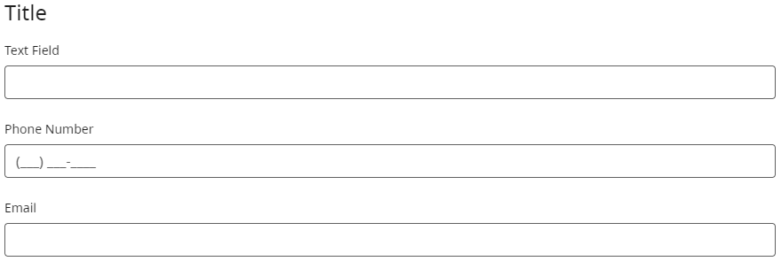
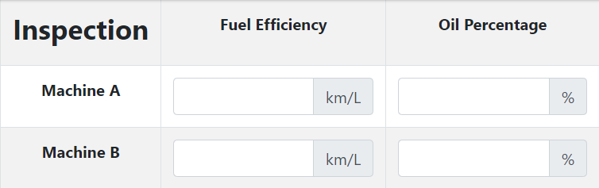
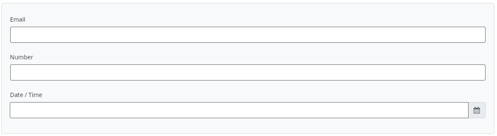

[Home](index) > [CHEFS Components](Components) > [Form Builder Components](Form-Builder-Components) > **Advanced Layout**
***

|  | Layout components in form builders allow users to structure and organize the various elements of a form effectively. They serve distinct purposes in defining the layout and presentation of form fields. |
|----------|----------|

<!-- **Page content:**

* [HTML Element](#html-element)
* [Content](#content)
* [Columns](#columns)
* [Field Set](#field-set)
* [Panel](#panel)
* [Table](#table)
* [Tabs](#tabs)
* [Well](#well) -->

## HTML Element
<!-- **[Back to top](#top)** -->

An HTML Element component may be added to a form to display a single HTML Element. This is useful if you wish to quickly insert and configure some HTML in your form. All unsafe HTML is stripped before rendering to prevent cross-site scripting exploits. 

## Content 
<!-- **[Back to top](#top)** -->

A Content component may be added to a form to provide non-field information such as contextual language, headers, or media. For example, if you need instructions at the top of a form that are for display only, use the Content component. The Content component value is not submitted back to the server. When compared to a text/image component, a content component offers additional logic and layout capabilities.

## Columns 
<!-- **[Back to top](#top)** -->

The advanced column component groups various components, such as Text Fields, Text Areas, Checkboxes, etc., into customizable columns. It is used to display multiple components in a single line or save vertical space on a form. This component also provides additional logic and functionality for enhanced capabilities.

## Field Set
<!-- **[Back to top](#top)** -->

A Field Set can be used to create a title for an area of the form or grouping of components. This is useful to put inside Layout components or in between lots of related components. The Field Set is for display only and will not be saved to the API.

## Panel
<!-- **[Back to top](#top)** -->

A Panel functions as a versatile container that enhances the organization and visual appeal of your user interface by grouping fields, providing a title, and offering various styling options. By leveraging Panels, you can create a cohesive and user-friendly design while effectively structuring and arranging your components. Furthermore, Panels support additional features to further enhance their functionality, including:

_Collapsible:_ Panels can be collapsed or expanded, allowing users to hide or reveal the grouped fields as needed. This feature helps reduce clutter and enables users to focus on relevant information.

_Initially Collapsed:_ You can set Panels to be initially collapsed, meaning they start in a hidden state. Users can then expand them if they need to interact with the fields within. This feature is particularly useful for conserving screen space and presenting a more streamlined interface.

_Hidden:_ Panels can be completely hidden, ensuring that the enclosed fields remain invisible until triggered by a specific action. This feature is helpful when you want to progressively disclose information or provide a more minimalistic interface.

_Hide Label:_ With the hide label option, you can remove the title or label of a Panel, resulting in a cleaner and more concise visual presentation. This feature is beneficial when the content within the Panel is self-explanatory or when you want to save space.

_Disabled:_ Panels can be disabled, preventing users from interacting with the fields within them. This feature is useful when you need to temporarily restrict access or indicate that certain functionality is currently unavailable.

_Modal Edit:_ By applying the modal edit feature, you can configure Panels to enter an edit mode, where users can modify the fields within the Panel in a modal or pop-up window. This approach allows for a focused and isolated editing experience while maintaining the overall context of the UI.

## Table
<!-- **[Back to top](#top)** -->

A Table is a grid-like layout with columns and rows that accommodates different components in its cells. It offers a structured and organized approach to present information or data concisely. Additionally, Tables support advanced features such as stripes, borders, hover effects, condensed layout, hidden cells, hiding labels, and modal editing. These features enhance the functionality and aesthetics of the Table, allowing for a more versatile and engaging user experience.

## Tabs
<!-- **[Back to top](#top)** -->

This component groups different sets of fields together into separate tabs. Similar to a Wizard flow, users can switch between tabs using a navigation bar with tab buttons, each of which opens a set group of components

It is also possible to control the current tab using "Previous" and "Next" [Navigation Buttons](Navigation-Buttons).

## Well
<!-- **[Back to top](#top)** -->

A Well is a visual element used to distinguish or emphasize a particular section of a form. It is a container that adds visual prominence and sets apart the enclosed content from the surrounding elements. By utilizing a Well, you can effectively draw attention to a specific section, making it more noticeable and easily distinguishable within the overall form layout.

The Well typically features a distinct background colour or shading, such as a light or dark background, to create a visual contrast with the rest of the form. 

***
- [Basic Layout](Basic-Layout) 
- [Basic Fields](Basic-Fields) 
- **Advanced Layout** 
- [Advanced Fields](Advanced-Fields) 
- [Advanced Data](Advanced-Data)
- [BC Government](BC-Government)

***
[Terms of Use](Terms-of-Use) | [Privacy](Privacy) | [Security](Security) | [Service Agreement](Service-Agreement) | [Accessibility](Accessibility)