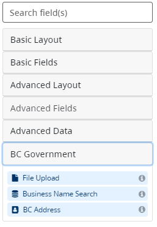
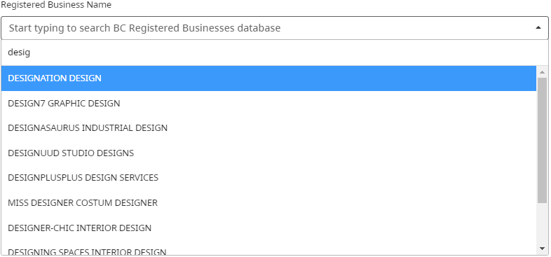
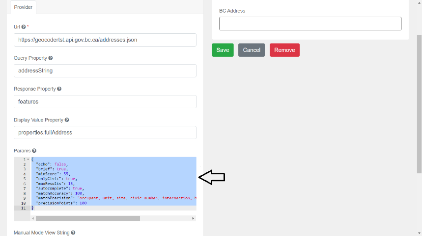
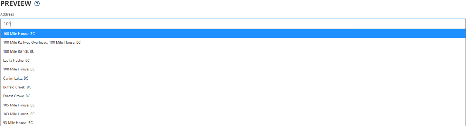
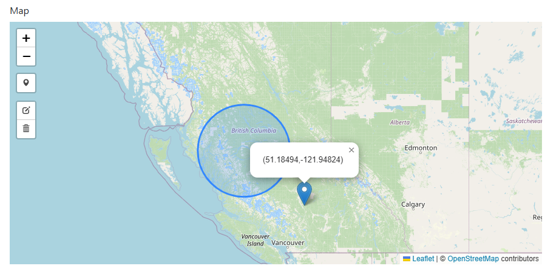
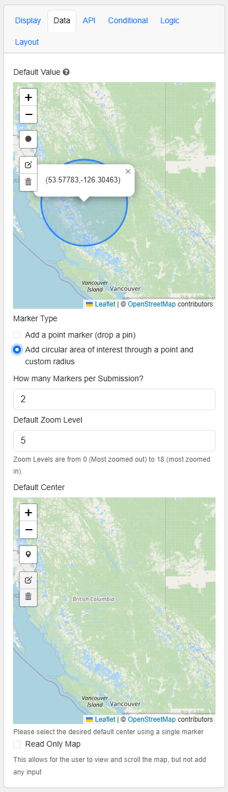
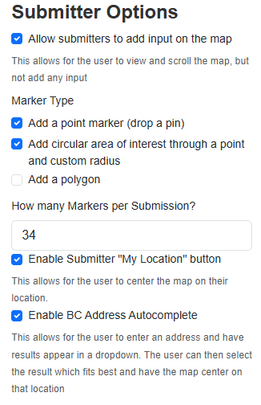

[Home](index) > [Components](Components) > [Form Builder](Form-Builder) > **BC Government**
***

<!-- * [File Upload](#file-upload)
* [Business Name Search](#business-name-search)
* [BC Address](#bc-address) -->

## File Upload
<!-- **[Back to top](#top)** -->

With the CHEFS form builder, you have access to the 'File Upload' component, which enables you to attach files or documents to the form while submitting it. The maximum file size that can be uploaded using this component is 25MB, and all the files submitted through the form are securely stored in a designated Object storage space.

> **Note**: The max size per file for upload is 25MB.

### Configuration options

- Multiple files
- Add a label describing the Type of file you want people to upload (eg: 'resume' or 'cover letter')
- File Pattern - we encourage you to enter a list of the allowed file extensions. (For example: `.docx, .doc, .pdf`)

> **Note**: File Uploads are limited to forms that use IDIR or BCeID access. This is for security reasons. We’re looking into ways we can allow file uploads on public forms in a future release.

### File Storage

Files uploaded via a CHEFS form are saved to a designated space in **Object storage**. The Object Storage Service is for Ministry and Greater Public Sector clients to store data as objects using standard protocols including S3, NFS, and HTTP. It provides a scalable, secure, fully managed object storage platform with high availability and enterprise features.

## Business Name Search
<!-- **[Back to top](#top)** -->

The "Business Name Search" auto-complete feature is a useful component that allows you to quickly find organizations by their name, business number, or BC Registries ID. The auto-complete feature helps save time and effort by eliminating the need to type out the full name or number of the organization you are searching for. Instead, you can select the suggested match from the drop-down list and find the organization you are looking for in seconds.

## BC Address
<!-- **[Back to top](#top)** -->

The BC Address auto-complete component is a preconfigured feature designed to help you quickly find BC addresses. As you enter your query, the tool generates a drop-down list of suggested matches, allowing you to easily select an option and save time and effort that would have been spent typing out the complete address.

This is a preconfigured component. Please note that users can only change the 'Params' details as indicated in the following image. Please visit this link for more information: [Geocoder Developer Toolkit](https://bcgov.github.io/ols-devkit/examples/address_autocomplete.html)

A similar component to the BC Address is the - [Advanced Fields – Address Component](Advanced-Fields#address) component, which helps you set up external providers like Google Maps, Azure Maps, OpenStreetMap Nominatim, or even a custom address API. This could be used for global address search.

## Map Component
<!-- **[Back to top](#top)** -->

The "Map" component allows for a form designer to show a feature on the map for the submitter's reference, or allows for a user to submit one or many features to provide geospatial data for submission. 
Current features supported include:
  - Markers: Single Latitude and Longitude points on the map
  - Circles: Single Latitude and Longitude points with an associated radius
  - Polygons: A set of Markers which form a closed shape
  - Line: A set of markers which do not form a closed shape

### Configuration Options 
Under the "Data" Tab in the Map Component Settings, there are two subheadings: Default Values, and Submitter Options.

#### Default Values
  - Default Value: Choose what should be displayed on the map once the user loads the form.
  - Zoom Level: Choose how zoomed the map should be initially.
  - Default Center: You can place a point on the displayed map to select where the map should be centered by default for the submitter.

#### Submitter Options
  - Allow submitters to add input on the map: This allows for users to add features to the map.
  - Marker Type: Currently the map component supports Markers, Circles, Polygons, and Lines.  
  - Markers Per Submission: Select how many entries you would like the user to submit.
  - Enable Submitter "My Location" button: This button centers the map on the location provided by the user's browser.
  - Enable BC Address Autocomplete: This enables a textbox which allows the user to type an address and have similar addresses appear in a dropdown. The user can then select an option and have the map center on the selected location. This dropdown uses the same service as the aforementioned BC Address form component.

<!-- **[Back to top](#top)** -->

***
- [Basic Layout](Basic-Layout)
- [Basic Fields](Basic-Fields)
- [Advanced Layout](Advanced-Layout)
- [Advanced Fields](Advanced-Fields)
- [Advanced Data](Advanced-Data)
- **BC Government**

***
[Terms of Use](Terms-of-Use) | [Privacy](Privacy) | [Security](Security) | [Service Agreement](Service-Agreement) | [Accessibility](Accessibility)
