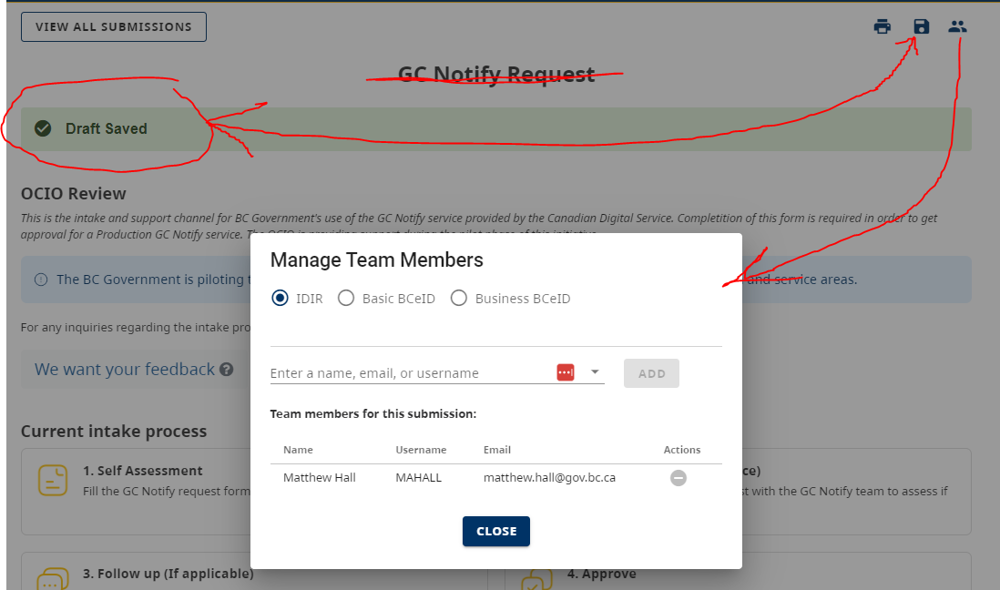
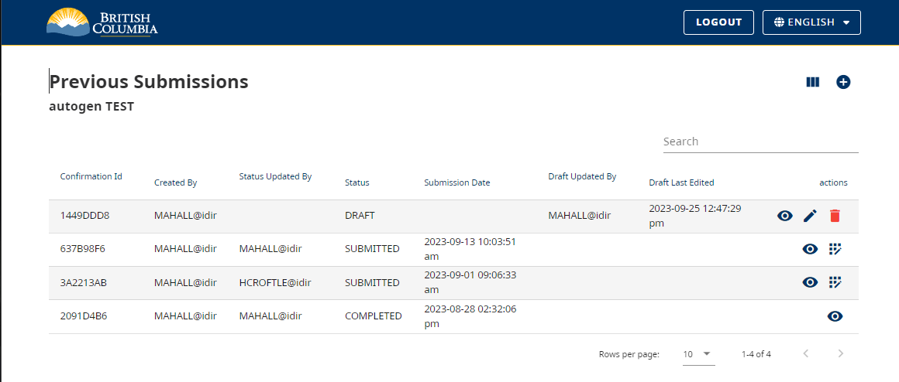

[Home](index) > [CHEFS Capabilities](CHEFS-Capabilities) > [CHEFS functionalities](CHEFS-functionalities) > **Creating Submission Team**  
***

## Question   
I'm creating a request form, and I have a field called "Requested for" for when the request is made on behalf of someone (like in MySC). Is there a text search field and/or way to auto-populate someone else's details from the GAL (IDIR/email/name etc.)?

## Answer  
Not directly in the way you describe it, however there is a way to effectively add other people to your submission team.  This achieves the ability to be a watcher or a contributor to a form submission. If you have the job of filling out the form for them, once you are done, you can save it and then add them to the team, they will get an email where they can load up the completed form and click submit.

### Process   
1. The first person to launch the form will start the filling out the form and save the draft. This will then display the team button. Click that to display the Manage Team Members pop up.
  

2. Add another person to your "submission team". Start by selecting the group to search within (IDIR, Business BCEID, or Basic BCeID). Then enter a name, email or username. If you are searching within for BCeID person, you have to type out the full email or username before it will show up.
  

### Editing the submission  
Only one team member at a time can made edits. Once each person is done, they need to click save.  
The other submitter will need to reopen the form from the original link they got when they were invited to the team, or they can also see the saved draft submission in a list of all previous submissions.  
   
If you relaunch a new version of that form there is a button to click to get to page.  
  

### Submitting the form  
Only the person who clicks the submit button will be listed as the submitter. However, each person who contributed will have their edits stored in the draft history.  If you had a field that you wanted to autopopulate with a username, email address or full Name, then you need that person to login and be the one to submit the form. If you started completing the form it would have your name in those fields, but if you save it and add another person to the submitter team, then they would load up the form and those values would change to their information.  
> Here are the instructions to autopopulate data from the logged in User. [Custom-Default-Value](Custom-Default-Value)