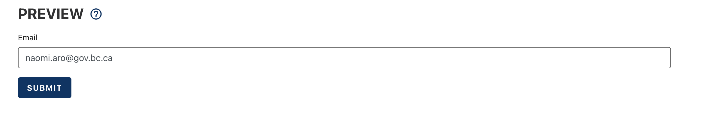

[Home](index) > [CHEFS Components](CHEFS-Components) > [Custom Components](Custom-components) > **Custom Default Value**
***

## Examples

Example user field:
```json
{
  "username": "naomiaro",
  "firstName": "Naomi",
  "lastName": "Aro",
  "fullName": "Naomi Aro",
  "email": "naomi.aro@gov.bc.ca",
  "idp": "idir",
  "public": false
}
```

You can give your form fields a custom default value, including details about the currently logged in user. 

Custom Default Values are only available on Advanced Fields.
***

## Custom Default Value (Tutorial)

On this page:
* [Getting the Current User's Email](#Getting-the-Current-User's-Email)
* [Tips](#Tips)

## Getting the Current User's Email
**[Back to top](#top)**

To setup a form field which will default to the currently logged in user's email address, start by dragging over a new `Advanced Fields > @ Email` form field


When the editor opens, navigate to tab `Data` and scroll down to open the section named `Custom Default Value`. Inside the Javascript section you need to write
```javascript
value = user.email;
```
and then save your email component progress.


To make sure all custom defaults are loaded properly you can open your form preview or refresh your form designer page.

### Form Preview


### Form Designer


## Tips
**[Back to top](#top)**

For further insight into what is available from the variables in the table - an easy way is by entering

```javascript
value = JSON.stringify(token);
```


