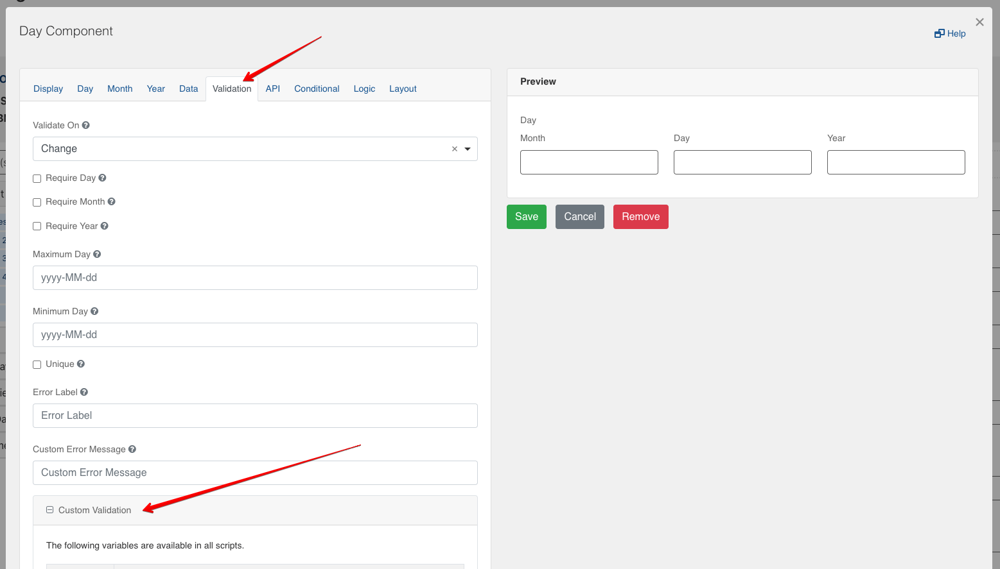

[Home](index) > [CHEFS Components](CHEFS-Components) > [Custom Components](Custom-components) > **Custom Validation**
***

### Get started

## Day Component

Let's cover the custom validation for `Day component`
When the editor opens, navigate to tab `Validation` and scroll down to open the section named `Custom Validation`. Inside the Javascript section you need to write
```javascript
var val = moment(input, 'MM/DD/YYYY');
valid = true;
if (!val.isValid() || val.format('YYYY') === '0000') {
  valid = 'Please, enter the valid date';
}
```


This way we validate if user enter incorrect `Day` for example `e2, -2, +2` or leaves `Year` box empty


