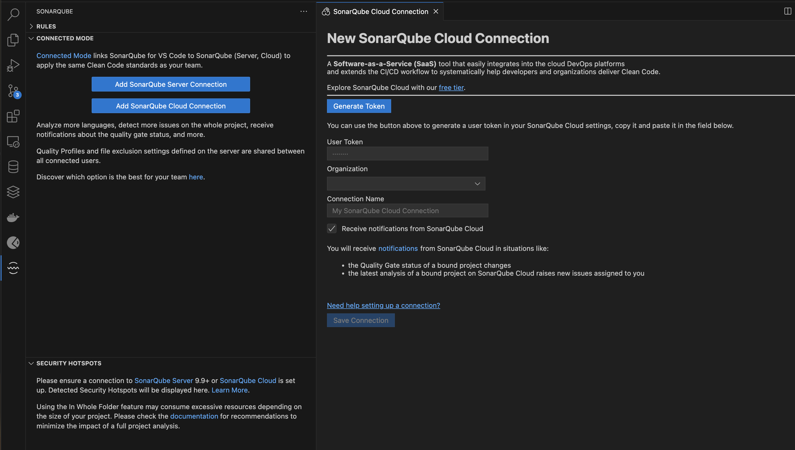
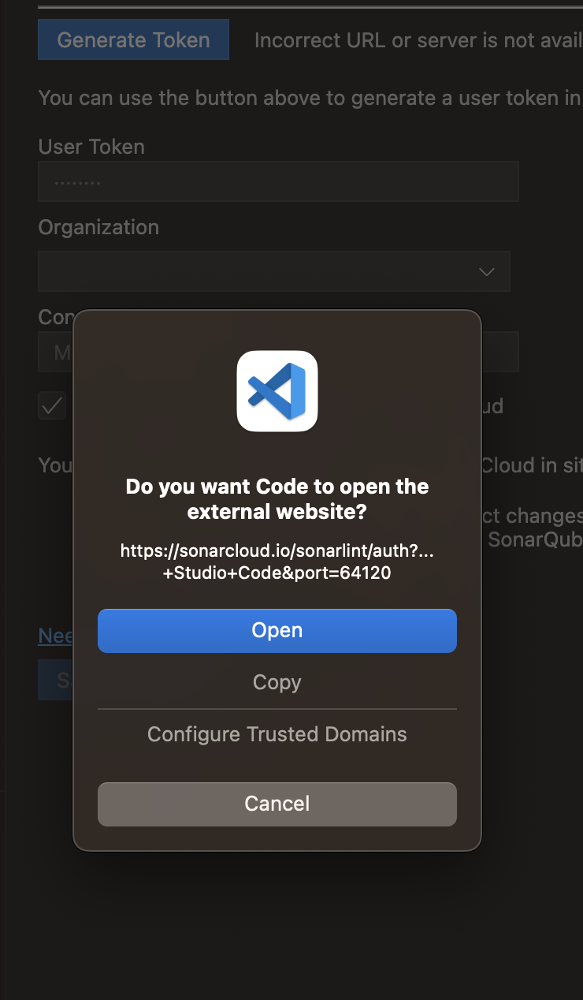
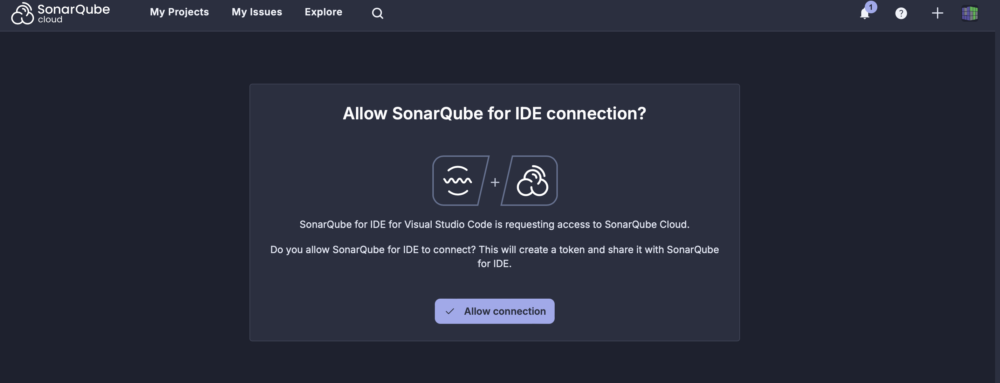
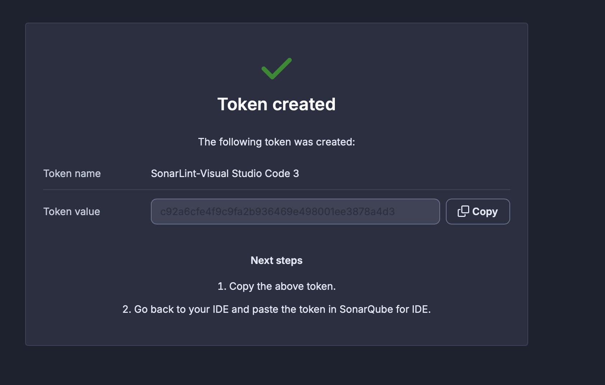
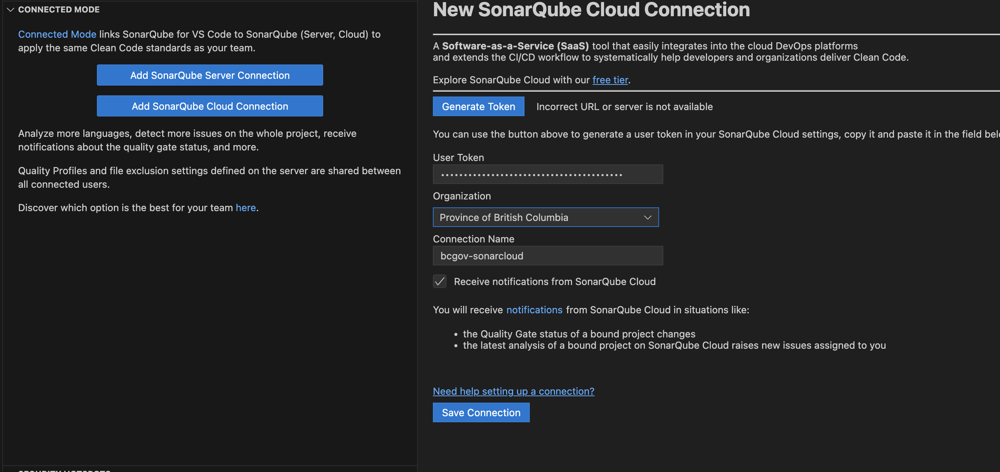
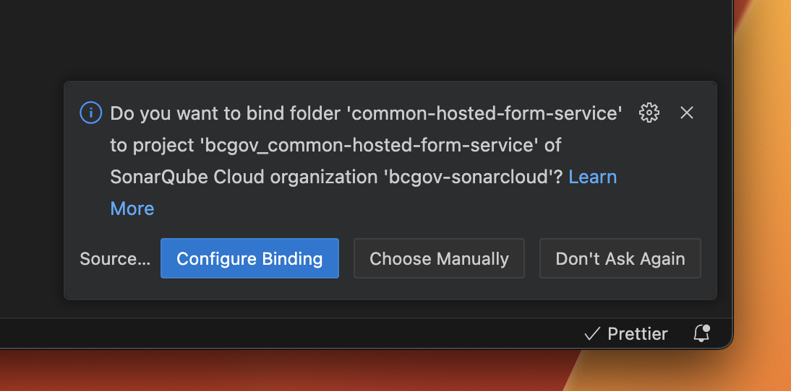

[Home](index) > [Developer](Developer) > [Contributors](Contributors) > **Local Setup**
***

This document will help developers looking to install CHEFS on their local machines for testing and development. Following this documentation, an isolated sandbox CHEFS instance will be set up for investigation and research before preparing pull requests or code commits.

<!-- **On this page:**
* [Prerequisites](#prerequisites)
* [Setup](#setup)
* [Running CHEFS](#running-chefs)
* [Developing and Contributing](developing-and-contributing)
* [Troubleshooting](#troubleshooting) -->

# Prerequisites
<!-- **[Back to top](#top)** -->

An IDIR account is required to access CHEFS.

You will need [Visual Studio Code](https://code.visualstudio.com), commonly referred to as vscode.

Ensure that [Docker](https://www.docker.com/get-started/) is installed and running on your local machine. Using Docker allows for a quick CHEFS build on your local machine; however, this is not how the production environment is hosted.

# Setup
<!-- **[Back to top](#top)** -->

Start by cloning the [CHEFS source code](https://github.com/bcgov/common-hosted-form-service) onto your local machine.

CHEFS development takes place using a devcontainer. Open the cloned report in vscode, and you will be prompted to build the container.

The `.devcontainer/chefs_local` directory contains the `local.json` file for running CHEFS.

## Sonar Static Code Analysis

CHEFS uses Sonar to ensure contributed code meets quality standards and consistency. This is ongoing work, but all Pull Requests and contributions should pass and add no new issues.

The dev container builds with the Sonar extension; you need to configure it.

1. Login to [SonarQube Cloud](https://sonarcloud.io/organizations/bcgov-sonarcloud/projects)  (use your BCGov approved github account) and find `common-hosted-form-service", open it.
1. Rebuild your devcontainer: Command Palette: "Dev Containers: Rebuild Container without Cache"
1. You should see the SonarQube extension loaded, open its panel, look for "Connected Mode" section, and use the '...' on its righthand side to run the "Connect to SonarQube Cloud"
1. Click "Generate token" and accept going to SonarCloud Online Code Review as a Service Tool; if logged in, you should see a token. Copy it and paste it into the IDE User Token field.
1. Organization: "Province of British Columbia"
1. Connection name: "bcgov-sonarcloud"
1. Save connection
1. Configure Binding to project "bcgov_common-hosted-form-service"
1. When logged into SonarCloud Online Code Review as a Service Tool common-hosted forms, you can click on an issue's "Open in IDE" button. This will work if you have checked out the same branch and use a supported browser. Safari doesn't currently appear to work, but Chrome does.

# Running CHEFS
<!-- **[Back to top](#top)** -->

In the sidebar, select the `Build and Debug` item, and in the dropdown menu, select `CHEFS` and click the green arrow. This will start the API and the frontend.

# Developing and Contributing
<!-- **[Back to top](#top)** -->

For those interested in developing and contributing CHEFS code, please follow the [CHEFS Development with Dev Container](./CHEFS-Development-with-Dev-Container.md) and [Forking Repository](Forking-Repository.md)

# Troubleshooting
<!-- **[Back to top](#top)** -->

All development machines are unique and here we will document problems encountered and how to fix them.

## Failure during load of devcontainer when running webpack (Segmentation Fault)

Encountered on Mac Ventura 13.6, with Mac Docker Desktop 4.26.1 when running `npm run build:formio` on load, we hit a `Segmentation Fault`. The issue was resolved when turning off the virtualization settings in Docker Desktop.

Under Settings, select `gRPC Fuse` instead of `VirtioFS` then unselect `Use Virtualization framework`. Restart Docker and VS Code.

> NOTE: There are issues with VS Code and devcontainers running in Windows environments with WSL. We will be updating this section with workarounds and solutions.

***
[Terms of Use](Terms-of-Use) | [Privacy](Privacy) | [Security](Security) | [Service Agreement](Service-Agreement) | [Accessibility](Accessibility)
