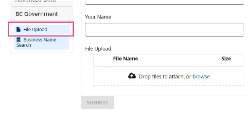

The CHEFS form builder has a 'File Upload' component. This allows someone to attach files or documents when submitting the form.

On this page:
* [Configuration options](#Configuration-options)
* [File Storage](#File-storage)

> **Note**: The max size per file for upload is 25MB.

## Configuration options

- Multiple files
- Add a label describing the Type of file you want people to upload (eg: 'resume' or 'cover letter')
- File Pattern - we encourage you to enter a list of the allowed file extensions. (For example: `.docx, .doc, .pdf`)
  
> **Note**: File Uploads are limited to forms that use IDIR or BCeID access. This is for security reasons. We’re looking into ways we can allow file uploads on public forms in a future release.

## File Storage

Files uploaded via a CHEFS form are saved to a designated space in **Object storage**. The Object Storage Service is for Ministry and Greater Public Sector clients to store data as objects using standard protocols including S3, NFS, and HTTP. It provides a scalable, secure, fully managed object storage platform with high availability and enterprise features.