[Home](index) > [Developer](Developer) > [Contributors](Contributors) > **Keycloak configuration**
***

In a fresh install of Keycloak, you’ll need to start by creating a realm. You will need to remember this name or use the name chefs.

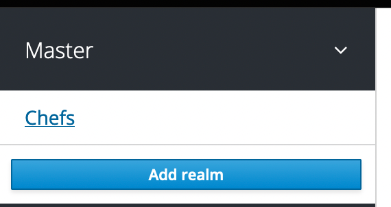

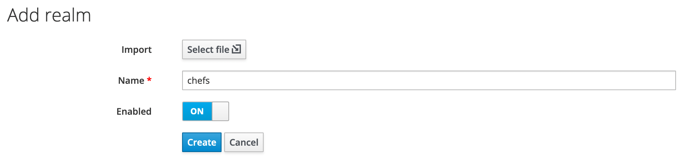

Once created, you’ll need to click on the Login tab and then disable Login with email and then enable Duplicate emails.

Then you’ll need to create your clients by going to the clients tab, and clicking the Create button at the top right of the table.

You’ll be creating one called chefs which will be your back end and one called chefs-frontend which will be your front end.

For your chefs back end, under the settings, do the following: change the access type to confidential, disable standard flow and direct access grants. Optionally, enable service accounts. Then click Save at the bottom of the page.

In the credentials tab, you’ll want to take note of your client secret, this is used in your local.json configuration for CHEFS.

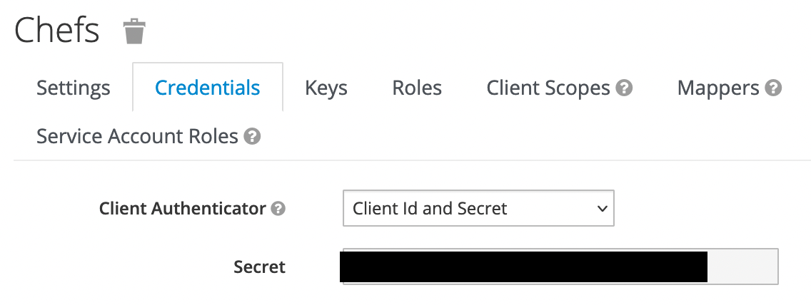

In the scope tab, disable full scope.

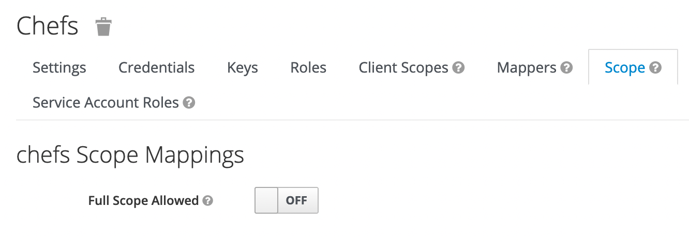

In the roles tab, create 4 roles.

First, create the user role and the admin role.

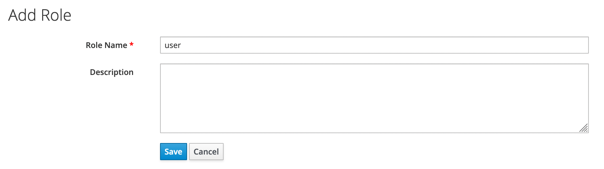

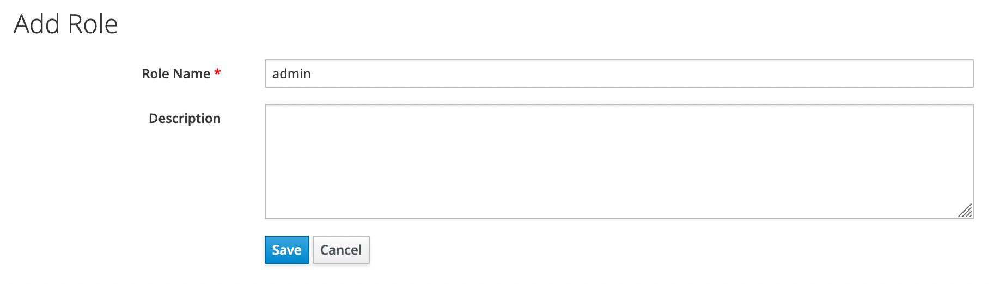

Then create a role called CHEFS User.

Enable Composite Roles , in the drop down for Client Roles, select chefs and then select the user role and click Add selected.

Create the role CHEFS Admin.

Enable Composite Roles, in the drop down for Client Roles, select chefs and then select the CHEFS User and admin role and click Add selected for both.

Back in the clients page, create another client called chefs-frontend for your front end.

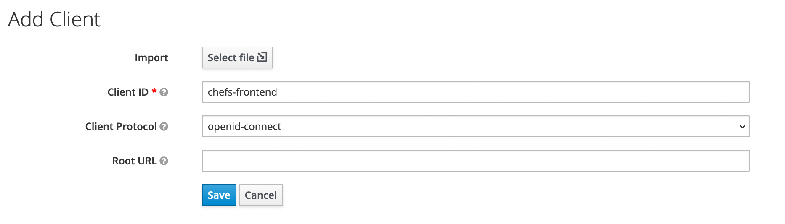

In the settings tab, make sure the Access Type is public and disable Direct Access Grants.

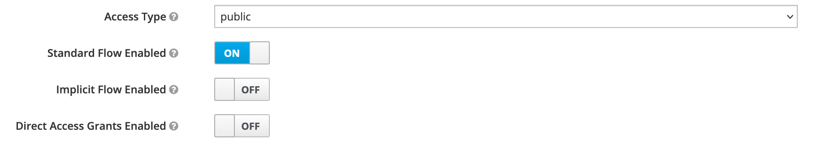

Set the Root URL and Admin URL to the host your CHEFS app will be listening on. In this example, it’s listening on http://localhost:8081. Set the Web Origins to * to allow all origins. Then click Save at the bottom of the page.

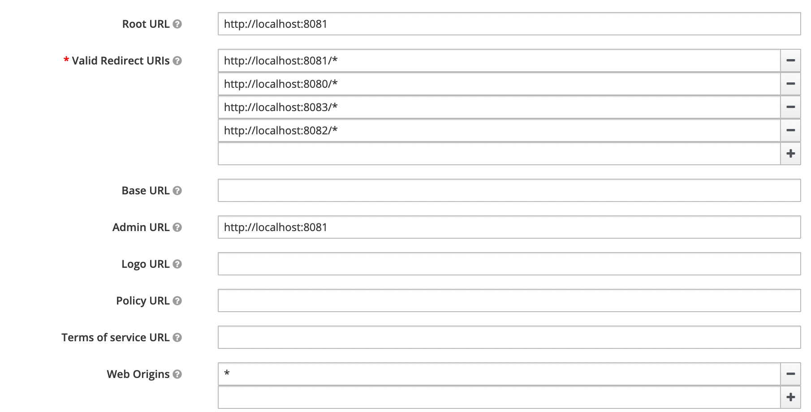

In the Client Scopes tab, select chefs in the Default Client Scopes under Available Client Scopes and then click Add selected.

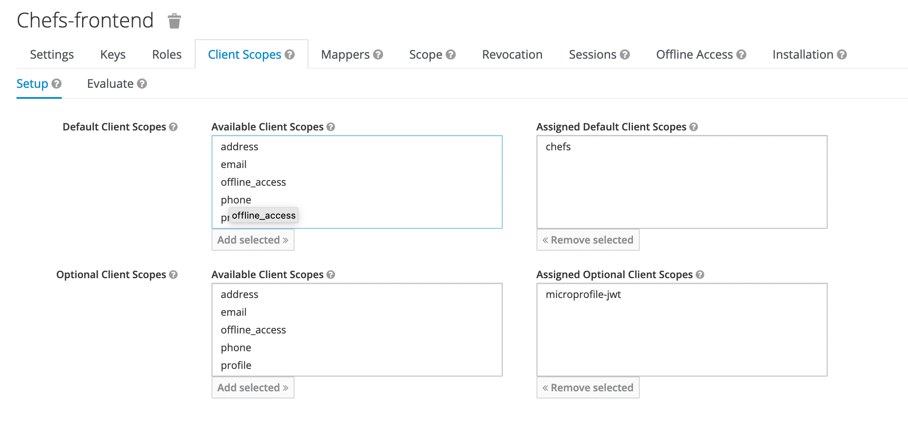

In the roles tab, click the Add Role button to create a role.

Name the first one developer.

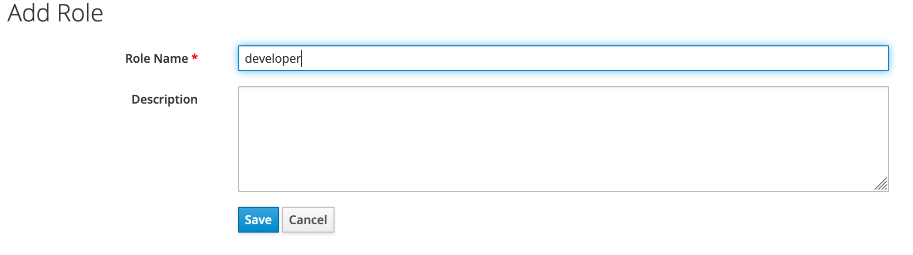

Then create another one called Frontend Developer. Enable Composite Roles, in the Client Roles dropdown, select chefs-frontend and then click on developer and click Add selected

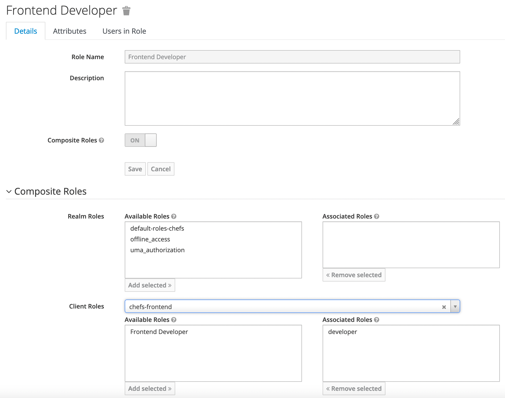

In the Client Scopes tab, click the Create button at the top right to create a client scope.

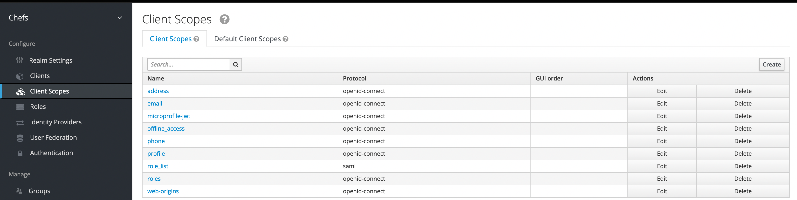

Name the first one chefs and disable Display On Consent Screen.

Create a protocol mapper called idir_user_guid, set the Mapper type to User Attribute then set the User Attribute to idir_user_guid, set the Token Claim Name to idp_userid, and set the Claim JSON Type to String.

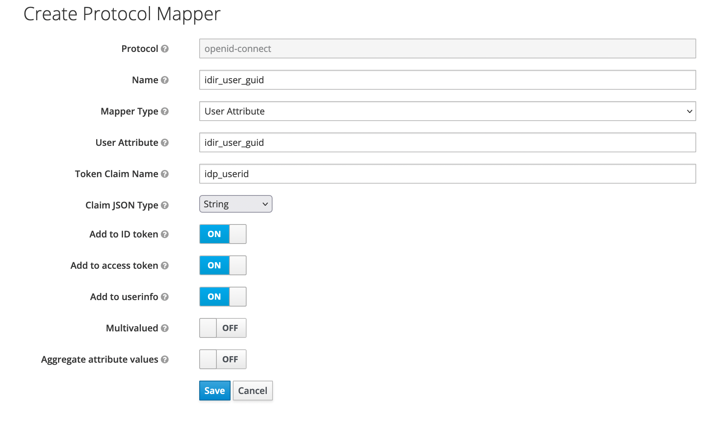

Create another protocol mapper called idir_username, set the Mapper type to User Attribute then set the User Attribute to idir_username, set the Token Claim Name to idp_username, and set the Claim JSON Type to String.

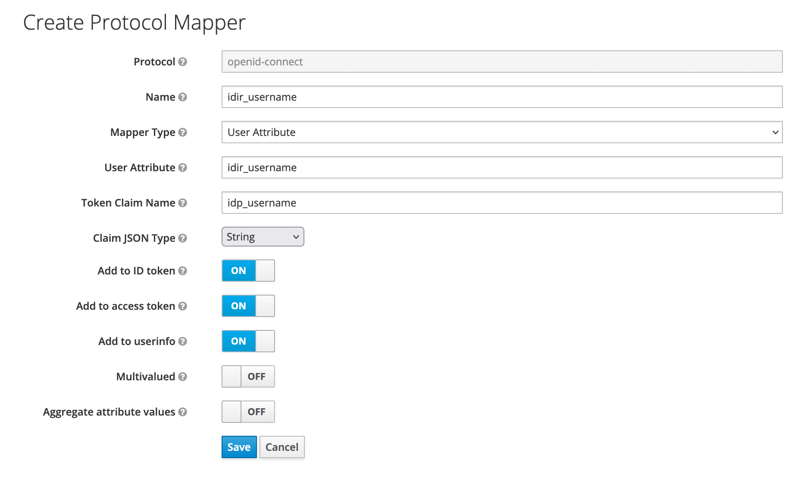

Create another protocol mapper called bceid_user_guid, set the Mapper type to User Attribute then set the User Attribute to bceid_user_guid, set the Token Claim Name to idp_userid, and set the Claim JSON Type to String.

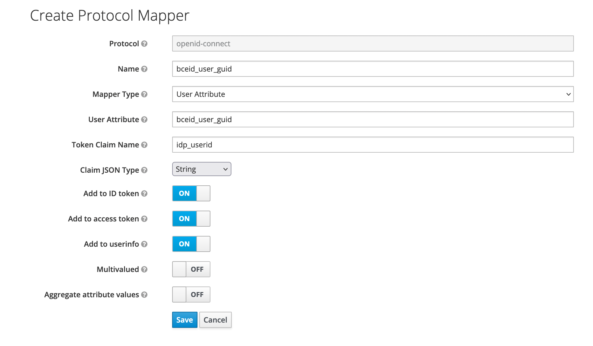

Create another protocol mapper called bceid_username, set the Mapper type to User Attribute then set the User Attribute to bceid_username, set the Token Claim Name to idp_username, and set the Claim JSON Type to String.

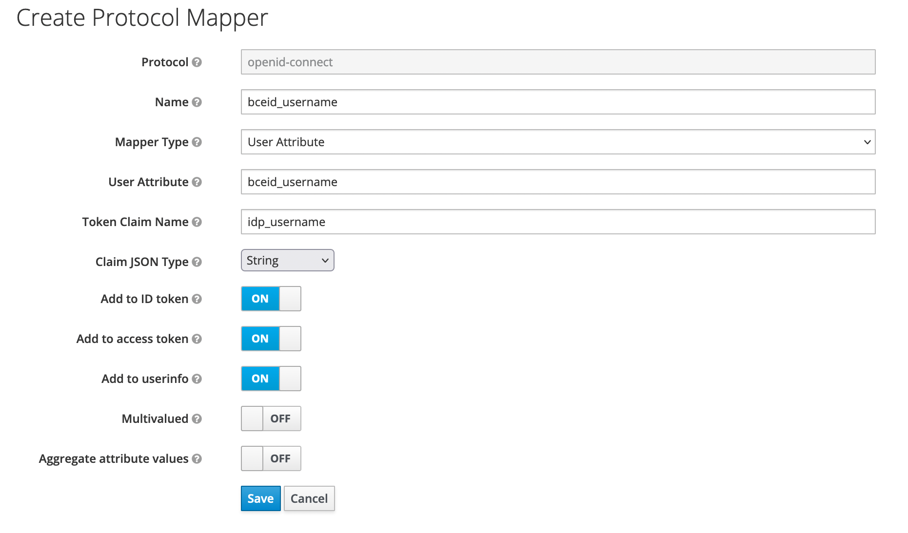

Create another protocol mapper called identity_provider, set the Mapper type to User Session Note then set the User Attribute to identity_provider, set the Token Claim Name to identity_provider, and set the Claim JSON Type to String.

Create another protocol mapper called chefs aud, set the Mapper type to Audience then set the Included Client Audience to chefs.

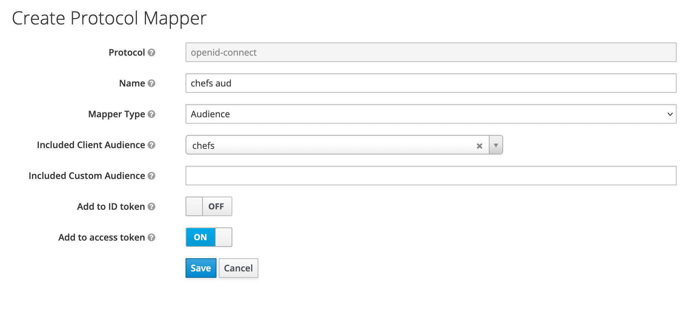

Back on the Mappers tab, click the Add Builtin button.

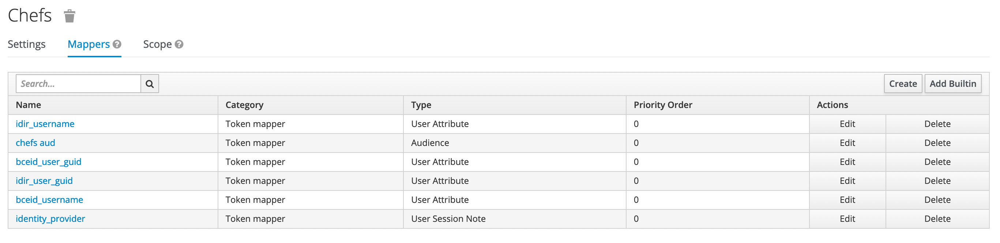

Check the family name, email, client roles, given name, full name, audience resolve, and username then click Add selected.

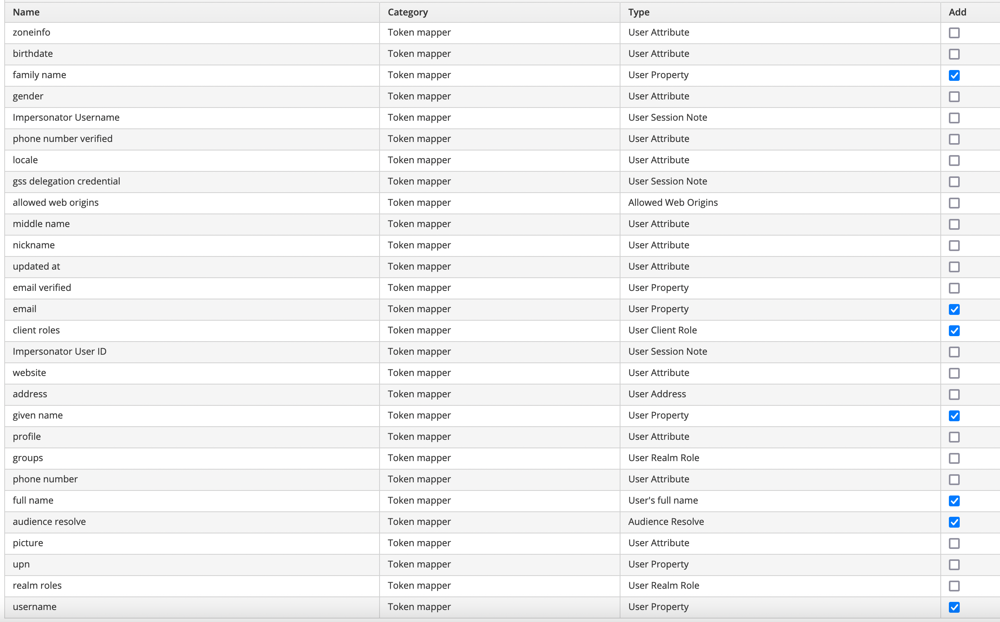

In the Scope tab, select chefs in the Client Roles and then select admin and user and click Add selected for both of them.

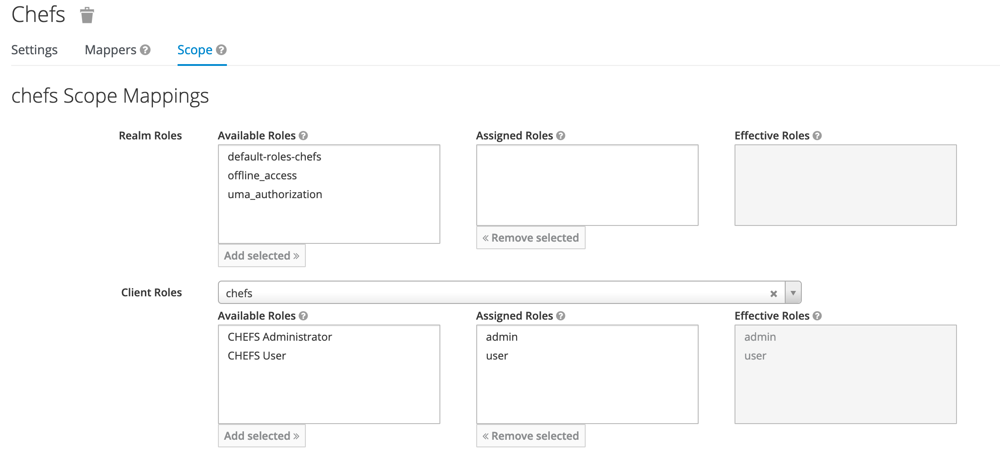

Create another Client Scope called chefs-frontend and disable Display On Consent Screen.

Click on the Mappers tab and then click the Create button to create some mappers.

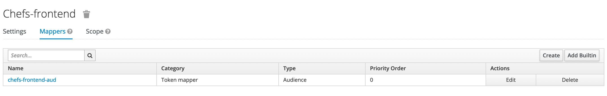

Create a protocol mapper called chefs-frontend-aud, set the Mapper type to Audience then in the Included Client Audience dropdown select chefs-frontend.

Check the family name, email, client roles, given name, full name, audience resolve, and username then click Add selected.

In the roles page, click on default-roles-chefs

In the dropdown for Client Roles, select chefs then select CHEFS User and then click Add selected.

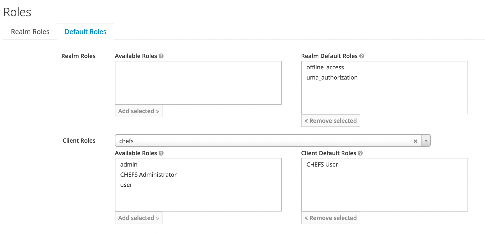

You’ll then need to add in your required identity providers, the guide to doing so can be found:

https://stackoverflow.developer.gov.bc.ca/a/891/57

After setting up your keycloak, you’ll need to configure your local.json file for CHEFS.

There should be a block that looks like:

Make sure that your clientSecret is the one found in the chefs client under the Credentials tab. The serverUrl should be the host your keycloak is listening on.

***
[Terms of Use](Terms-of-Use) | [Privacy](Privacy) | [Security](Security) | [Service Agreement](Service-Agreement) | [Accessibility](Accessibility)

