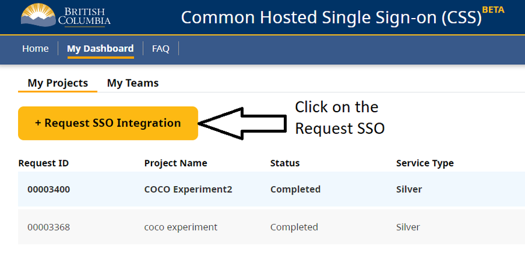
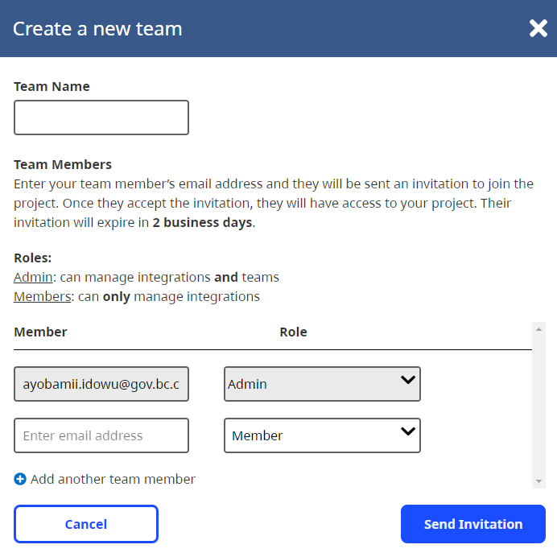
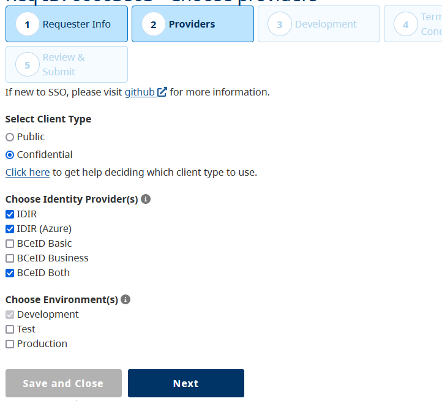
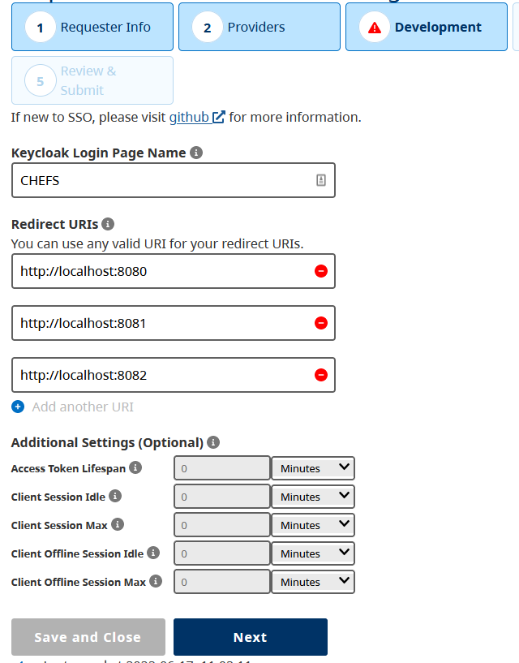
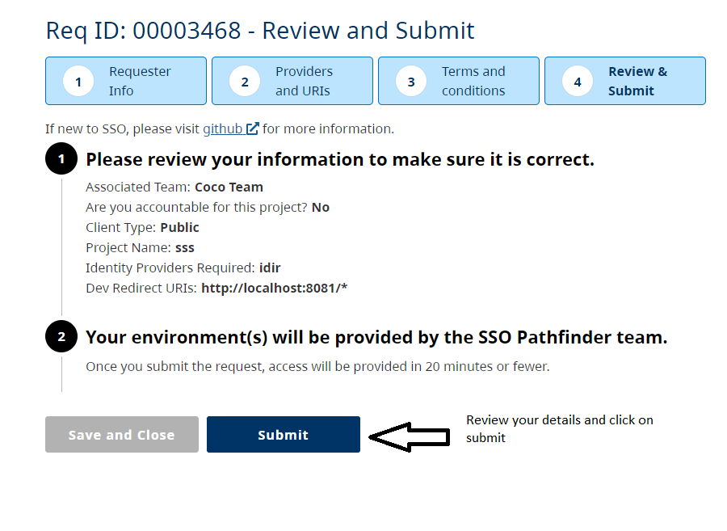

[Home](index) > [Developer](Developer) > [Deployment](Deployment) > **Pathfinder SSO client**
***

CHEFS requires single sign on authentication which is done through the Pathfinder SSO. You require an IDIR account to register. You must first head to this link https://bcgov.github.io/sso-requests and request SSO integration. However, if you’re joining a team then you’ll need to request an invitation from another team member.

Once your SSO integration request is approved, you’ll have the ability to download a JSON file containing your client id and secret labeled as ***resource*** and ***secret***.

<!-- **[Back to top](#top)** -->

***
[Terms of Use](Terms-of-Use) | [Privacy](Privacy) | [Security](Security) | [Service Agreement](Service-Agreement) | [Accessibility](Accessibility)