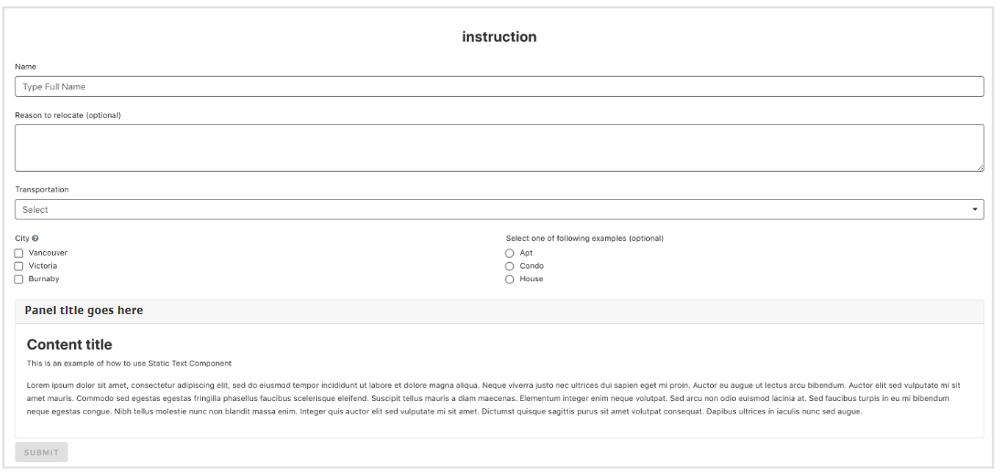
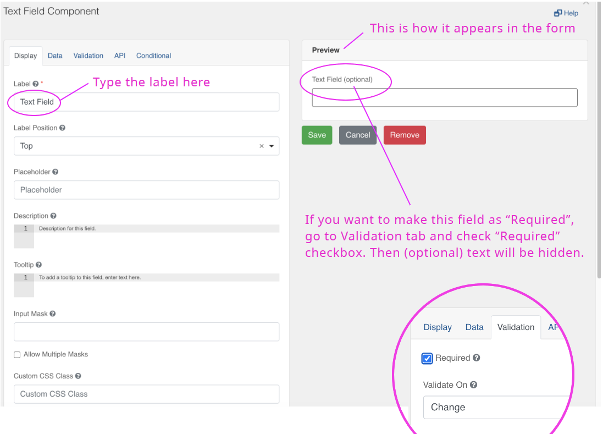
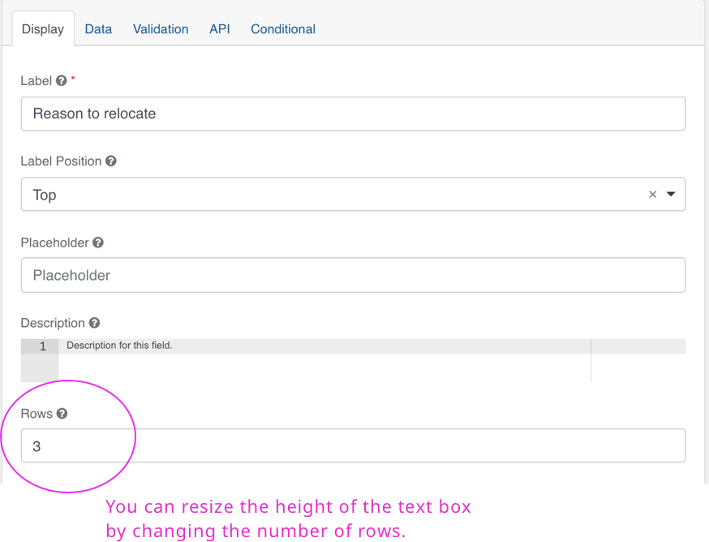
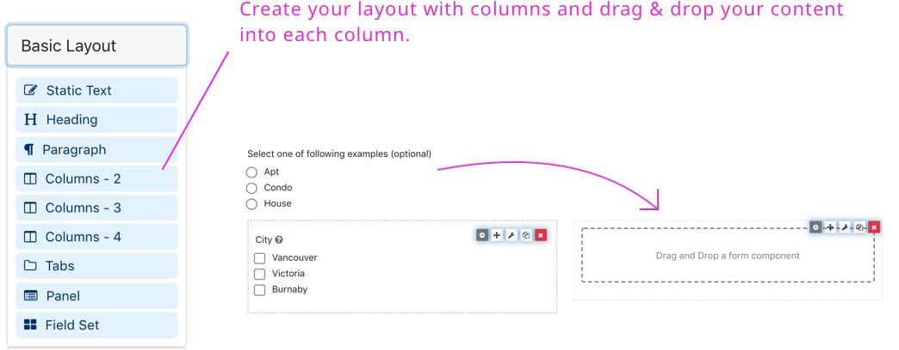
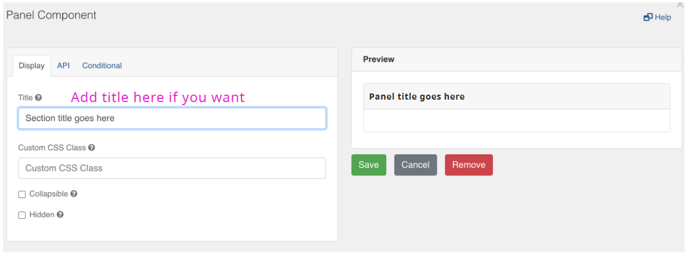
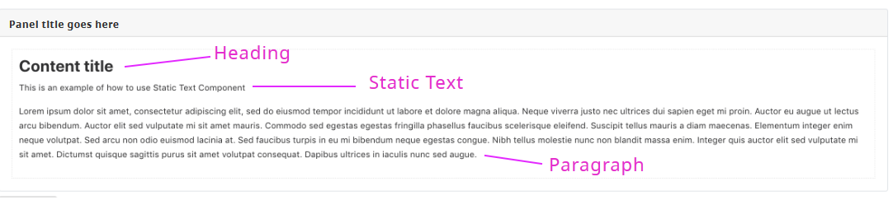
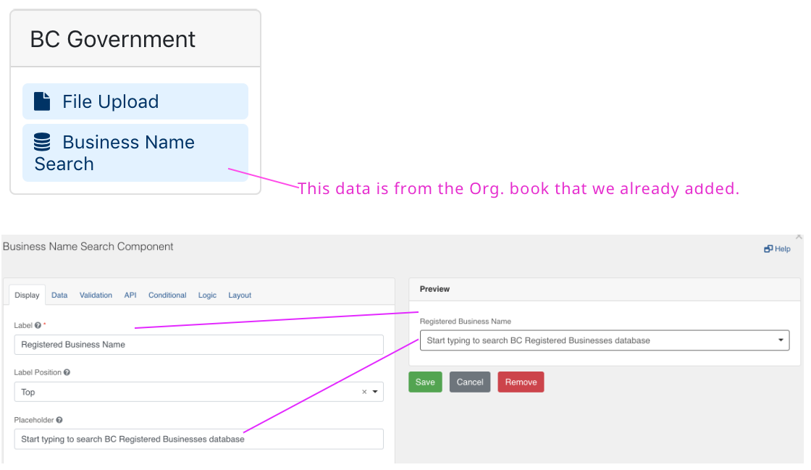
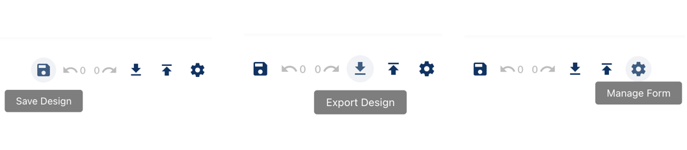
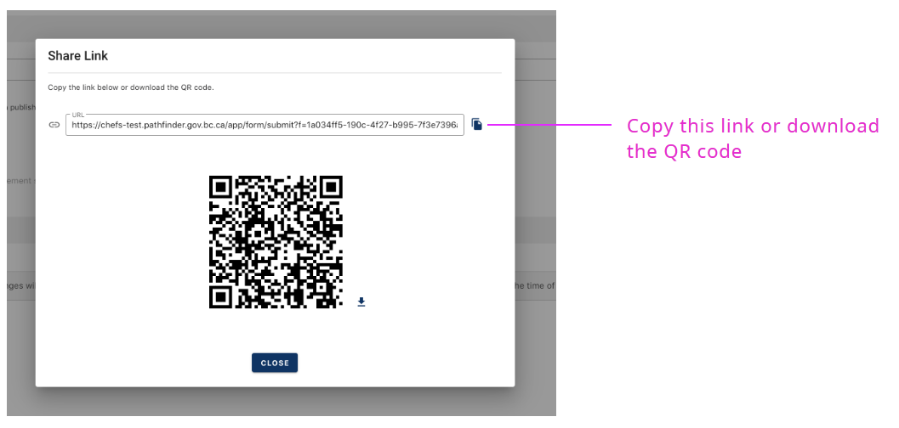

Follow this guide if you want to learn how to quickly get started building forms.  You will require an IDIR attached to a valid email address to connect.

> Are you building your first form?
> You can now watch our [**video series**](https://www.youtube.com/playlist?list=PL9CV_8JBQHirsQAShw45PZeU1CkU88Q53) on how to get started.

<!-- **On this page:**
* [Form settings](#form-settings)
* [Form structure](#form-structure)
* [Basic and advanced components](#basic-and-advanced-components)
* [Text field](#text-field)
* [Select list](#select-list)
* [Column layout](#column-layout)
* [Checkbox group](#Checkbox-group)
* [Panel layout](#Panel-layout)
* [Static content](#static-content)
* [B.C. Government components](#bc-government-components)
* [Save your design](#Save-your-design)
* [Managing versions](#Managing-versions)
* [Share your form](#Share-your-form) -->

 

## Form settings

The name you provide here will show above the form.

## Form structure

A form is made up of components. For example: input fields, checkboxes or text boxes. You can drag and drop these components from the left column onto your form.

# Basic and advanced components

Advanced components have more configuration options than the basic fields (for example: advanced conditional logic). Having JavaScript programming experience will help when trying to take full-advantage of using advanced components.

## Text field

When you drag a text field onto the form you will see this dialog screen.

**Note**: The form builder has specific components for **Email**, **Phone** or **Number** form fields. They look like the standard ‘text’ field, but the validation rules and appearance are slightly different and will help ensure the data you collect is in the right format.

## Multi-line text

Use this component when submitters may need to type more than one line of text.

## Select list

When you want to create a list of items from the dropdown and let users select as you see below.

Go to “Data” tab and add the list items as you see below.

## Column layout

Use the ‘columns’ component to create a 2, 3 or 4 column layouts. 

## Checkbox group

Go to “Data” tab and add a list of values

Add tooltip to help the user identify or learn more about an element. Tooltips will appear as question mark at the end of a field’s labels.

## Panel layout
Panels allow you to create groupings of form fields.

Drag & drop the “Panel” component from the layout, then you will see the following dialog.

## Static content

The "Static Content" components can be used to add headings and other text formats as shown in the sample form

## BC Government Components

"Business Name Search" component will show a search field that lets the user select from a database of organizations legally registered in BC.

## Save your design

Once you’ve created a form, make sure you save your design. To save your form click on the “Save Design” icon. You can also export / import your design (as a JSON schema) for re-use in another form or by other form designers.

Once you save the form, you will see this alert banner. You can preview your form or publish the form.

## Managing versions

You can create a new version of your form design, using an existing version as a starting point. You do this by clicking on the plus icon next to an existing version. A new version will be in a 'draft' state until you set it as 'published' using the toggle in the table of versions. You can only have one draft version, but you can delete that to re-start a new one if required.

## Share your form

You can send the link to anyone you would like to share this form.

