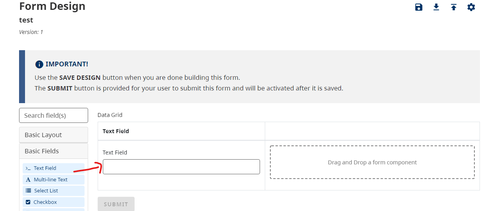

You can create multiple rows of data to create a set of Data points.
Use the Data Grid Component in the Form Builder to start creating new rows.

On this page:
* [Data grids](#data-grids)
* [Tips](#tips)
* [Examples](#examples)

## Data Grids

Drag and drop a `Data Grid` Component into the designer.

Add other components into the Data Grid's columns to populate the rows of the Data Grid.

Once you have populated all of the columns that you want for this Data Grid, you can save your form to test it out. You will simply be able to click the `+ Add Another` when filling out the form.

## Tips

If you require a high volume of columns in your Data Grid, we suggest that you organize your Components within your Data Grid by inserting additional Columns to organize all of the Data.

> You can also download an example file and [import](Importing-and-exporting-form-designs) it into your design to test out columns in the Data Grid 
> Example: [advanced-data-grid.json](examples/advanced-data-grid.json)

## Examples
> Try a working example: 
> [View simple example](https://submit.digital.gov.bc.ca/app/form/submit?f=c07fb298-afce-41c5-8f53-8bb838546347) 
> [View advanced example](https://submit.digital.gov.bc.ca/app/form/submit?f=285efa0d-e3d7-457c-9d34-67a9719cac1c)

> You can also download the example files and [import](Importing-and-exporting-form-designs) it into your design 
> Simple: [simple-data-grid.json](examples/simple-data-grid.json) 
> Advanced: [advanced-data-grid.json](examples/advanced-data-grid.json)
