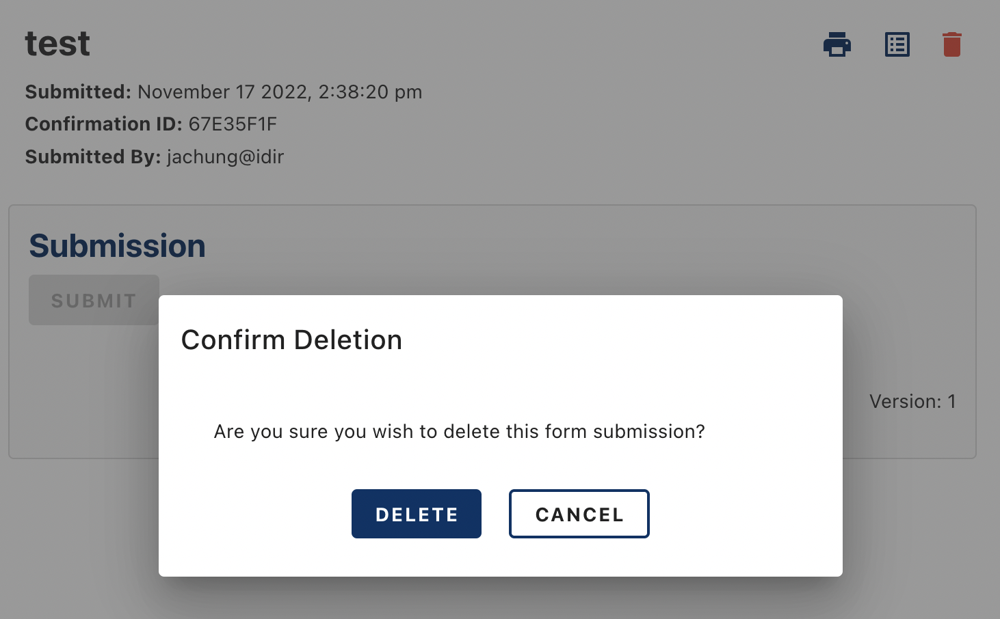
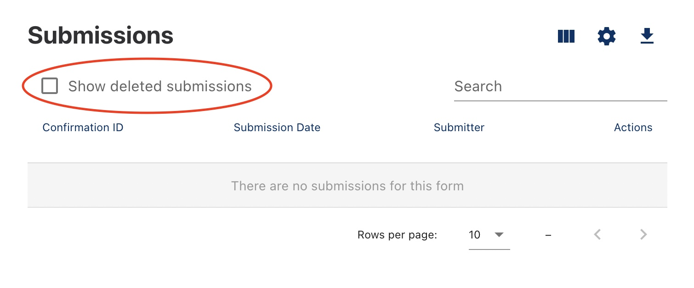

[Home](index) > [CHEFS Capabilities](CHEFS-Capabilities) > [CHEFS functionalities](CHEFS-functionalities) > **Restoring a deleted submission**
***

In the event that someone has deleted a submission for a form version, you can restore the submission if you are a form owner.

For example, if a user deletes a form submission:

The form owner can access the submissions for a form, and check the box to show deleted submissions.

Once you've found the submission you want to restore, simply click the restore button and confirm restoration.

**[Back to top](#top)**
