[Home](index) > [Developer](Developer) > [Deployment](Deployment) > **S3 Object Storage**
***

* [Requesting S3 Object Storage](#Requesting-S3-Object-Storage)
* [Migrating Data Between S3 Storage Buckets Using Rclone](#Migrating-Data-Between-S3-Storage-Buckets-Using-Rclone)
* [Creating a New User](#Creating-a-New-User)
* [Create New S3 Bucket and Add User to ACL](#Create-New-S3-Bucket-and-Add-User-to-ACL)
* [S3 Bucket Validation](#S3-Bucket-Validation)

## What is Object Storage?
<!-- **[Back to top](#top)** -->

The Object Storage Service is for Ministry and Greater Public Sector clients to store data as objects using standard protocols including S3, NFS, and HTTPS. The S3 compatible storage is a Dell ECS Enterprise Object Storage, providing a scalable, secure, fully managed object storage platform with high availability and enterprise features. Data put into Object Storage will be mirrored by the OCIO between Calgary and Kamloops, with a failover function in the event that one data center is unavailable. The replication of data is asynchronous and constant. There are no data backups within Object Storage as it is meant for archival data.

## Requesting S3 Object Storage
<!-- **[Back to top](#top)** -->

Object Storage requests are handled through the Information Management Branch (IMB) Service Desk, the iStore preparer for several business areas within CITZ. The person submitting the request must be a MySC authorized requestor. 

To submit an iStore Request: 

Navigate to the [Citizens' Services Hub](https://intranet.gov.bc.ca/thehub/tools-and-resources/forms-manuals/forms/istore-requests) and scroll down to the bottom of the page. Under the “Hosting & SharePoint” dropdown,  click on “Application Services“ to download the “Application Hosting Services“ form. 

Select the “Object Storage” option under the “Custom Hosting Services” section. 

Email the completed form to: [CITZIMBSD@gov.bc.ca](mailto:CITZIMBSD@gov.bc.ca)

A confirmation Ticket Tracking Number will be sent to you from open to close of your ticket which must be referenced for correspondence with IMB about your request. 

The status of your ticket can be tracked by visiting the [CITZ IMB Service Desk](https://imbsd.gov.bc.ca/).
The Object Storage Service is for Ministry and Greater Public Sector clients to store data as objects using standard protocols including S3, NFS, and HTTPS. The S3 compatible storage is a Dell ECS Enterprise Object Storage, providing a scalable, secure, fully managed object storage platform with high availability and enterprise features. Data put into Object Storage will be mirrored by the OCIO between Calgary and Kamloops, with a failover function in the event that one data center is unavailable. The replication of data is asynchronous and constant. There are no data backups within Object Storage as it is meant for archival data.

Requesting Object Storage
Object Storage requests are handled through the Information Management Branch (IMB) Service Desk, the iStore preparer for several business areas within CITZ. The person submitting the request must be a MySC authorized requestor. 

To submit an iStore Request: 

Navigate to the [Citizens' Services Hub](https://intranet.gov.bc.ca/thehub/tools-and-resources/forms-manuals/forms/istore-requests) and scroll down to the bottom of the page. Under the “Hosting & SharePoint” dropdown,  click on “Application Services“ to download the “Application Hosting Services“ form. 

Select the “Object Storage” option under the “Custom Hosting Services” section. 

Email the completed form to: [CITZIMBSD@gov.bc.ca](mailto:CITZIMBSD@gov.bc.ca)

A confirmation Ticket Tracking Number will be sent to you from open to close of your ticket which must be referenced for correspondence with IMB about your request. 

The status of your ticket can be tracked by visiting the [CITZ IMB Service Desk](https://imbsd.gov.bc.ca/).

## Migrating Data Between S3 Storage Buckets Using Rclone
<!-- **[Back to top](#top)** -->

Rclone is a command-line program to manage files on cloud storage. It is a feature-rich alternative to cloud vendors' web storage interfaces, supporting over 40 storage products including Amazon S3. 

### What can Rclone do for you?
<!-- **[Back to top](#top)** -->

*  Backup (and encrypt) files to cloud storage
*  Restore (and decrypt) files from cloud storage
*  Mirror cloud data to other cloud services or locally
*  Migrate data to the cloud, or between cloud storage vendors
*  Mount multiple, encrypted, cached or diverse cloud storage as a disk
*  Analyze and account for data held on cloud storage using lsf, ljson, size, ncdu
*  Union file systems together to present multiple local and/or cloud file systems as one

### Download
Navigate to the [Rclone downloads](https://rclone.org/downloads/) page and download Rclone on your local machine.

## Usage
The following documentation provides an example of using Rclone on a Windows machine. 

### Command prompt

Go to the downloaded file and extract it where you want the rclone to reside on the computer.

cd rclone <destination> in command prompt e.g. cd C:\**\**\***\***\rclone\rclone-v1.59.0-windows-amd64

Type any of the rclone commands e.g. rclone config

### Rclone GUI

Go to the downloaded file and extract it where you want the rclone to reside on the computer.

cd rclone destination in command prompt e.g. cd C:\**\**\***\***\rclone\rclone-v1.59.0-windows-amd64

and type rclone rcd --rc-web-gui

### Using Rclone with S3

Note: For S3 bucket objects transfer, you will need to follow steps 1 - 18 for both the source bucket and the destination bucket. 

 cd rclone destination

Enter rclone config and you will be asked if you want to create New Remote, Delete Remote, Rename Remote, Copy Remote, etc. as shown in the image below.

Enter the remote name

Choose your storage option number. Since we are working with s3, we will select number 5 and enter it below, as shown in the second image

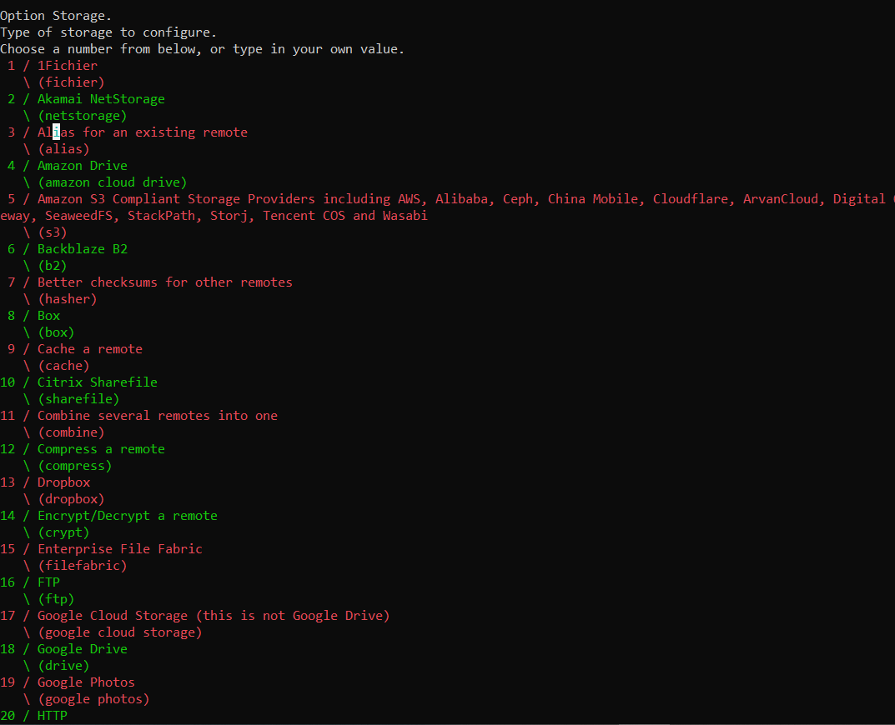

Choose your S3 Provider, and in this scenario, we will pick number 1

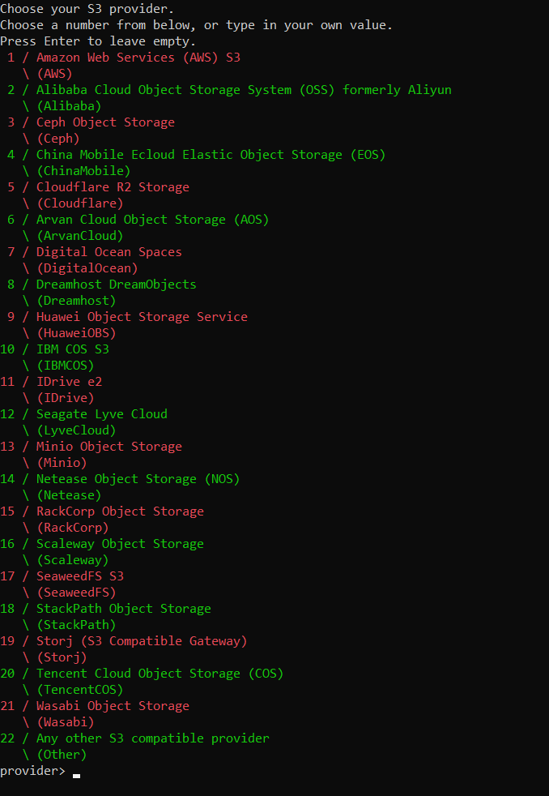

You will be asked if you want to provide S3 Credentials or want the credentials to the fetched from the environment

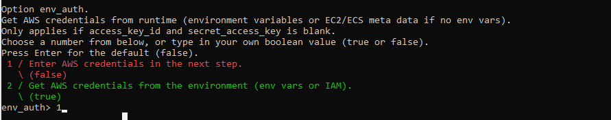

Provide access key

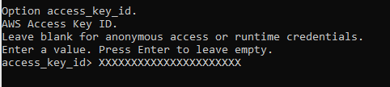

Provide secret key

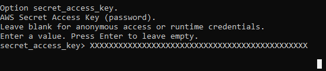

Provide region

Provide your S3 endpoint

Provide location constraints. This is needed if you are creating a new bucket. Otherwise, leave it blank

Provide access control options

Provide server-side encryption option

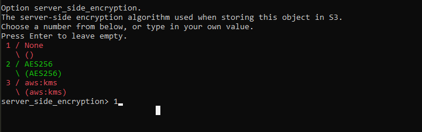

provide SSE KMS KEY ID

provide S3 storage class 

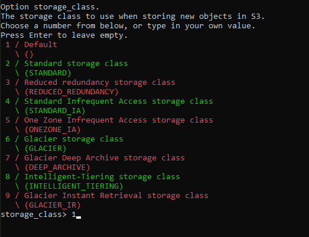

you will be asked if you want to edit advanced config?. We will not do that in this documentation but if you want to edit advanced config, enter ‘y’

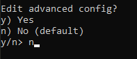

You are done with the setup. Enter “Y” for yes to save your setup

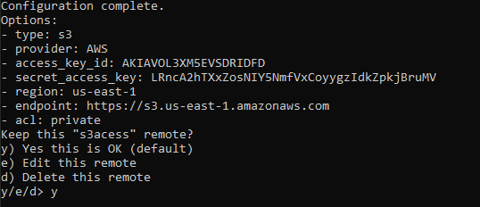

Quit the configuration setup

Note: You will be using remote created above with the commands below e.g. to list all objects: rclone ls <bucket_name>

You can use any of the commands below to copy from one S3 Bucket to another

rclone sync: make source and dest identical, modifying destination only

e.g. rclone sync <remote-name>:<source-bucket-name> <remote-name><destination-bucket-name> (rclone sync formulatorsource:formulatorazure formulatordestination:formulatora)

rclone copy: copy files from source to dest, skipping already copied

rclone move: move files from source to dest 

rclone copyTo: copy files from source to dest, skipping already copied

You can use any of the commands to delete files and paths (Warning: Please do not use any of these files without permission)

rclone delete: remove the contents of path

e.g. rclone delete <your remote-name>:<bucket-name> (rclone delete formulatorsource:todeleteaa)

rclone deletefile: remove a single file from remote 

rclone purge: remove the path and all of its contents

rclone rmdir -- remove the path

rclone rmdirs -- remove any empty directories under the path

You can use any of the commands to list bucket objects

rclone ls: list the objects in the path with size and path

rclone lsd: list all direction/containers/buckets in the path

rclone lsf: list directories and objects in remote:path formatted parsing

rclone lsjson: list the directories and objects in the path in JSON format

rclone lsl: list the objects in path with modification time, size and path

You can confirm if the source bucket and destination bucket are in sync using this command

rclone check: checks the files in the source and destination match

e.g. 1 rclone check testa:formulatorazure testa:todeleteaa. In the image below the two buckets are not in sync

e.g 2 rclone check formulatorsource:formulatorazure formulatordestination:formulatora. In the image below the two buckets are in sync

To read more about rclone commands, go to this link: [Commands (rclone.org)](https://rclone.org/commands/)

## Creating a New User
<!-- **[Back to top](#top)** -->

This article highlights the steps taken in the DELL EMC ECS console to create a new user. Note that a VPN is required to access the admin console. Contact your product owner to inquire about your team’s object storage access. 

1. To create a new user, log in to the DellEMC ECS login page.

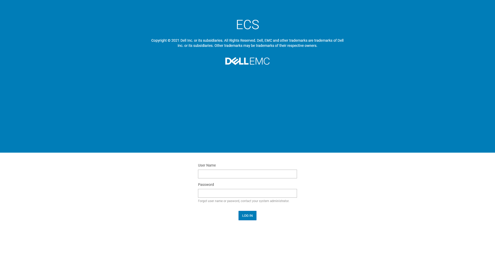

2. From the left sidebar, click on Manage > Identity and Access (S3)

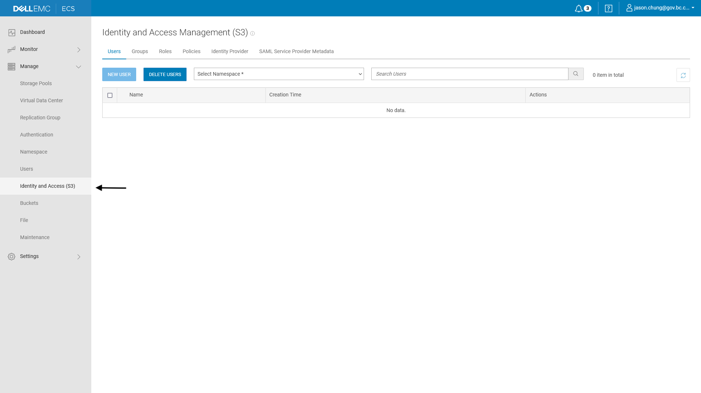

3. Select your Namespace from the dropdown (commonservices in this case) and click on ‘New User’

4. Enter a ‘Name’ and click on the ‘Next’ button

5. This section allows you to add the user to a group, copy permissions from a user, and attach policies. Click on ‘Attach Policies'

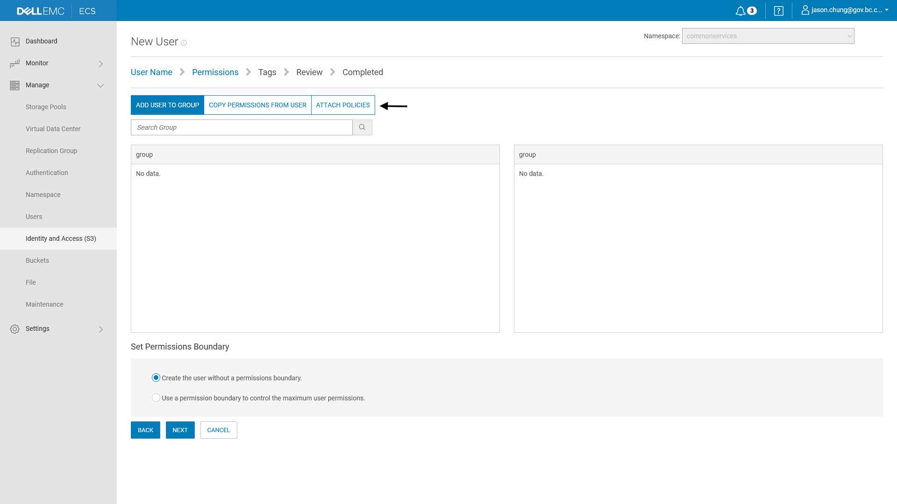

6. Select 'ECSS3FullAccess'

7. Click on ‘Use a permission boundary to control the maximum user permissions’ and select 'ECSS3FullAccess.' Click the 'Next’ button. 

8. Optionally, add any tags in this section and click ‘Next’

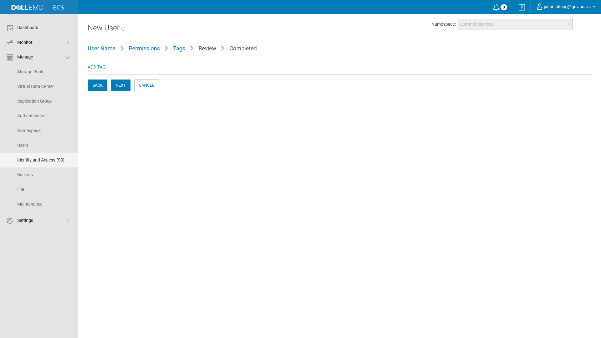

9. Review all the details and click on ‘Create User’

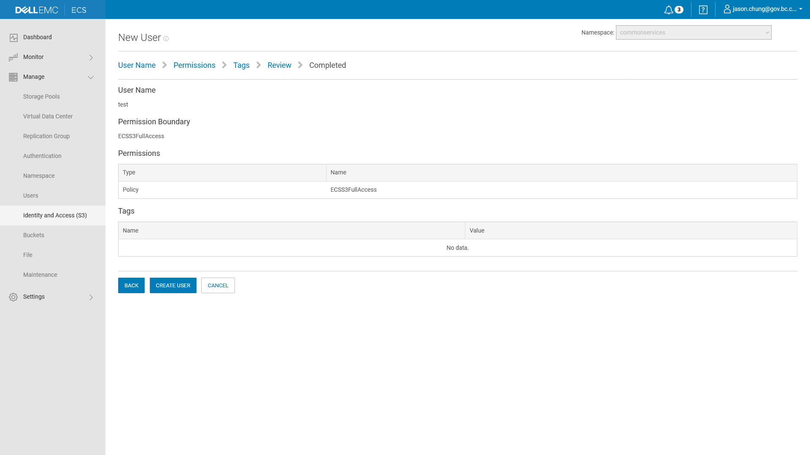

10. The confirmation message confirms that the user has been created. The user security credentials can be downloaded and this is the only point at which they can be downloaded.

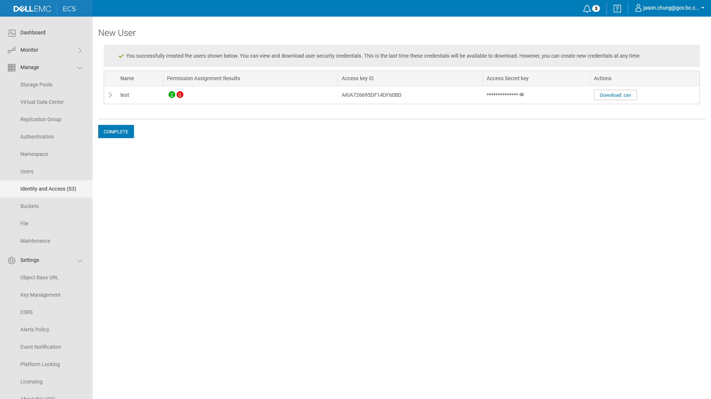

## Create New S3 Bucket and Add User to ACL
<!-- **[Back to top](#top)** -->

This article highlights the steps taken in the DELL EMC ECS console to create a new S3 bucket and add a user to the Access Contol List (ACL). Note that a VPN is required to access the admin console. Contact your product owner to inquire about your team’s object storage access. 

### Create New S3 Bucket

1. Once logged in, navigate to Manage > Buckets from the left sidebar and click on ‘New Bucket’

2. Name the bucket, and enter urn:ecs:iam::<NAMESPACE>:root in the ‘Bucket Owner’ field, where <NAMESPACE> is your Namespace. Click on ‘Next’

3. Ensure that the ‘Access During Outage’ toggle is turned on. 

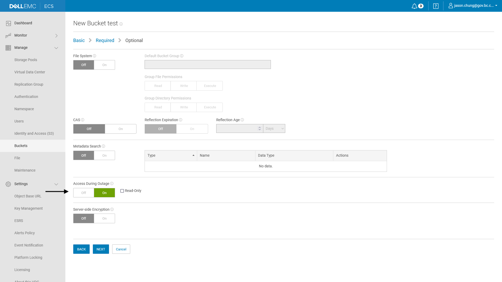

4. Toggle the ‘Quota’ on and set notifications at 1000 GB in the optional section. 

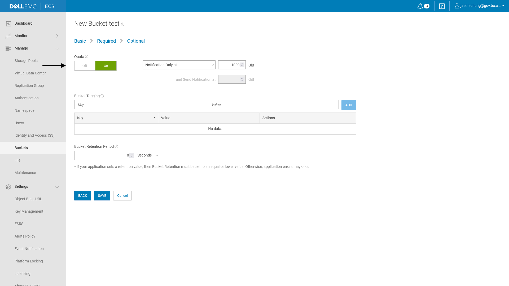

5. Click ‘Save’

### Add User to the Access Control List (ACL)

1. Navigate to Manage > Buckets from the left sidebar, and click on ‘Edit ACL’ from the dropdown under the ‘Actions’ tab. 

2. In the ‘Bucket ACLs Management’ tab, click on ‘Add’

3. Under ‘Permissions,’ select ‘Full Control’ and ‘Privileged Write’ and click ‘Save’

## S3 Bucket Validation
<!-- **[Back to top](#top)** -->

Validation Process

A)

**Step 1:** Log in to chefs database pods in the openshift

**Step 2:** Run this command \c chefs to switch to the chefs database

**Step 3:** Run this command \dt to list all the tables in the chefs database

**Step 4:** Run this command \d file_storage to describe the file_storage table. it will list all the fields in the table

**Step 5:** Run this command select "path" from file_storage;

**Step 6:** Copy and paste the

formSubmissionId (all the objects keys) above into a file named objectskeyspaths.txt

**Step 7:** wrote a javascript file that does the following

I) read this file objectskeyspaths.txt

II) access the bucket and get the metadata of each object in the bucket

III) extract the key the for each object metadata

IV) compare the keys extracted in III) with the keys extracted in I)

Attached is the script:

B)

**Step 1:** Log in to Metabase through this URL https://chefs-metabase.apps.silver.devops.gov.bc.ca/

**Step 2:** Extract “path“ from file_storage in the Metabase objectskeyspaths.csv

**Step 3:** wrote a javascript file that does the following

I) read this file objectskeyspaths.csv

II) access the bucket and get the metadata of each object in the bucket

III) extract the key the for each object metadata

IV) compare the keys extracted in III) with the keys extracted in I)

<!-- **[Back to top](#top)** -->

***
[Terms of Use](Terms-of-Use) | [Privacy](Privacy) | [Security](Security) | [Service Agreement](Service-Agreement) | [Accessibility](Accessibility)