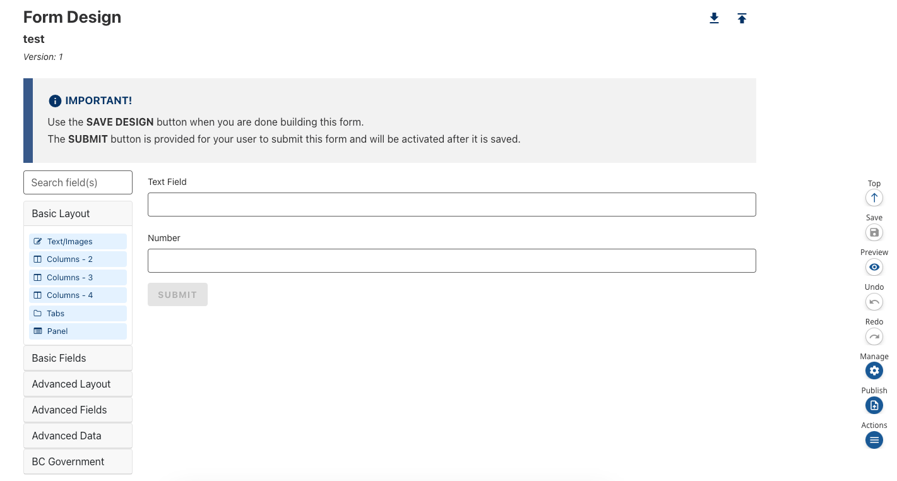

CHEFS features a new enhanced sidebar to simplify the form design process. Users may now navigate to the top and bottom of the form, preview, manage, and publish the form directly from the sidebar. 

Only the ‘Top/Bottom’ navigation and ‘Collapse’ buttons are enabled by default with the other buttons being enabled as the form is populated. Once you add components to the form, the ‘Save’ button and ‘Undo/Redo’ functionality becomes enabled. 

The ‘Undo’ feature allows a user to revert changes until the most recent ‘Save’ point when the page is loaded, and the ‘Redo’ button until the most recent change to the form. This means that if the form builder page is reloaded after clicking ‘Save’, that will be the new form state and undo/redo will be disabled. After clicking ‘Save’, the ‘Preview’, ‘Manage’, and ‘Publish’ buttons are enabled. 

The ‘Preview’ button will preview the form as a submitter would see it, and the ‘Manage’ button will navigate to the ‘Manage Form’ dashboard where additional options are available to share the form and add team members with different roles. The ‘Publish’ button will also navigate to the 'Manage Form' dashboard but will prompt the user to confirm publishing the form, making it live. 

If a user clicks ‘Cancel’, they will automatically be redirected to the form builder page where they can continue working on the form. 