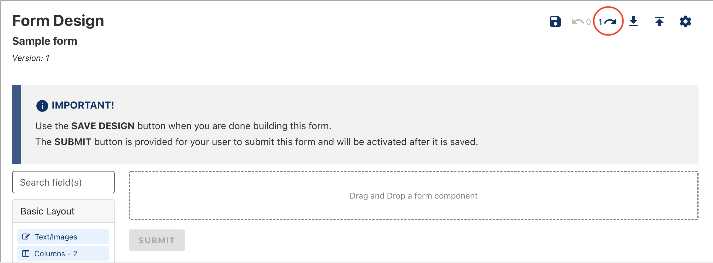

When creating or updating an existing form, mistakes happen. You can use the **Undo** or **Redo** feature to correct an error.

To start using the **Undo** or **Redo** feature:

1. Drag any form component onto the form builder or make a change to an existing form component to enable the undo feature (Fig. 1).

<figure>
<figcaption>
<small>Figure 1: Drag a form component onto the form builder</small>

</figcaption>
    
</figure>

&nbsp;

2. To undo a change you have made, click **Undo** (Fig. 2).
<figure>
<figcaption>
<small>Figure 2: Click <strong>Undo</strong> to step back a change</small>

</figcaption>
    
</figure>

&nbsp;

3. To redo something you have undone, click **Redo**. The **Redo** button is only enabled after you've undone a change (Fig. 3).
<figure>
<figcaption>
<small>Figure 3: Click <strong>Redo</strong> to step forward a change</small>

</figcaption>
    
</figure>

&nbsp;

4. Click **Save Design** to save your changes.

> **Tip:** There is no limit to the number of undoable changes. However, if you leave the form edit screen, you will lose your undo history. If you want to keep your undo history, try loading the form preview in another browser tab or window.
