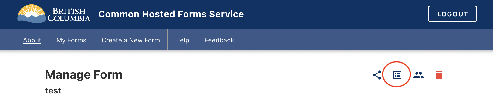
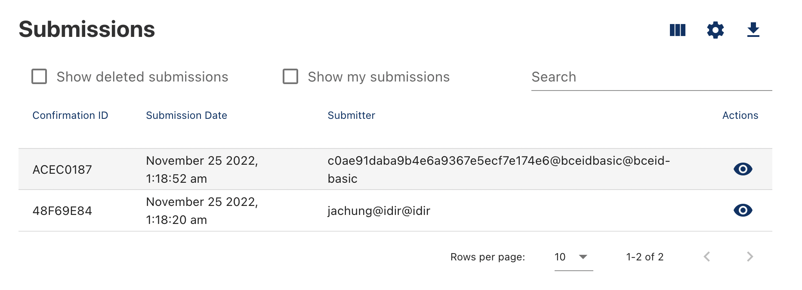
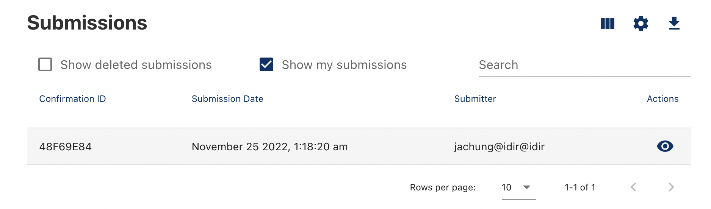

When viewing the submissions for a form, you can view the submissions that you submitted with your own account. This can be done by clicking on the checkbox for show my submissions when you're on the form submissions page.

When you're on a form, click here to view submissions:

You should be able to see some submissions like this:

Click on the Show my submissions checkbox:

You'll then be presented with your own submissions.

***
[Terms of Use](Terms-of-Use) | [Privacy](Privacy) | [Security](Security) | [Service Agreement](Service-Agreement) | [Accessibility](Accessibility)